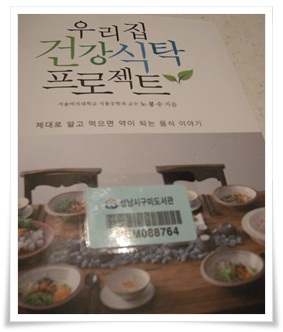

# \[책\]우리집 건강식탁 프로젝트

포사장님이 새 책을 출간했다는 소식에, 구미도서관에 희망도서 신청을 했다.

지난번에 구입하는데 석달이 걸렸는데, 이번엔 한달만에 구매되었다는 문자메시지가 왔다.  도서관이 이번엔 예산에 여유가 좀 있었나 보다.

제목에서부터 웰빙의 분위기가 느껴졌다.

좀 시기가 늦은게 아닌가라는 생각이 들더군.

한 5년전에만 출간되었어도 훨씬 더 괜찮았었을텐데..

그 시절만 해도 한창 웰빙 바람이 불었었데 말이다.

지금은...

먹고 살기 조차 힘든 세상이 되다보니, 더이상 웰빙이라는 단어가 안 나오는 듯하다.

책 표지 저자 이름 옆에는 어디 교수라는 게 적혀 있군.

나 개인적으로는 저자명에 무슨무슨대학 교수라고 씌여 있는 책을 선호하지는 않는다.  아주 개인적인 편견으로, 예전 학생때 다른 연구실 교수 책을 펴낸다고 열심히 워드질하고 문서 편집했었던 기억이 있었다.  타이핑하면서도 느꼈던것이 이런 책을 누가 산다고 책을 쓰는가 의문을 가졌었는데, 이유는 교수세계에는 책을 내는 것도 연구 논문 발표와 같은 수준으로 교수 평가 점수에 들어가는 거였고, 그래서 자비로 책을 내는 사례가 많았다고 한다.  물론 이책은 아니겠지만...

책을 읽으면서, 당연한 내용이 많아 나오겠다 싶었지만, 그렇지는 않았다.

내가 잘못 알고 있었던 내용을 일깨워주는 내용들이 있어 호기심을 갖고 읽게 하였다.

1\. 우유는 정말 완전 식품인가?

초등학생때 우유 급식을 했었고, 우유는 완전 음식이라는 소리를 들었었기에 별 의심을 안 했었는데, 현대에 우유는 사람을 위한 음식이 아니라 '송아지를 위한 것'이라고 한다.  여러 부작용이 있다 한다.  하긴 나도 락타아제분해 효소가 없어 우유만 먹으면 설사를 하긴 한다.

2\. 라면은 그리 몸에 나쁜 음식이라는 것

라면만 먹고 다른 음식을 섭취안하면 당연 편식으로 문제가 되지만, 우리가 골고루 음식이 먹듯이 라면도 여러 반찬과 같이 먹으면 좋다는군.   인터넷 유머로 '라면은 완전식품이다'라는 말이 새삼 떠오른다.

3\. 어린이게 참치는 좋지 않다.

초등학생때 점심 반찬으로 참치캔을 싸오는 애들이 엄청 부러워었는데,..  그래도 참치캔이 맛있긴 하다.

4\. 플라스틱용기가 위험하다는 과학적 근거는 없다.

한창 가스렌지에 컵라면 돌리면 환경 호르몬 때문에 안 좋다라는 말이 있었고, 요 몇년전에는 비슷한 이유로 락액락이 안 팔리고 스텐인레스 반찬통이 잘 팔리던 때가 생각난다.  전자레인지의 온도로 플라스틱 용기의 성분을 분해시켜 다이옥신이 나올 정도가 되지는 않는다고 한다.

하지만, 이 책도 내게 그다지 동조안되는 문구도 있었다.

"우리 조상들은 혀가 즐거운 쪽보다는 식구들의 건강을 늘 먼저 생각했다.  그래서 다소 시간이 걸리더라도 돼지고기를 삶아서 만들고, 고무마나 감자도 삶아서 먹곤 하였다. ....  우리 조상들의 건강한 식생활에 대한 지혜를 엿볼 수가 있다."

과연 우리 조상들이 건강을 생각해서 그랬을까?

건강 서적이라 할 수 있겠지만, 제법 재미있게 읽었다.

'스펀지'에 자문활동을 하고 있다는 저자답게, 책 읽기에 흥미를 읽지 않게 해 준다.

