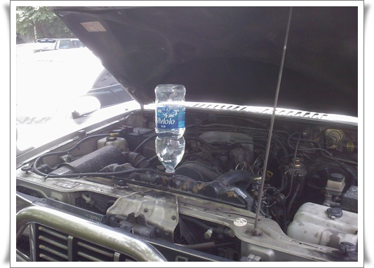

# 헤드 나간 갤로퍼 물 보충하며 다닌다

내년까지는 현재 내 차 갤로퍼를 타려 했는데, 올해로 단축하기로 했다.

이유는 엔진 헤드 고장.  뭐 정확히는 엔진 헤드 균열이나 헤드가스켓 수명 과다로 봐야겠지.

첫차 [록스타를 폐차](../6166733.html) 한 이유중 하나도 엔진 헤드였었다.

그 이유로 엔진 헤드를 세번 교체했었으니..

헤드가 뭐냐 하면, 실린더 위에 캠샤프트(?)가 있는 부분이다.  이게 나가면, 첫 증상이 냉각수가 없어진다.

이유는, 엔진의 실린더압이 헤드 균열 사이로 압력이 새기 때문에, 냉각수가 라디에디터로 역류된다.

그래서 냉각수가 빠져나간다.

수리를 하는 것이 정확한 해결책이지만,

95년식이라 14년된 차이고,

주행거리도 22만이 넘었고,

정밀검사중 매연검사도 제대로 통과가 안되고,

스타트모터의 브러쉬부분에 때가 껴 가끔 시동 안 걸릴 때도 있고,

문을 잠그면, 조수석문이 자동으로 안 잠지고,

조수석 사이트미러가 부러져 테이프로 칭칭감아 놓은 상태고,

엔진 블럭자체 문제로 엔진 오일로 계속 누유되는 상태고,

하여 올해 겨울이 되기 전 폐차하기로 결정했다.

암튼, 그때까지는 타고 다녀야 한다.  어떻게?

운행전마다 엔진룸을 열고, 냉각수를 보충하면 된다.

이렇게..

일단, 올 가을까지는 타고 다니는데, 그 다음차로 뭘 살까나?

현재 후보군.

RV: 카니발, 트라젯, 스타렉스

승용차: EF소나타, 매그너스, 액센트,

예산은 300만원 이하.  돈이 없군.  빚이 2억이 넘다보니, 생활이 쪼달린다.

년식은 이제 길 좀 들은 10년이상, 주행거리도 한 15만은 넘어야겠고..

그래도, 요즘 가끔 중고차사이트가서 가격 알아보고 있다.

앞으로도 서너달은 더 남았지만, 지름의 과정중 제일 행복한 순간이 바로 이 고르는 순간이니..

