# 봉산 산책

토요일 회사 사람들과 트래킹을 가기로 했다.

목적지는 봉산.  서울의 서쪽 은평구에 있는 나즈막한 언덕이다.

오전 10:30 디지털미디어씨티역 5번 출구에서 만나기로 하여, 집에서 8시반 출발했다.

오리역에서 분당선과 2호선, 4호선, 6호선 이렇게 두시간을 갈아타고서야 도착했다.

멀긴 멀군.

5번 출구로 나왔을 때 주변을 둘러봐서, 산 같아 보이는게 없더군.

역시 듣던대로 낮은 언덕이서 그런가 보다.

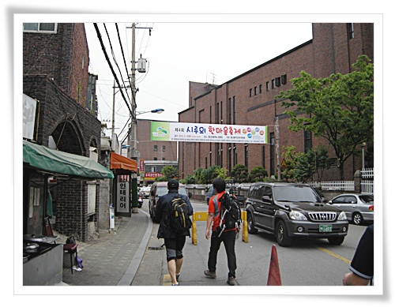

\- 산책길 입구로 가는 길.

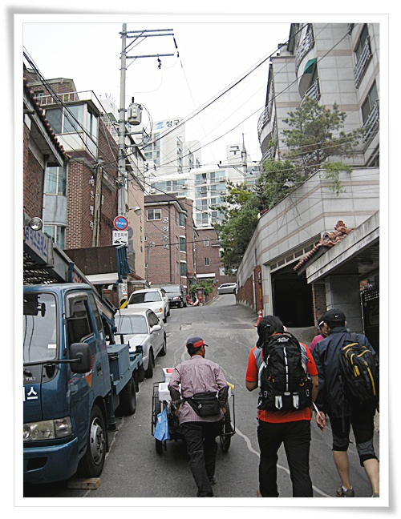

\- 주택가라 산책가 입구 찾기가 쉬어 보이지 않는다.

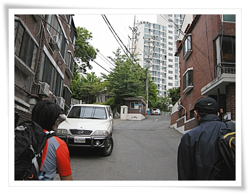

\- 드디어 입구 근처의 아파트.

\- 왼쪽편으로 올라가면 산책로가 시작된다.

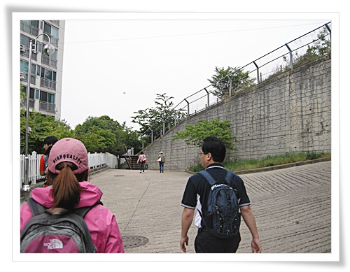

\- 저 계단이 산책로의 시작.

\- 계단으로 올라가니, 아직 아파트보다 낮은 언덕이다.

\- 상암 DMC가 보이는군.

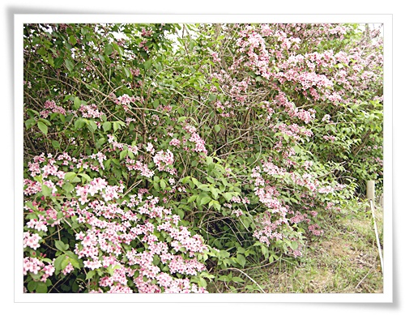

\- 이제 지기 시작하는 꽃도 있다.

\- 걷기 좋은 흙길이 쭉 나 있다.

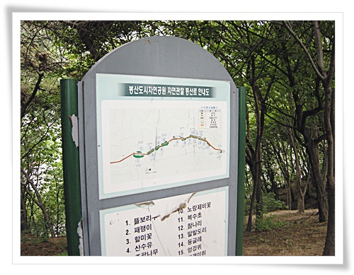

\- 봉산도시자연공원.  그리 길지 않은 산책코스다.

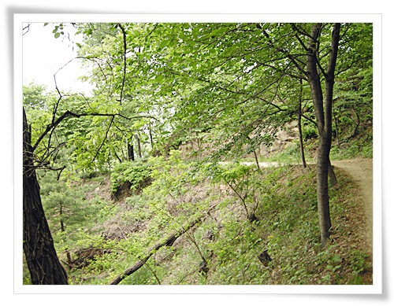

\- 길도 평탄하니 좋다.

\- 얼마 걷지 않아 나타난 조망명소 표지판.

\- 시들어 죽은 나무인지, 암튼 이 나무들도 의외의 풍경을 더해준다.

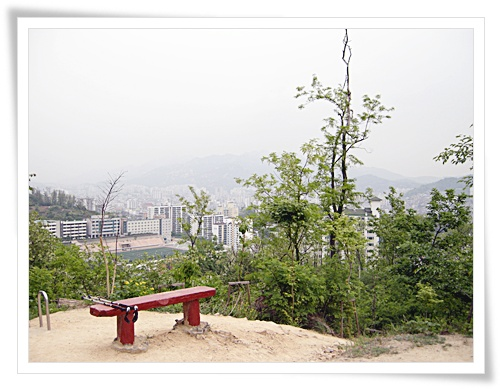

\- 시계가 그리 좋지 않아 멀리는 보이지 않는다.  앞에 있는 게 북한산인가 보다.

\- 생태경관보존지역이라 관리가 잘 되는 모양이다.

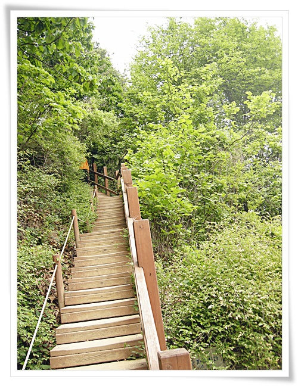

\- 관리를 너무 잘해서일까?  계단이 너무 많더군.

\- 올라가는 계단보다 더 안 좋은 내려가는 계단.

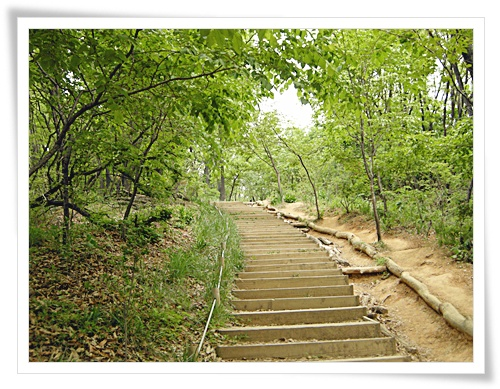

\- 그리고 또 올라가는 계단.

\- 숲길이 좋다.  사람도 별로 없다.

\- 여기가 1시간쯤 걷고 나서 쉰 장소.

\- 이곳에 막걸리 파는 곳이 있던데, 영 깨끗해보이가 않는군.

\- 다시 숲길 걷기.

\- 계단이 참 많은 언덕이다.

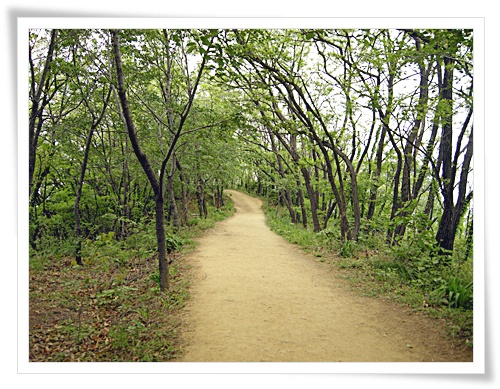

\- 능선따라 걷는 넓은 길.

\- 경기도 고양의 풍경도 보이고.

\- 정상 부근.

\- 여기가 봉산 정상

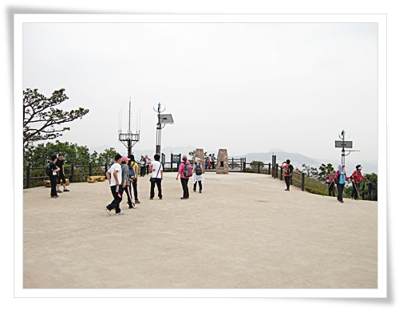

\- 정상을 꽤 넓게 다듬어 놓았다.

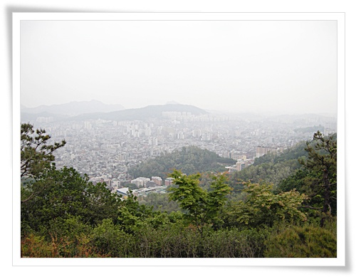

\- 오밀조밀한 시내

\- 봉산이 원래 봉령산이로군.  봉수대가 있어서 붙여진 이름이라고 하는군.

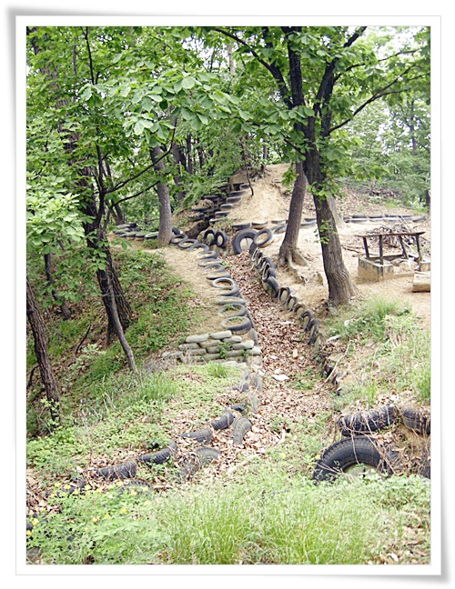

\- 내려가는 길 곳곳이 보이는 참호.  이 진지공사하느라 군인들 얼마나 생고생을 했을까 싶다.

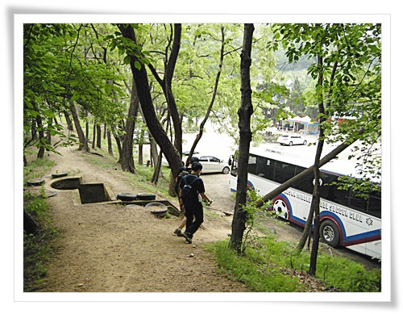

\- 정상에서 내려오는 길은 금방.

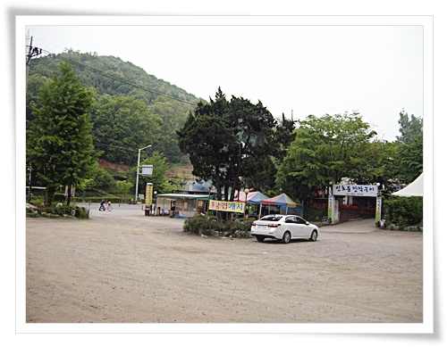

\- 내려오는 곳 바로 있는 신호등 장작구이라는 오리집에서 점심을 먹기로 했다.

\- 점심은 오리구이와 막걸리.

역시 산행후 먹는 점심은 맛있다.

\- 오전 봉산 코스.  6km 1시간 55분 걸렸군.

점심 먹은 후, 일부 귀가하고 남은 4명이서 나머지 코스 재개.

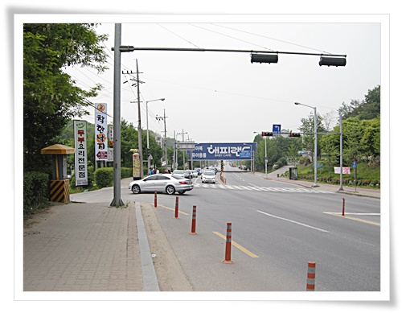

\- 길을 건너고.

산책로 입구를 찾는데, 입구 같아 보이는게 없다.

\- 샛길 같은 것이 있어 그 길을 따라 올라갔다.

\- 대전차 장애물을 따라 올라가면 되는 거였군.

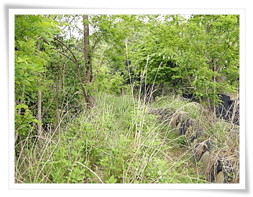

\- 그런데 이길로 다니는 사람이 별로 없는지, 길이 제대로 안 나있다.

\- 군데군데 있는 표시지만.  앵봉으로 향하는 중.

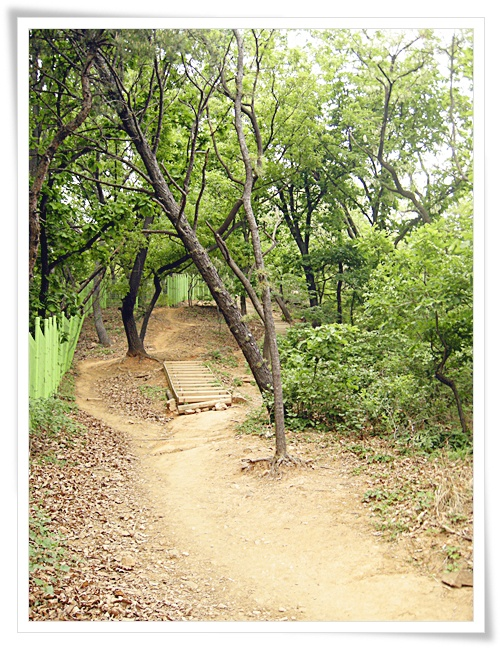

\- 군부대가 있어 산책로 왼편은 장벽이 쳐져 있다.

\- 이쪽 철조망은 좀 정비가 필요해 보인다.

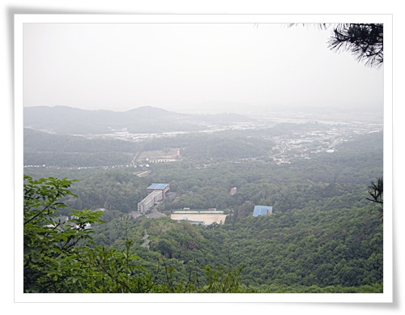

\- 시계만 좋았더라면 참 좋았을 텐데, 잘 안 보인다.

\- 곳곳에 색다른 잡목들로 구성된 수풀이 있어 걷는 재미를 준다.

\- 다 내려오니 꽃밭도 가꾸어져 있었다.

\- 동네 뒷산 공원화 사업으로 조성한 것이군.

\- 점심 후 걸은 앵봉 코스.  4km 1시간반.

