# 이유생협 어린이날 동네 잔치

딸내미가 이제 어린이날도 챙겨줘야 하는 나이가 되었다.

어린이날이면 놀이공원은 사람들도 북적여 그런데는 가고 싶지 않은 차에, 아내가 동천초등학교로 가자고 하였다.

어린이날 아침 9시부터 오후 1시까지 이유생협에서 어린이날 행사를 한다고 하였다.

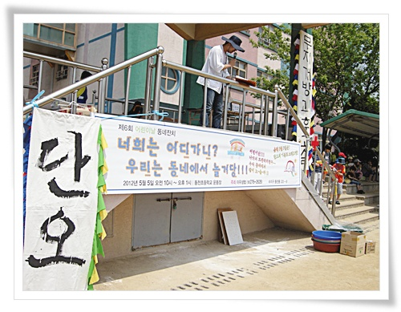

\- 이유생협에서 주최한 어린이날 행사.

"너희는 어디가니?  우리는 동에서 놀거당!!!"

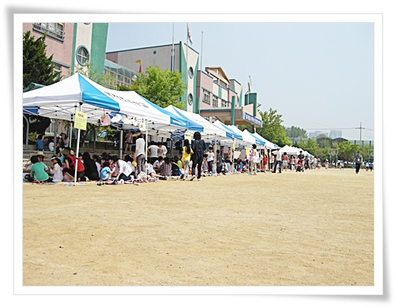

\- 한여름의 햇볕을 방불케하는 뜨거운 날이었다.

각 천막마다 체험행사가 진행되었다.

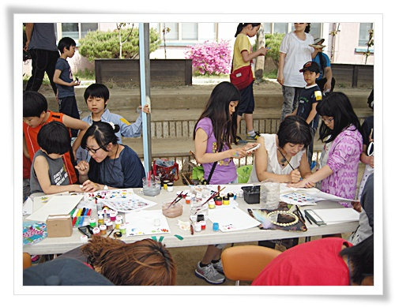

\- 가장 인기 많은 코너인 페이스페인팅.

\- 10여분 줄서 기다려, 손등에 요정 그림을 그리는 중.

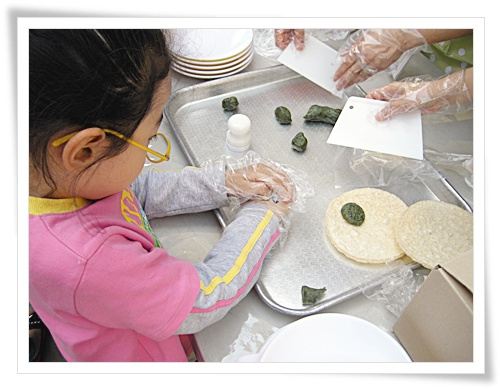

\- 떡살 모양 만들기 행사.

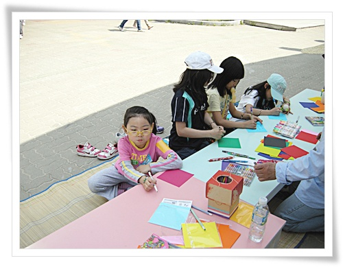

\- 소원 적기 코너.

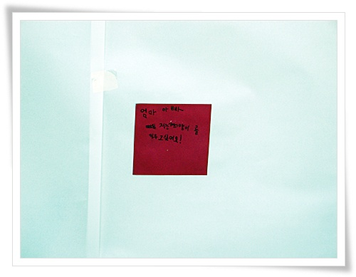

\- 딸내미는 소원 색종이에다가 "엄마 아빠, 저는 고양이를 키우고 싶어요!"라고 썼군.

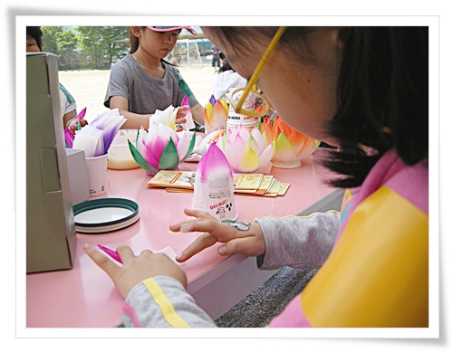

\- 연꽃만들기 행사.

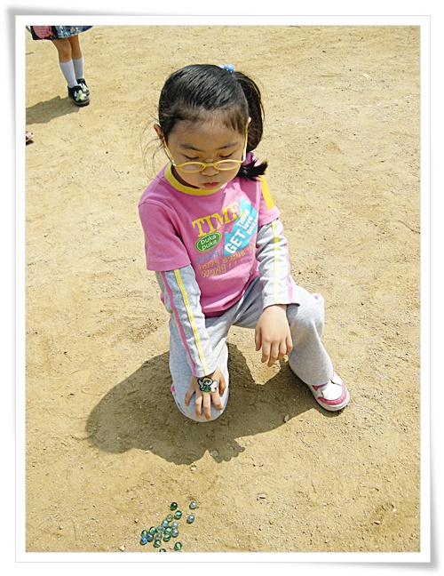

\- 구슬치기 놀이.

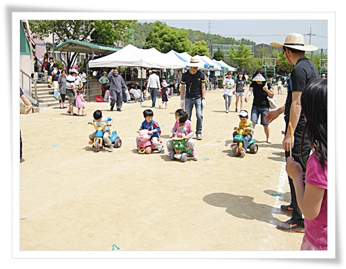

\- 운동회의 마지막이 이어달리기이듯이, 마지막 행사로 진행된 세발자전기 계주.

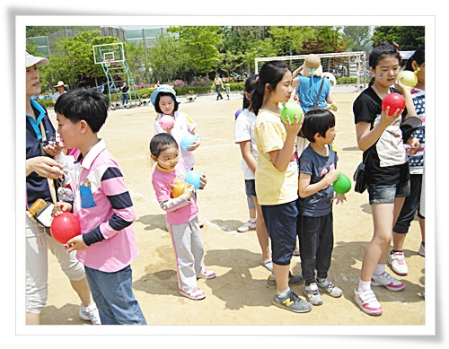

\- 물풍선 터트리기 놀이

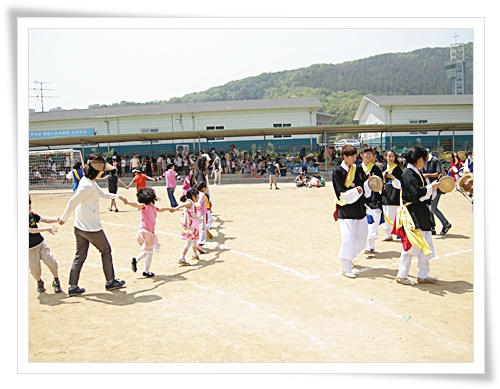

\- 마지막은 이유고등학생으로 여겨지는 사물놀이패와 함께 손잡고 돌기.

짧지만 알차게 짜여진 행사였다.

어렸을 적 시골에 살았을 때 초등학교 운동회가 동네 잔치였듯이, 이 행사도 동네 잔치의 맛이 느껴진다.

그리고 어린이날 행사를 준비하느라 봉사하는 사람들에 대한 고마움도 느낀다.

