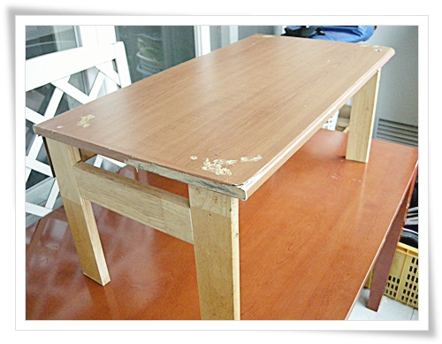
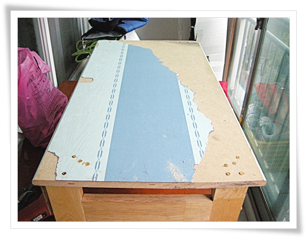
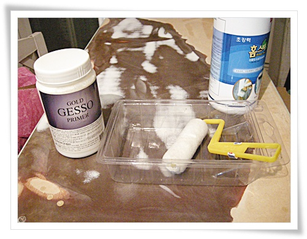
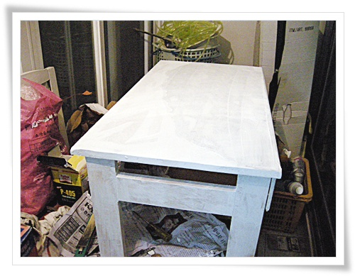
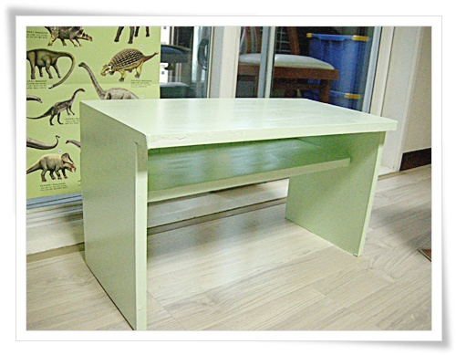
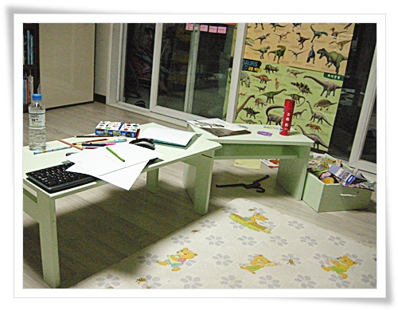
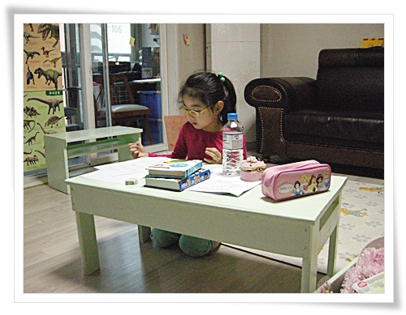

# 첫 젯소,페인트,바니쉬 칠

[지난 번 대충 만든 독서테이블](../10866982.html) 의 후속 작업으로 페인트칠을 하기로 했다.

페인트칠이 상당히 난이도 놎다는 것은 익히 알고는 있었지만, 그래도 그 난이도가 어느 정도인지는 직접 경험해보고 싶었다.

인터넷쇼핑몰에서 젯소와 페인트를 주문했다.

\- 작업 시작 전.

MDF위에 시트지를 붙여 놓았는데, MDF 코팅면이 벌어져 있어 코팅면을 제거하기로 했다.

\- 먼저 시트지 부터 제거하고

\- 코팅면을 제거하기 시작했으나, 작전 실패다.

아주 강하게 접착되어 있어, 채 1/3도 벗겨내지 못했다.

그냥 이 상태에서 사포질을 했다.

\- 사포질 완료 상태.

사포질에 상당히 공수를 들여야하는게 정석이지만, 그냥 그라인더에 원형사포로 밀었다.

결과는 역시 별로다.

오른편의 총강력 젯소를 이번에 주문해서 산 것인데, 칠할려고 롤러를 꺼내다 보니 4년전 사 놓은 젯소가 있었다.

그게 왼편의 것.

그래서 4년전 산 젯소로 칠하기로 했다.

혹시나 굳어있지 않나 걱정했으나, 괜찮더군.

\- 두번의 젯소칠을 완료한 상태.

\- 그리고 두번의 페인트칠을 마친 상태.

페인트 색상은 파스텔톤의 연두색으로 했다.

나의 미적 감각의 실패다.

영 안 어울리는 색깔이다.

\- 독서테이블 다른 하나도 마저 칠했다.

\- 바니시칠까지 다 하여 말린 후, 거실로 돌아온 모습.

\- 딸내미에 의해 실사용 모습.

첫 페인트칠의 결론.

페인트칠은 고난도의 작업이다.  사놓은 페인트 다 쓸 때까지만 하자.

