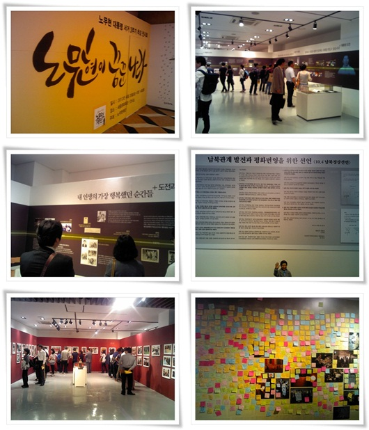

# 노무현 대통령 서거3주기 추모 전시회

벌써 3년이 되었군.

고속도로 휴게소 TV를 통해 뉴스를 통해 접한 그 때가 벌써 3년이나 지난거군.

세종문화회관에서 추모 전시회가 열리기에, 허진원씨와 퇴근 후 갔다.

미국의 광우병 발병으로 다시 켜진 촛불로 광화문과 시청일대는 전경들도 좍 깔려있었다.

실내는 조용했다.

다들 사진과 글들을 천천히, 조용히 보고 읽는다.

