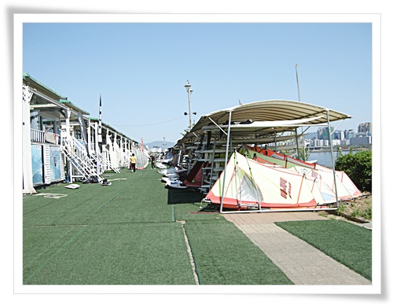
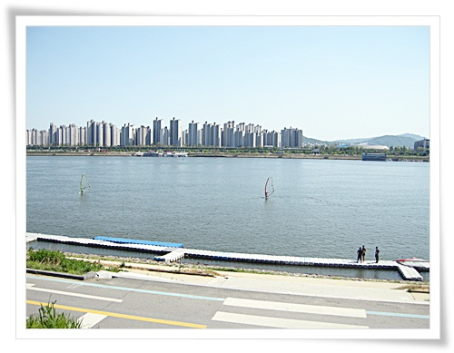
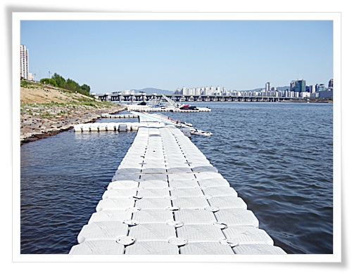
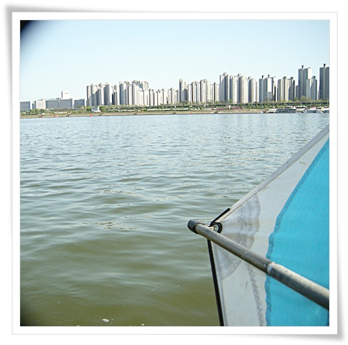
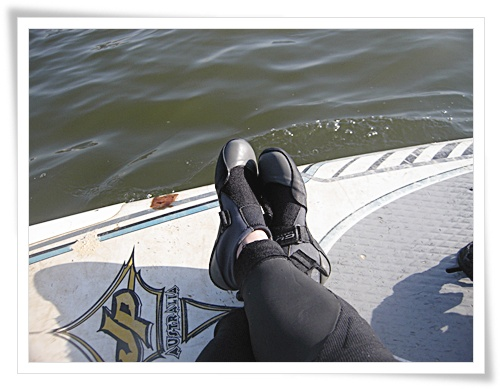

# 한강 윈드서핑

4월 30일 월요일.  권장휴무라 휴가를 썼는데, 아내와 딸내미는 각자 자기 일정이 있다고 하여 나혼자 놀기로 했다.

뭘 할까 생각하다가, 윈드서핑을 타기로 했다.

마지막으로 탔을 때가 벌써 3년전이군.

윈드서핑 처음 탔을 때의 그 느낌을 잊을 수가 없다.

물위로 사르르 미끄러지는 그 느낌이란,..

먼저 바람 예보를 살펴봤다.

자양동의 바람이 초속 3~4m의 동품.

그냥 미풍이긴 했지만, 그 정도의 바람이라도 불어주는게 어딘가 싶다.

윈드서핑 클럽에 전화하여 일일강습을 신청했다.

일일강습 요금은 7만원.

\- 한강 윈드서핑 클럽.  아직 봄이고, 평일이라 그런가 한산하다.

\- 한강에 떠있는 보드도 두세대 정도.

3년만에 타는 터라, 다시 기본 5개동작을 연습한 후 한강으로 내려갔다.

\- 윈드서핑 선착장.

\- 한강 위에서 서핑보드만 타고 물 위에 떠 바라보는 풍경은 참 좋다.

\- 초여름의 무더위라, 보드위에서 잠시 쉬기도 했다.

5시 넘어서부터는 바람이 잔잔해졌다.

간만에 탄 윈드서핑으라 근육도 피곤하고 하여, 채 5시간을 못 타고 땅으로 왔다.

그래도 머리가 아닌 몸이 기억하는 것은 오래간다는 말처럼, 타는 법을 안 까먹고 있어, 즐길 수 있었다.

바람 부는 날 다시 타 봐야겠다.

