# 1박 2일 스위스 인터라켄 여행

독일에 놀러온 김에 가 본 스위스.

옆 나라라서 멀지 않은 거리이고, 아직 스위스는 가 본적이 없기에 1박2일 여행을 잡았다.

2019년 2월 20일 수요일부터 2월 21일 목요일까지 1박 2일 일정.

가는 방법은 기차, 버스, 카쉐어가 있는데, 제일 비싸지만 그래도 제일 안전한 기차로 택했다.

인터라켄 왕복 기차표에  85유로, 그리고 인터라켄에서 도미토리 8인실 숙소 : 26유로를 미리 결제했다.

Etlingen Was역에서 중앙기차역까지 트램을 탄 후, 스위스 Basel SBB역까지 ICE기차를 타고 갔다.

거기서 인터라켄오스트역까지 갔다.

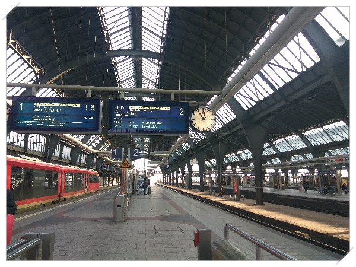

\- 인터라켄 가는 기차 기다리는 중

\- 기차 연착되어 내가 원래 타려던 기차를 못타, 저 information desk가서 말하니 새 표로 바꿔줬다.

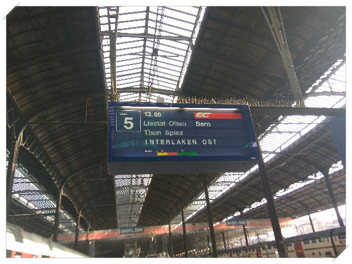

\- 목적지 interlaken OST

가는 동안 차장 너머로 보이는 알프스 산맥은 사진에서 보던 것과 똑같았다.

헌데, 홀로 여행이라서 그런가 그렇게 신나지는 않았다.

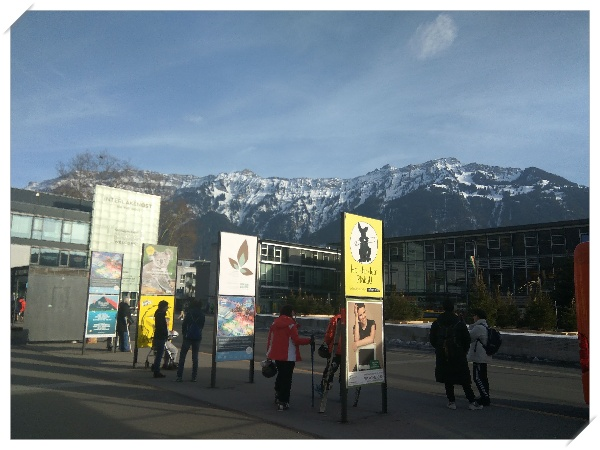

\- 도착한 인터라켄.  산간 동네라서 해가 일찍 진다.

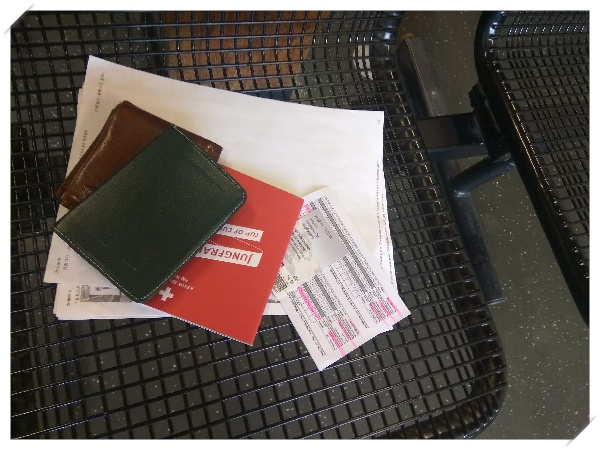

\- 먼저 융프라우표를 예매했다.  145프랑.

저녁 5시 호스텔에 내 방에 도착했다.

비싼 나라 호스텔이라 그런지 모든게 좁았다.

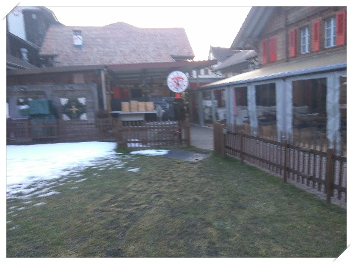

\- 1박 묵었던 호스텔

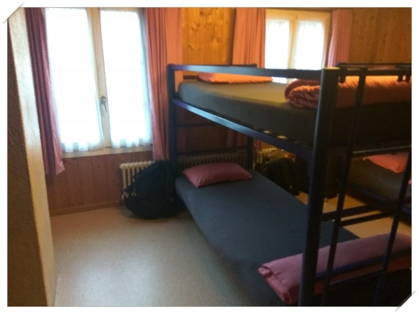

\- 8인 도미토리중 내 자리는 저 1층 자리.  8인실에는 나와 다른 한국인 커플 이렇게 총 세명이 묵었다.

저녁시간 할 일이 없기에, 동네 산책하고 왔다. 알프스 산맥이 보인다는 것 말고는 크게 감흥은 없었다. 늙었나 보다.

그냥 용평리조트처럼 보였다.

시내는 작았다. 그리고 물가는 비쌌다. 감히 뭘 사먹지 못하겠더군.

한국식당도 있어 가격을 보니 닭볶음탕이 22프랑. 즉 2만5천원정도 된다.

한참을 걸어도 별로 볼 것은 없어, 버스를 탔다. 105번 버스를 탔는데, 기차타고 올라갈 골짜기쪽 마을까지 가더군. 혹시나 안 돌아오면 어쩌나 하는 불안감은 있었으나, 마을에서 턴을 해서 돌아왔다. 아직 나의 방향 감각은 죽지 않았다.

숙소 오는 것도 거의 정확히 내렸다.

저녁은 슈퍼에서 산 빵과 우유로 대충 떼우고 잤다.

다음 날

융프라우가는 첫 기차를 탔다. 평일이고 비수기라 사람이 별로 없다. 이 기차가 반으로 쪼개져 그린데발트와 라우터반으로 나눠진다는데, 내가 어떤쪽을 탔나 몰라 좀 긴장되기는 했다.

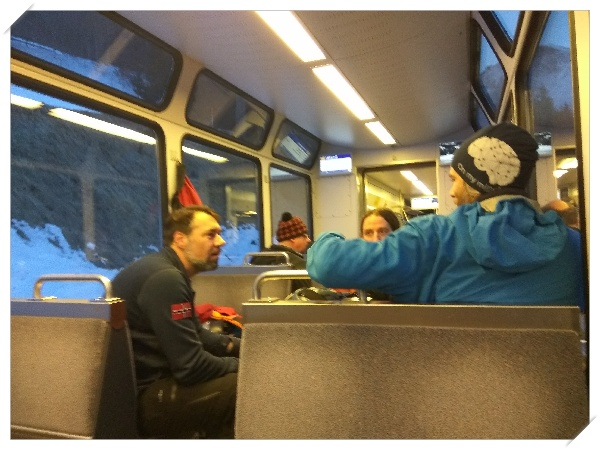

\- 융프라우로 가는 기차안

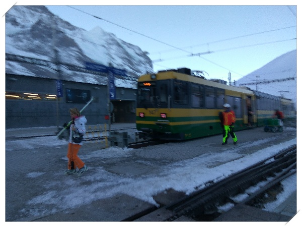

\- 산악 기차로 갈아타기위에 환승.  스키타는 사람들로 많았다.

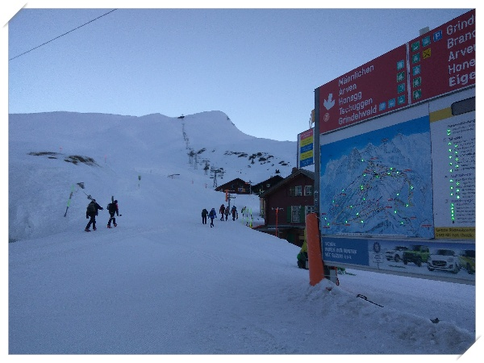

\- 스키 타는 사람들을 보니 나도 보드를 타고 싶더군.

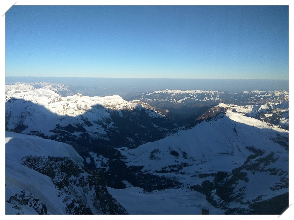

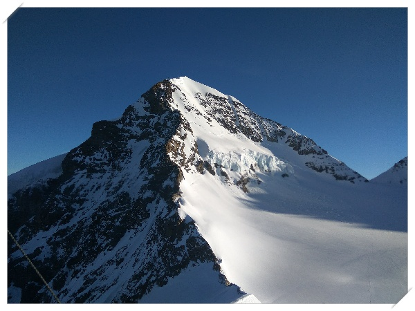

\- 이게 융프라우였던 것 같다.

