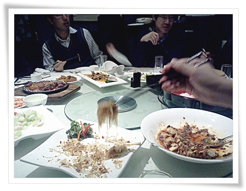
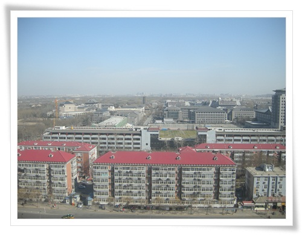

# 북경에서의 하루

이번 중국의 목적은 회의.

상대회사가 있는 장소는 호텔에서 3km 정도 떨어진 쭝꽌춘역 근처.

처음 찾아 갈때, 회사 주소를 택시 기사에게 보여주었지만, 건물 이름을 알지 못해 한동안 고생을 했다.

\- 처음 사무실 찾아간 코스.  택시비 16위안.

\- 쭝꽌춘.  이 동네가 우리의 예전 테헤란밸리정도 되는 것 같았다.

인터넷 기업이 몰려 있고, 코엑스몰같이 각종 상가들이 모여 있었다.

\- 택시에서 내려서 본 사무실이 있는 건물.  건물이름은 정방국제대후.

\- 출입구는 건물 뒷편이 정문.

\- 북경대가 한눈에 보이는 전망좋은 곳에서 하루 종일 회의.

\- 두번째 날 북경오리를 먹으로 간 북경오리 전문 고급 식당.

\- 북경오리와 맛있는 북경식 중국요리.

다들 접시를 싹싹 비우는 통에, 음식 남기는 것을 예의로 생각하는 중국인에게 결례를 범한 듯..

그래서 다음 날은 이날의 1.5배를 주문해서 도저히 비울 수 없게끔 해주더군.

\- 이곳은 저녁으로 먹은 쓰촨성 요리 전문점.

10년과 달리 입맛의 유동성이 줄어 들어서 그런가, 맛이 익숙치는 않았다.

\- 중국회사 사람들이 대접한 쓰촨 요리

\- 15층 회의실 유리창 밖 풍경.  저 전체가 북경대학이라고 한다.

평소의 북경답지않게 날씨가 꽤 좋았다.

\- 중국의 공휴일이라 도로에 차가 없지만, 평소에는 강남사거리 정체를 실감할 수 있다고 한다.

\- 첫 회의 후, 북경오리를 먹고 나고 호텔로 복귀한 경로.

