# 북경 동네탐험 - 호텔에서 월마트까지

북경 2일차.

중국이 한국보다 1시간 느리기에, 핸드폰 알람 소리가 울리기 전에 깨었다.

새로운 동네에 왔으니, 취미인 동네 탐험을 할 기회가 온 거다.

지도를 보니, Jade Palace Hotel이 있는 곳이 북경 북서쪽으로 아침 산책 거리에 구경할 만 한 것은 없었다.

2km 안쪽에 월마트가 보였다.

첫 탐험은 월마트로 정했다.

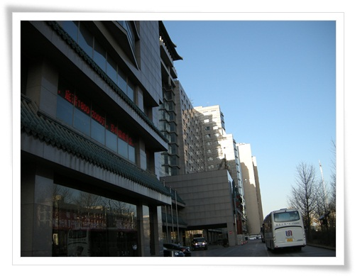

\- 호텔에서 나온 시각 아침 7시.

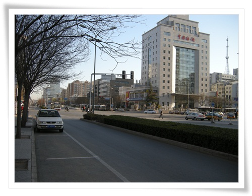

\- 호텔주변은 이렇게 삭막하다.

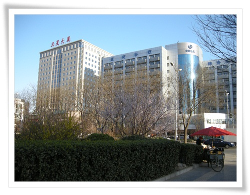

\- 아침거리를 파는 노점상이 있다.

길거리 현지 음식 사먹는 것을 좋아라 하지만 아침이 숙박비에 포함되므로 굳이 사먹을 필요가 없어 그냥 통과.

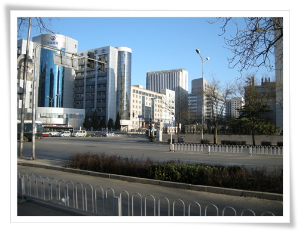

\- 월마트가 있는 동쪽으로 계속 걷는다.

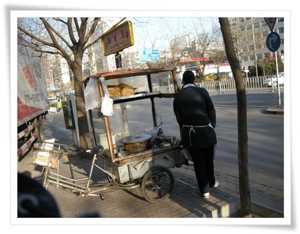

\- 여기도 아침파는 아줌마.  예전에 먹어온 적이 있었던 것 같은 음식이다.

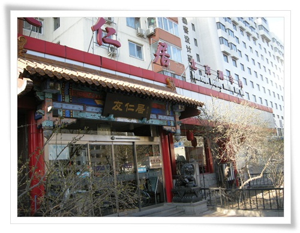

\- 길가다 보이는 음식점.  이런 새로운 곳에 들어가 맛집 평가도 해 봐야 하는데..

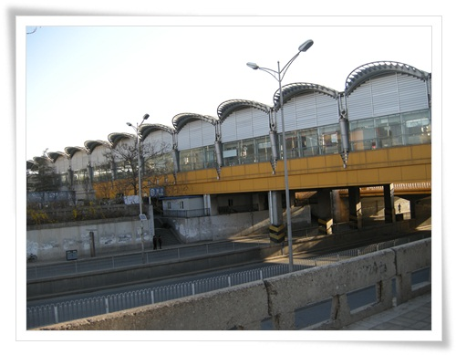

\- 저게 북경 지하철 쯔이신루역.

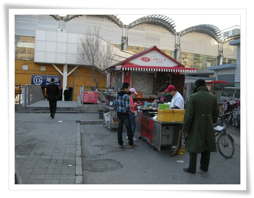

\- 역앞에 있는 또 다른 길거리 음식.  여기도 맛 있어 보인다.

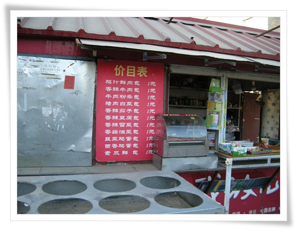

\- 모두 1위안이므로 싼 가격인가 보다.

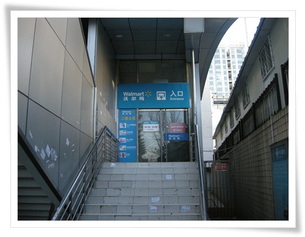

\- 지하철 옆에 있는 월마트 출입구.

아침 7:30 오픈이라, 문은 닫혀 있었다.

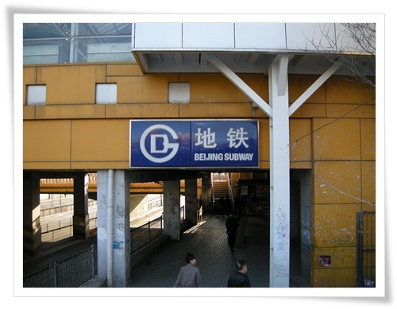

\- 철도 너머 세상으로도 들어가 본다.

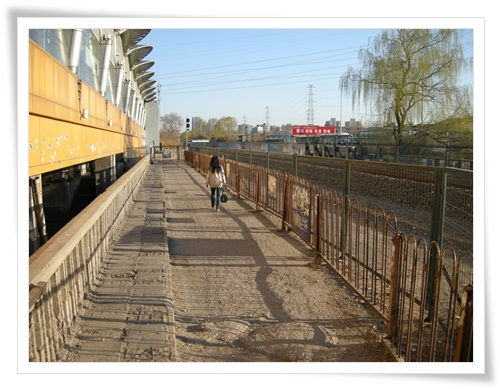

\- 통과하면 그냥 유턴하는 길이다.

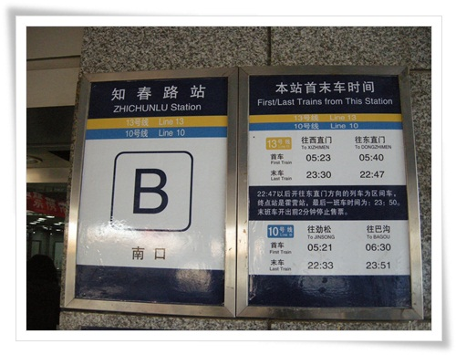

\- 이게 쯔춘리역의 시간표라고 하는군.

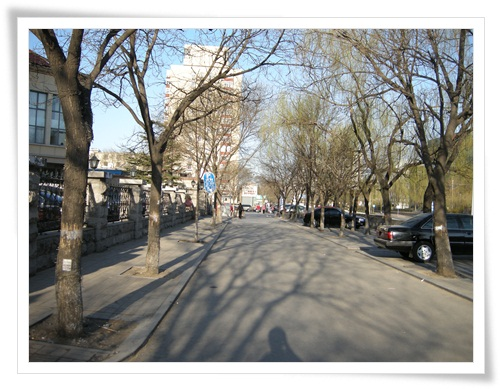

\- 다시 돌아, 이제 월마트를 찾아본다.

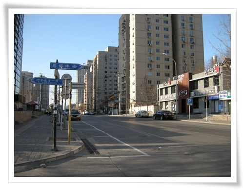

\- 이 골목으로 들어가야 월마트 입구가 있다.

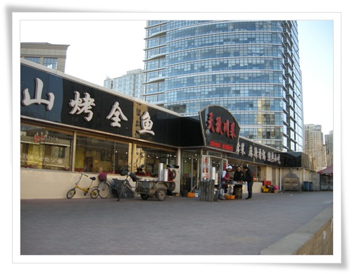

\- 입구에도 뭔가 맛있어보이는 요리들이 본이다.

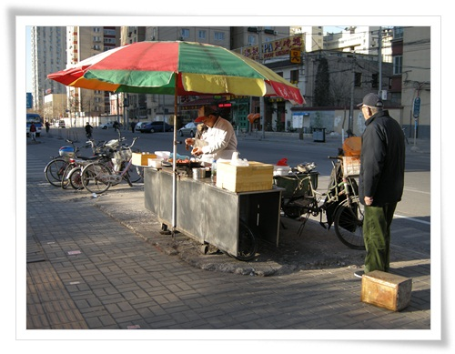

\- 여기 또 다른 노점상도 있다.

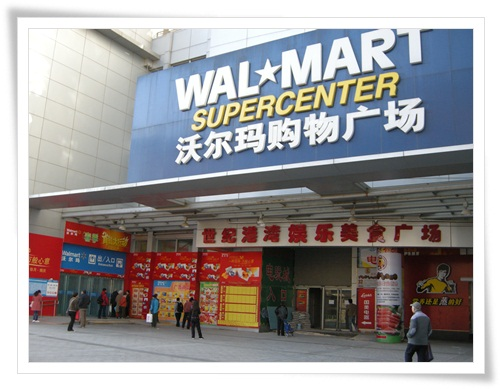

\- 여기가 월마트

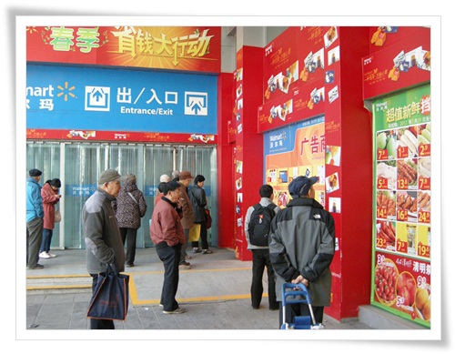

아직 07:30 전.  사람들은 전단지로 보며 기다리고 있다.

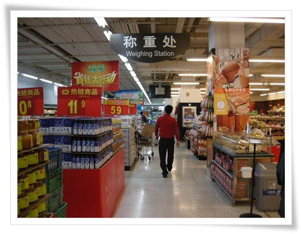

\- 마트 내부.

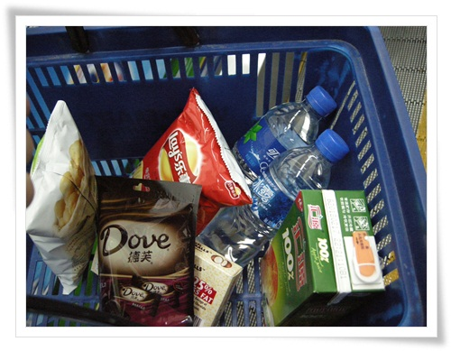

\- 이번에 내가 산 것.  450위안.

샀는데 비닐봉투를 안주길래 비닐가리켰더니, 3마오라고 했다.

그래서 비닐봉지도 별도로 샀다.

북경도 우리나라처럼 마트에서 비닐을 무상으로 주는 것을 금지하는 법을 시행하고 있다고 하는군.

그런데 3마오면 우리돈 50원이란 소리인데, 제법 비싸군.

\- 이제 베이징도 꽃이 피는구나.

꽃잎 모양이 벚꽃같다.

\- 이게 오늘 아침 월마트까지의 산색코스.   왕복 3 km정도 된 듯 하다.

