# 정통 중국 탕수육

기나긴 중국출장중에 심심함을 달래고자 내 재밌는 장난감 디카로 이거 저것 찍었어요.

사진과 함께 텐진에서 어떻게 놀고 있었나를 한번 써 봤는데, 한번 보시죠.

텐진이 어디에 붙어있는 거냐 하면에 바로 인천에서 그냥 서쪽으로 가면 있어요. 북경 밑에 붙어있군요.

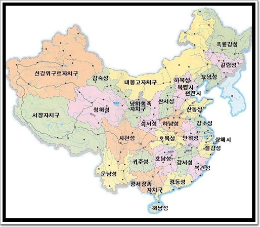

텐진에 있는 펨스타로 2만대 리플래쉬를 하기 위해 이동하게되었지요.

이동방법은 국내선 비행기, 남방항공. 비행시간은 2시간 반이더군요.

광저우 공항에서 비행기를 타기전, 왠 중국군이 무언가 중요한 물품을 이송중인지 경무장한 군인 두명이 총을 들고 경호를 하더군요. 하지만 왠지 폼이 나지 않은 어리버리로 보여, 보는 사람들로 하여금, 위압감보다는 고것 참 귀엽군이란 느낌을 갖게 하더군요.

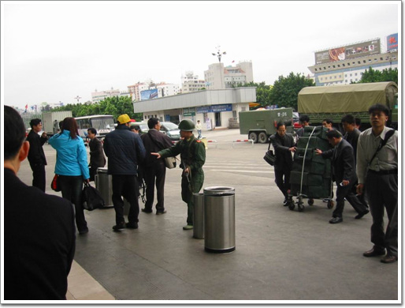

앞선 애보다 후방 경호를 담당한 애가 훨씬 더 어리버리해보이더군..

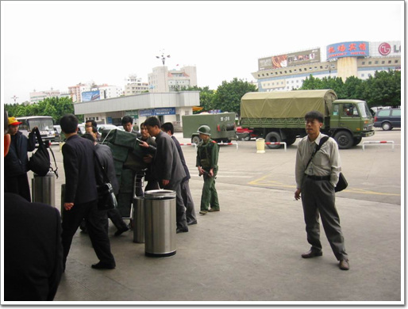

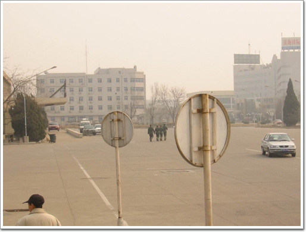

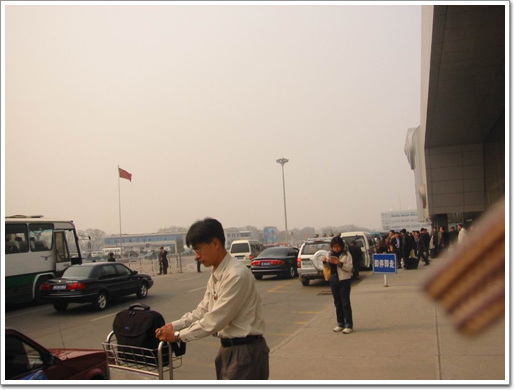

여기는 텐진공항, 상당히 황량한 공항이었다.

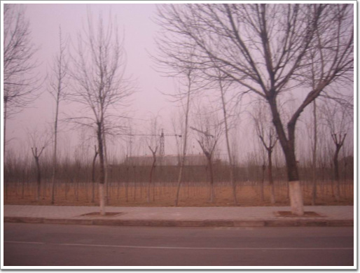

공항에서 펨스타 공장으로 가는 길은 공항앞보다 더 황량했다.

공기는 광저우보다 더 뿌옇였다.

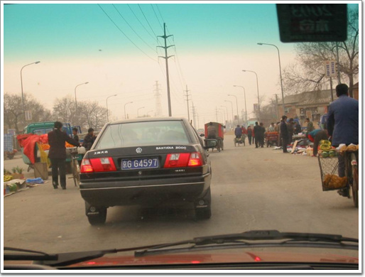

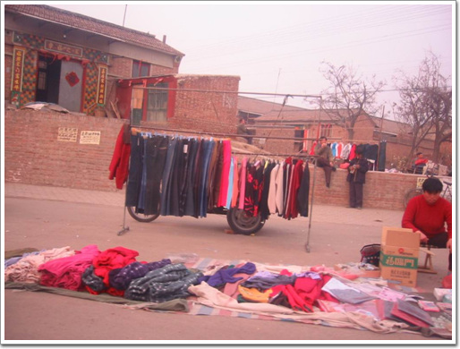

군데군데 보이는 집들과 사람들에게서 활기는 별로 느껴지지는 않더군요.

텐진시의 외곽이기는 하지만, 꽤나 설렁했다.

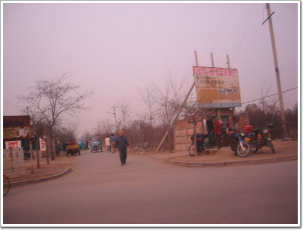

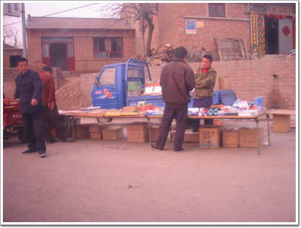

흥정하는사람앞에 보이는 트럭이 있는데, 세발달린 트럭이었다. 이런 트럭이 꽤 많이 보였다.

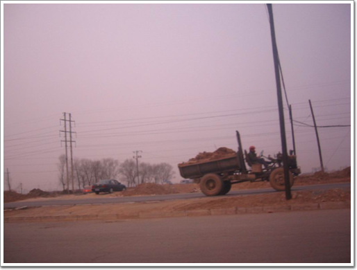

텐진시외곽은 개발이 한창이었고, 이렇게 흙을 싣고 가는 차량이 많이 보였다.

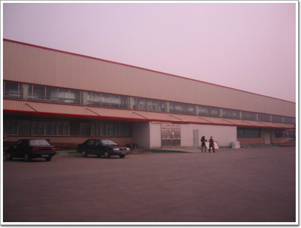

여기가 나의 목적지 펨스타. 정문도 제대로 없는 그냥 창고 건물 그 자체였다.

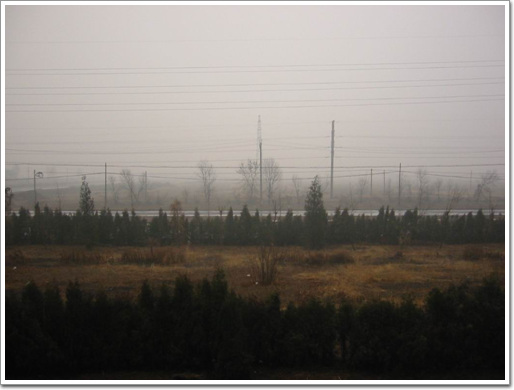

공장안에서 바라본 바깥 풍경

펨스타 공장의 보안은 철저하여, 행동의 제약이 꽤 따랐다.

공장의 일을 끝내고 호텔에 체크인을 하고 들어왔다.

호텔은 한국인이 경영하는 거의 한국인전용 호텔이었다. 뭐 그리 반갑지는 않았다.

텐진의 다운타운가는 아니고, 좀 많이 떨어진 곳에 위치하고 있었다. 호텔주변은 한국인 식당들이 즐비하여 있는 것으로 보아, 아마 한인타운이 아닐까 여겨지더군요.

한인타운은 좀 우중춤한 변두리에 있다는 것이 썩 좋지는 않더군요.

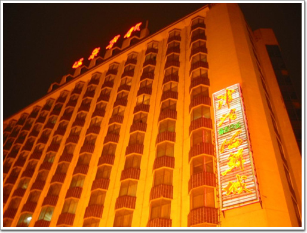

이게 호텔. 이렇게 찍으니 좀 그럴싸 해 보이기는 하군..

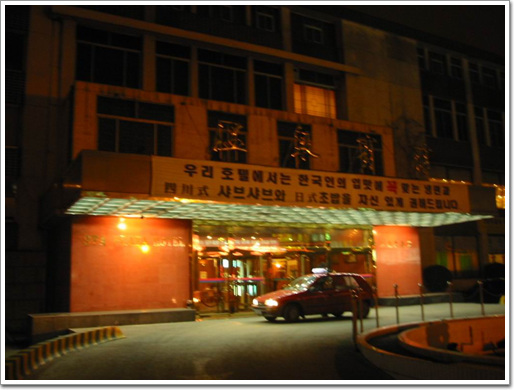

정문은 여기.

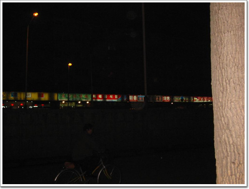

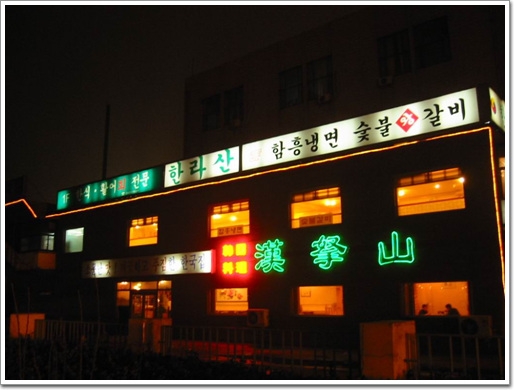

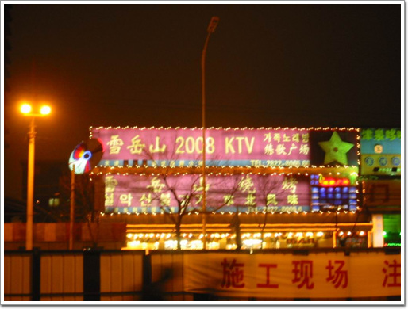

주변의 한국인 식당들.

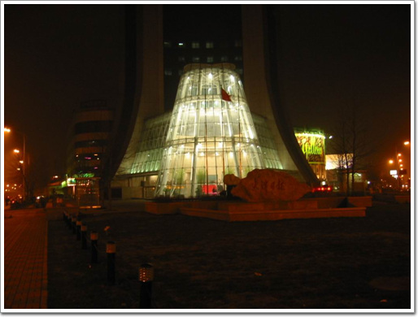

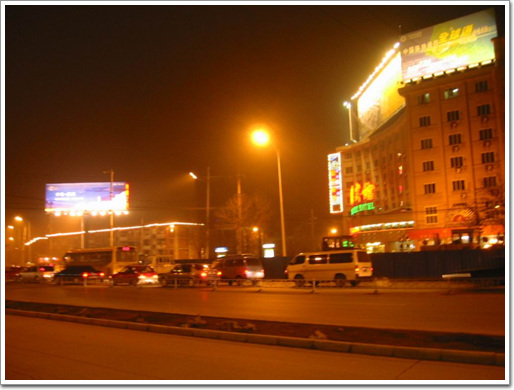

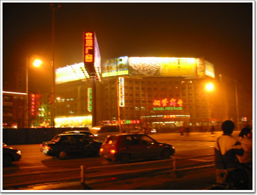

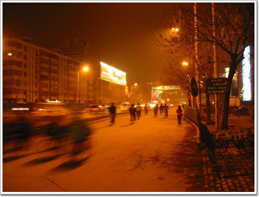

호텔주변의 도로변.

텐진에 대한 느낌은 활기가 보이지 않은, 회색도시.

다음날, 점심 때, 부사장이 공장에 왔기 때문에, 덕분에 같이 점심 대접을 받을 수 있었다.

점심을 먹기 위해 간곳은 베이징과 텐진의 중간쯤 되는 곳이 위치한 swan lake라는 호수였다. 리조트처럼 조성된 곳이라고 한다.

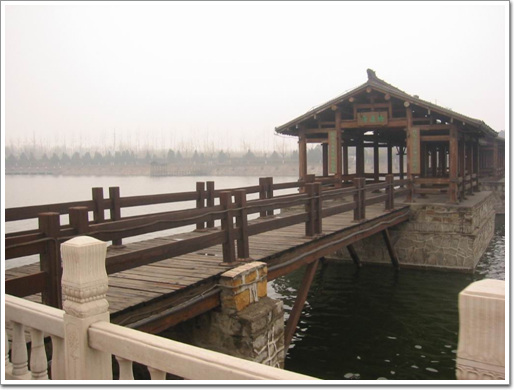

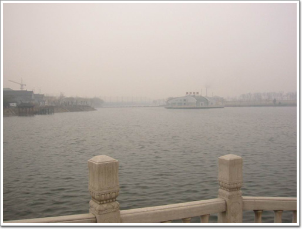

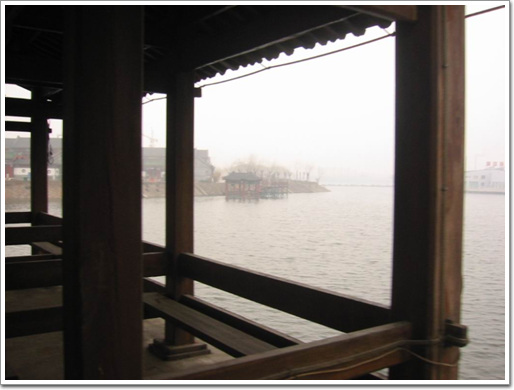

호수 중앙을 가로지르는 나무 다리가 있는데, 간만에 본 전통적인 모양이었다.

식사를 하러 들어간 곳은 중국영화에서 늘상 보아오던, 2층짜리 목조건믈로 황비홍이 날라다닐만한 건물이었다. 정통 중국 요리는 맛있더군.

식사를 마치고 나갈 때 배웅하는 종업원.

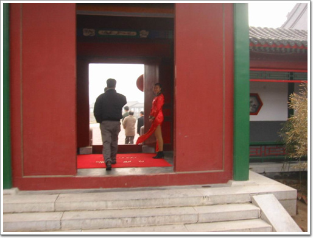

아주 절묘한 타이밍으로 바람에 날리는 모습이 찍혔군요…

