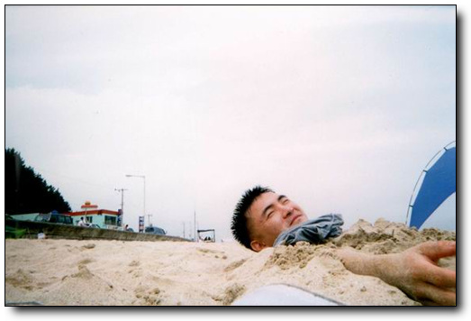
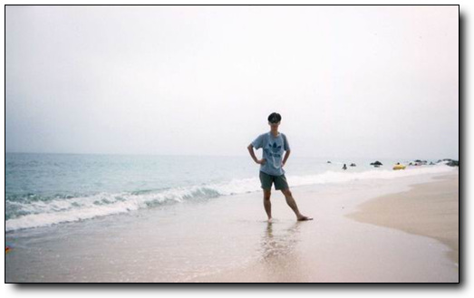
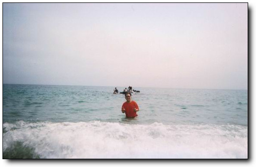
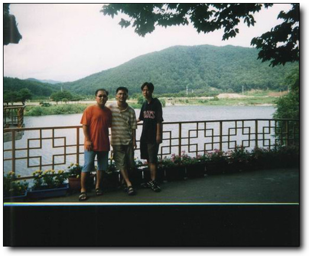
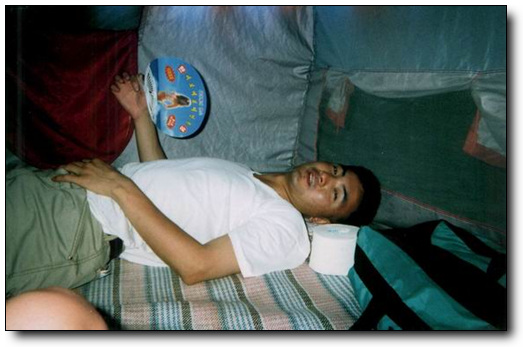
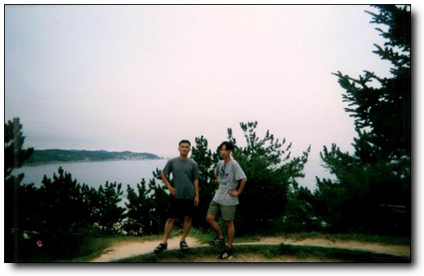

# 수박 쥬스

5일동안 전국을 8년된 록스타로 일주하는 무모한 여행을 성공적으로 마치고 살아 돌아왔습니다.

장난감을 사고 나서 꼭 하려고 했던 게, 전국 일주였었고, 여름휴가를 중국으로 가보려던게 무산되어 당장 실행에 옮기기로 하고 8년된 록스타를 몰고 남한의 북에서부터 동해, 남해, 서해를 완전히 돌아보기로 하여, 여행 계획을 세웠지요. 처음 세웠된 계획이 연천, 철원, 고성, 울진, 광안리, 남해의 취도, 해남 땅끝 마을, 서해 바닷가 였지요. 참으로 거창한 계획이었지요.

이 계획을 내 대학 동기들에게 말을 하니, 제발 살아서 돌아오지 말게나 하면서 술을 사주더군요. 절대 술 사줄 친구들이 아닌데.. 그래서 휴가 출발 하루 전 새벽 두시까지 술을 마시고, 회사 출근하였지요. 그 날, 그러니까 8월 14일 저녁 회사 일과 끝나고 곧바로 출발하기로 하였지요. 차가 퍼지면 뒤에서 밀고, 앞에서 끌어줄 힘센 장정 두명을 태우고. 중학교때부터 친구들인데, 둘 다 그다지 삶에 미련에 없어 보여서 같이 갔지요.

저녁 7시 반 잠실운동장에서 출발하여, 애초의 계획대로 3번 국도를 타고 연천으로 향했습니다. 내 청춘이 스며있던 연천이라 무척이나 설레이데요. 의정부, 동두천, 덕정을 거쳐 한탄강이 유유히 흐르고 있는(밤이라서 유유히 흐르는지는 보이지 않았지만, 아마도 그럴거라고 믿습니다.) 전곡에 들어섰을 때의 그 감회란 더블백을 메고 자대로 처음 들어갔을 때의 그 느낌 그대로였습니다.

임진강 줄기를 따라 죽 올라가니, 꼭 폭격맞아 부서진 것 같은 화이트교가 그대로 있었고, 거기서 잠깐 발을 담그었을 때가 밤 10시. 그리고 곧장 철원으로 갔습니다. 연천까지는 그래도 피서객들이 조금 있었는데, 철원 가는 길은 그야말로 인적이 뚝 끊긴 정적만이 감돌더군요. 어두컴컴하고, 게다가 날도 흐린 날이라 별도 달도 없어, 꼭 귀신이라도 나올 것 같더군요. 특히나 나같은 독실한 샤머니스트들에겐 참으로 음산한 기분이 들게끔 하더군요.

철원을 지나 예전 근무했었던 화천의 27사단 78연대 2대대 근처의 계곡가에 멈추고 첫밤을 맞이하려고 했는데, 근처에서 고양이 울음소리 비슷한 짐승소리가 들리고 하여, 친구들이 반대를 하더군요. 무슨 훈련 나온 것도 아니고, 뭐 이런 데서 야영을 하냐고 하면서 말이죠. 그래서 풀던 짐을 다시 꾸리고 동해로 향했지요.

동해까지의 국도라서 그런지 정말 길이 꾸불꾸불 산길에, 왜 그리 멀던지.. 양양 근처의 휴게소에서 저녁을 국수로 사먹고, 출발을 하려고 보니, 잘 나오던 헤드라이트가 안 나오더군요. 여행 시작 하루만의 첫 고장. 그래도 엔진이 안 선게 참 다행이란 생각을 하면서, 그대로 가기로 했지요. 전조등 대신 조수석 앉은 친구가 후라쉬를 창 밖으로 빼꼼이 빼서 전방을 비추면서 갔지요. 후라쉬로 앞을 비추고 가니, 꼭 TV에서 보던 그 생각이 나더군요. 내셔널지오그래피같은 프로그램에서 사반나의 야행성 짐승 야간 사냥 장면을 찍기 위해서 밝은 불빛을 짐승에게 향하면서 열나게 쫓아가며 추격하듯이 찍던 그런 모습이. 그런데, 그것도 한 한 시간정도 하고 나니, 후라쉬로 전방을 비추던 친구가 도저히 자기는 삶에 집착을 못 버려, 이 짓 못하겠다 하여, 도중 차를 세우고 해 뜰 때까지 차에서 눈을 감고 잤습니다. 이렇게 내 여행의 첫 밤을 보냈지요. 그래봤지 새벽 3시 자서 5시에 일어났으니, 두시간 잔 거 밖에 안되지만.

여명이 시작되자 마자 출발하여, 드디어 동해 도착, 해안도로 7번 국도를 타고 좌측의 바닷가를 구경하면서 죽 내려왔습니다. 아침의 바닷가는 참 좋더군요. 바다바람도 시원하고, 해안선을 따라 죽 쳐져 있는 철조망도 멋있고.

--모래밭에 머리를 내밀고 있는 흉측한 내 모습

경포대에 도착하여, 백사장을 거닐었습니다. 아니나 다를까 뉴스에서 보았던, 깨진 병들도 몇개 있었고, 과자 봉지들도 많더군요. 하지만, 모래사장에 널부러져있는 젊은이 없더군요. 바닷물이 차가워져서 인지, 사람들이 바글바글 대지는 않았지만, 그래도 사람들은 많더군요.

거기엔 번지점프대가 설치되어 있어, 값이 싸면 한번 뛰어 볼까 했는데, 한번 하강에 2만원. 없는 살림에 너무 비싼 돈이라, 그냥 번지점프하는 사람들만 밑에서 구경하기로 했습니다. 비싸서 그런지 타는 사람들이 없더군요. 기다리리기를 한 30여분. 20대 초반의 젊은 여인이 번지 점프대에 올라섰고 뛰어 내리더군요. 출렁거리는 줄에 매달린 여인을 보는 사람들은 마냥 즐거워하였고, 그 여자 끈을 풀고, 땅에 발을 내 딛었을 때, 남자 친구를 보이는 사내를 무지막지하게 두들겨 패더군요. 흡사 엽기적인 그녀에서 전지현이 차태현을 두들겨 패던 그런 모양으로 두들켜 패던데, 그 것 구경하는 게 어찌나 재밌던지.. 그 남자도 참 한심하지, 뭐라고 2만원씩이나 주고 여자친구 태워 몰대만 맞는지.. 그냥 지 혼자 타고 즐거워 할 것이지..

--여기가 아마 경포대인가, 아마 그런 것같군요..

\-\- 동함과 함께 같이 한 인수, 둘 다 경주에서 도주를 했지요..

점심 때쯤 되어 경포대를 떠나 정동진으로 향했다. 실은 정동진을 향한게 아니라, 그냥 7번 국도 타고 내려가다 보니, 정동진이 보였고, 거기에서 잠시 멈춘 거지만. 별 기대를 한 것도 아니지만, 그 별 기대안한 그 생각마저도 무참히 깨 버리더군요. 조그마한 기차역이 있었고, 그 주위엔 온갖 모래시계들만 파는 노점상들만이 보이더군요. 야광모래시계, 형광모래시계, 수공예모래시계 등등.. 그 근천에 조각공원이 있었는데, 거기에 있는 크루져 배보양의 건물만 멋있더군요.

그리고 나서 또 밑에서 계속 내려가 울진 밑의 망양 해수욕장에 짐을 풀고 텐트를 쳤습니다. 경포대에 비해 너무나 사람이 없더군요. 비키니는 한명도 없었고, 탱크탑 입은 여인 딱 한명만 보여 나와 내 친구들에게 아쉬움을 안겨주었습니다. 척박한 바닷가였습니다. 그래서 근처의 성류굴 구경좀 하다 다시 돌아와, 바닷물속에 들어가 물장구 좀 치고 나니, 왜 그리 피곤하던지, 라면 하나 끓여먹고 나서 저녁까지 죽 잤지요.

--여기가 석류굴 입구.

저녁은 울진 읍내로 나가 짜장면 사먹었고, 읍내 구경좀 하다보니, 입술에 좀 부자연스러워 거울을 보니, 입술에 물집이 생겼더군요. 노는 것도 과하게 놀면 피곤하는지, 이런 것도 다 생기고,. 약국에서 연고하나 사 바랐지요. 바크로비인가 하는 그 입술연고 정말 비싸더군요. 그 조그만게 4000원씩이나 하고.

n 이거 완전히 거지의 모습이군요. 텐트에서 자는데, 높은 기온에 축축한 공기, 그리고 달려드는 모기에 잠들기는 쉽지 않더군요.

동쪽 땅끝에서 일출을 보기로 하고, 새벽 두시에 일어나서, 또 죽 내려갔지요. 새벽이다 보니, 차가 없기는 없더군요. 포항까지 가는 동안, 마주치는 차가 거의 없었으니까. 우리나라 지도를 보면 호랑이 꼬리에 해당하는 부분이 있지요? 거기가 바로 장기곶, 일명 호미곶이라고 하는데, 우리나라에서 가장 해가 먼저 뜨는 곳이라고 하더군요. 구룡포를 지나 한 30여분 가니, 드디어 호미곶. 등대가 있고, 해돋이 광장이 있고, 앞 바다에다가 손모양의 큰 조형을을 박아 놨더군요. 떠오르는 해를 그 손으로 잡겠다는 뜻인지는 잘 모르겠지만.. 너무 안개가 많이 껴 해뜨는 광연은 못 보았지만, 대신 암초 경고를 알리는 경고음은 들었습니다. 소리가 정말 크더군요. 근처 지나가는 선박에서 암초 있음을 경고하는 것인데, 처음 그 소리를 들었을 때, 뭐 건물 무너지는 것인줄 알았습니다. 그 큰 소리를 내기 위해 발전기 두대로 소리를 내던데, 그 소리 한 번 날 때마다의 근처에 있는 자동차들은 일제히 도난경보기 음을 내어, 마치 탬버린과 캐스터내츠 짝짜꿍을 이루듯 하모니를 이루더군요.

호미곶을 뒤로 하고, 신라의 수도의 경주로 갔습니다. 석굴암, 불국사를 보기 위해 토함산에 올랐었는데, 토함산 좋더군요. 인라인스케이트타기에. 아니나 다를까 그 경사에 인라인스케이트를 타는 한 무리도 볼 수 있었는데, 정말 보기 좋더군요. 토함산 중턱에 좍 깔린 구름이 있어, 구름위에서 올라와 있다는 그 기분도 참 좋았구요. 불국사는 예전 수학여행때 갔었기 때문에, 별 다른 점은 없어보였고, 대신 불국사에서 석굴암까지 올라가는 등산로가 돌로 깔려 있고, 좌우로 아름드리 나무가 촘촘히 있어, 산림욕을 하듯이 천천히 걸으니, 비록 이틀간 샤워안한 몸이긴 하나 깨끗해진 듯 했습니다.

\-\- 도주하기 전 동함의 포즈

아침을 먹기 위해 찾아 간 곳이, 동국대 경주캠퍼스. 그곳 학생식당에서 1800원짜리 곰탐을 사 먹었는데, 정말 맛있고, 다들 그 맛에 감동을 하더군요. 여행시작 후 처음으로 먹어보는 쌀밥이었거든요. 그 다음 문무왕이 만들었다던 안압지가서 못을 구경하는데, 어찌나 햇살이 뜨겁던지, 그냥 그늘에서만 있다가 경주 시내로 들어와, 휴가일정이 다 끝난 두 친구를 버스 태워 보내고, 나 혼자의 여행을 계속했습니다. 박경모씨가 강력 추천하던 광안리로 가기 위해 13번 도로를 탔고, 부산 근처의 양산이라는 곳의 기사 식당에 들어가 4000원짜리 점심을 먹고, 커피 두잔 뽑아 먹고, 잠시 쉬고 있으려니, 샤워장도 있더군요. 나 같이 안 씻고 다니는 기사들을 위해 기사 식당에서 무료로 제공하는 샤워장이더군요. 얼씨구나 하며 들어가 그 동안의 묵은 때를 몽땅 벗겨내고 나니, 아드레날린이 솟아 나는 듯 하더군요. 부산도 참 차가 많고, 많이 막히더군요. 광안리 앞에 무슨 현수교를 만들고 있었고, 광안리 또안 사람으로 북적대지는 않았지만, 그래도 비키니들도 많이 있고, 다정스레 서로에서 오일을 발라주는 연인들의 모습들도 보여, 찾아온 보람을 느끼게끔 했습니다.

여행의 목적이 전국일주인 만큼, 아쉬운 광안리를 뒤로 하고, 2번 국도를 타고 진해로 향했고, 진해 항구에 잠시 멈춰, 항구를 보니, 커다란 배들이 많고, 군함들이 많이 보이더군요. 해군의 도시라서 그런지 해군들이 많이 있었고. 마산에 들어서니, 놀란게 마산에 이렇게 많은 차들이 있다는 사실에 놀랐습니다. 세상에 퇴근길 서울만큼이나 많이 막히더군요. 마산 시내 통과하는데만 1시간을 소요하고 나니, 마산에 대한 정이 사라져 곧장 진주, 통영을 거쳐 광양에 들어섰고, 광양 제철소의 굴뚝들을 보면서 저게 바로 제철소구나 하며 한번 중얼 거린 후, 순천을 지나 벌교로 갔습니다. 벌교 도착하니 밤 12시.

벌교. 태백산맥의 주 무대지요. 그 유명하다던 벌교다리를 한번 걸어보았는데, 역시나 밤이라 눈에 별로 보이는 것도 없고, 그냥 낡고 오래되고 짧은 도로이더군요. 장거리를 달린 차가 힘들어하는 기색을 보이길래 벌교에서 세째날 밤을 잤습니다. 물론 차안에서 신문지 덥고.

네째날, 금요일 아침이 시작되었고, 내가 고향이라고 생각하는 섬 취도로 갔습니다. 전남 고흥군 포두면에 있는 조그마한 섬이었고, 그 곳의 오취초등학교에서 3학년까지 있었지요. 여름이면 바닷가 개펄에서 헤엄치고, 겨울이면 산에서 칡캐어 먹고, 칡 덩굴로 밧줄 만들어, 타잔놀이 하고 놀았던 그 곳. 하루두번 배가 있었고, 썰물때는 개펄을 걸어 육지로 나올 수 있었는데, 지금은 다리가 만들어져 있었습니다. 아직 포장되지 않은 도로였었고, 마을 앞까지만 차가 다닐 수있고, 나머지는 경운기만 다닐 수 있는 길이라, 전륜구동으로 전환을 하고 오프로드로 달렸지요. 산 꼭대기 근처의 밭까지 나있는 경운기 길을 따라서. 전륜 구동이 좋긴 좋더군요. 수풀을 헤치고 달리는 그 기분 째지더군요. 도중 바퀴 두개다 통째로 구덩에 빠져 헤어나오지 못하고 있어 망연자실해 있을 즈음 나타난 경운기 아저씨. 그 아저씨, 아니 그 할아버지의 경운기에 줄을 메고 간신히 탈출할 수 있었습니다. 창문을 닫고, 에어콘을 켜니, 나오는게 뜨듯한 바람. 구덩이에 빠질 때의 충격으로 에어콘 냉매가 다 새어버린 모양인데, 어쩌겠어요. 그냥 에어콘없이 살아야지.

초등학교를 찾아갔습니다. 그 곳을 떠난지 18년이란 세월이 흘렀지요. 학교 정문 앞 표말에 적히 폐교라는 글자와 99년 2월 학생 9명을 마지막 폐교되었다는 글을 읽고 나니 참 서글퍼지더군요. 내 학교가 사라졌다는 사실이. 운동장과 교실 주위는 허리춤까지 오는 잡풀들도 무성한게, 어찌나 인생 무상을 느끼게끔 하던지..

학교 관사 근처에 큰 바위가 있었는데, 예전 그곳에 살았을 때 저녁이면 아버지, 어머니와 산책을 하다가 그 바위에 셋이 나란에 앉아 선착장 바닷가를 바라보곤 했었습니다. 낮동안 받은 열로 바위는 뜨듯하고, 저녁 바닷바람으로 참 선선했었던 기억이 있어, 그 예전의 기억을 되살리고자 그 바위에 올라 누웠는데, 어찌나 뜨거워 등이 다 익을 정도였고, 햇살또한 너무나 강렬하여 눕자마자 다시 일어섰지요.

마을로 내려가 내 예전 학교 친구들의 행방을 물어보았습니다. 용노, 옥노, 권율... 다들 섬을 떠났다고 하더군요. 하긴 그 젊은이들이 먹고 살기 적당한 섬은 아니었으니까요. 어린이와 젊은이들은 없고, 노인들만이 지키고 있는 한적한 섬으로 바뀌어 있었습니다. 지금은 마을 이장인 아버지의 친구를 찾아뵙고, 지나온 삶을 반추하는 담소를 나누었지요. 참 아름다운 섬입니다. 봄소풍, 가을 소품을 근처 무인도로 가서 놀던 시절이 참 그리워지더군요.

계속 남해안을 따라 보성으로 갔고, 거기에 있는 차밭을 갔습니다. 유명한 곳이지요. CF에서 많이 등장하는 차밭이 바로 그곳입니다. 동자승을 태우고 자전기를 타는 CF가 그 장소인데, 관광지가 아닌, 일반 농장이라서 그런지, 일반 관광지에서 흔히 보이던 "들어가지 마시오, 차나무에 손대지 마시오, 휴지를 버리지 맙시다" 등등의 경고성 푯말들은 하나도 없었고, 관리인도 보이지 않았고, 그냥 일하는 아주머니들도 구경하는 사람들을 전혀 의식하지 않고 자기의 일하는 모습들이 참 인상적이었습니다. TV에서 보던 그 느낌 그대로더군요. 차 밭 맨 위로 올라가니, 산 아래로 죽 펼쳐져 있는 차나무 들과, 남해의 바다와 조그마한 섬들까지 한눈에 보이더군요.

그 날 저녁은 고흥에 있는 외할버지 집으로 가서 잤는데, 여행 시작한 후 처음으로 건물에서 잠을 자니 비록 더운 날씨긴 해도 편안하니, 피로가 싹 풀리더군요.

다섯째 날, 토요일 아침이 밝았고, 해남 땅끝마을을 보고, 서해안으로 갈려고 했는데, 경운기가지고 놀다가 일정이 차질을 빚고 말았지요. 경운기 시동을 걸기 위해서 크랭크 축을 돌리는데 그 돌리는 손잡이가 튕겨져 나와 내 얼굴을 타격하였고, 비틀거리며 방안으로 들어가, 오전 내내 해롱해롱 대며 누워있었지요. 충격이 뇌까지 전달되었는지, 뇌까지 띵한게.. 정신 차리고 거울을 보니, 얼굴 왼쪽이 탱탱 부어있고, 기스도 조금 나 있더군요.

일정을 정리하고, 서울로 상경하기로 했지요. 서울 간다는 말에 외할아버지는 원당사는 외삼촌사는 집에 한번 가야겠다 하구선, 차에 쌀 세가마니와, 온갖 농산물을 싣고, 원당으로 갔습니다. 에어콘 고장난 덕택에 창문을 활짝 열어 젖힌채 고속도로를 달려고, 할아버지는 윗옷을 벗고, 런링 차림으로 여신 부채질만 하셨고, 도착하여 차에 내리니 "야, 이눔아 너 차를 타고 오니, 외리 온몸이 뻐쩍지근하냐" 하시더군요.

서해를 못보고 온게 못내 아쉬어, 인천에 들러 서해의 바다한번 보고 나서 집에 도착하니, 일요일 새벽 2시.

원래의 계획에 조금 못 미치었지만, 그래도 북쪽부터 시작하여, 동해, 남해, 서해를 다 들러 보았지요.

이렇게 해서 무모했던 전국일주가 끝났습니다. 지금 생각하기에 내가 일주일만 더 늙었어도, 못할 것 같은 짓을 한 것에 못내 뿌듯합니다.

이렇게 5일간 전국을 돌 수 있더군요. 계산해보니 5일간 총 수면시간이 17시간. 지금 생각해보니 노는데 환장한 사람같군요.

[null](../6166985.html#6166985_1)

