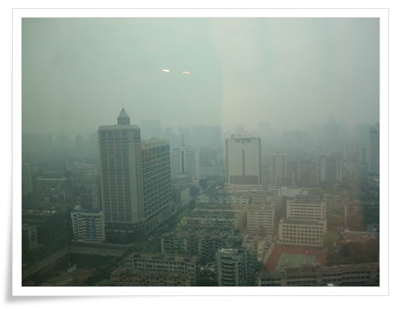

# 회사의 내 책상

광저우에 왔지만, 바쁜 일정으로 바깥 구경갈 기회가 없었지요.

어제 하루 늦게 출근하자고 하여, 이때다 싶어, 아침을 먹자마자 나갔지요.

사람구경을 하기 위해, 가장 사람이 많은 광저우역으로 갔지요.

예상보다 사람이 별로 없더군요. 난 엄청 많을 줄 알았는데, 예상보다 적더라구요...

여기가 광저우 역

그리고 사람들이 기차탈려고 기다리는 사람들.

그런다음 광저우에서 제일 유명한 공원이 웨슈공원이라 길래 거기로 갔지요.

걸어서 한 15분 정도 가니까 나오더군요.

여기가 입구

이게 공원 안내도고

공원안에 있는 호수의 풍경들

공원안에 있는 박물관이 있어 들어갔어요.

공원입장료 5원과는 별도로 6원의 입장료를 따로 받더군요.

들어가니, 제일 먼저 광저우가 얼마나 큰지 알려주는 것인지 나타내는지. 알려주는 모형이 있더군요. 정말 크긴 크더군요. 한 서울정도 되는 것 같아요.

그리고 11층짜리 기념탑. 내부는 3층까지만 올라갈수 있게 해놨더군요.

공원안은 사람들 사는 냄새가 풋풋나더군요. 제기차는 사람들도 있고, 태극권하는 할머니들도 많고, 춤 연습하는 사람들도 많고..

웨슈공원에서 제일 유명한, 광저우의 상징인 5양석상이라는 있어서, 기념으로 한방 찍었죠. 11m라는데, 그다지 멋은 없어보이는데, 이곳에 제일 사람들이 많더군요. 이 5마리 양이 뭔가 하니, 광저우에 벼를 가져다 주어, 사람들에게 쌀 재배를 하게 해주었다는 양이라네요..

밑에 같이 찍힌 여인네는, 아마도 시골에서 올라온 관광객인 것 같은데, 어쩌다 보니, 같이 찍혔네요..

다음 케이블카를 타고, 광저우에 유일하게 있는 산인 백운산에 올라갔어요.

아무래도 백운산에 올라가면 광저우시내가 한 눈에 보일 것 같아서..

택시를 타고, 그리고는“칭따이워취바윈샨”하니까, 제대로 못 알아듣더군요. 좀더 중국어 공부를 열심히 해야겠더라구요. 지도를 폈죠. 그리고 손가락을 가르켰죠. 이쪽으로 가달라고..

케이블카는 편도 20위안, 왕복 25위안이더군요.. 왕복을 끊었죠. 올라갔으면 내려와야하니깐.

아래가 케이블를 타고 내려다본 백운산 입구. 그리고 올라가면서 찍은 산의 모습들.

올라가다보니 옛날 건물들도 보이는게 좀 있고..

10여분만에 올라온 케이블카 종착점.

휴일이라서 놀러온 사람들이 많더군요.

이게 백운산의 약도

끼리끼리 놀러온 사람들의 모습들이 꽤 정겨워 보이더군요. 소풍갔을 때 하던 장기자랑 같은 것들을 하던데, 그럴땐 지나가던 사람들이 같이 보면서 웃고 그러는 게 좋아보이더군요.

정상에 있는 군사시설물

무슨 전망대 같은데, 스모그로 인해 보이는 것은 없더라구요.

그래도 정상에 무슨 야외레스토랑이 있는데, 여기서 차 한잔 마시면 꽤 괜찮을 것 같던군. 차마실 시간은 없어, 그냥 지나쳤지.

놀러온 사람들이 다들 이런 폼으로 간식을 먹더군. 우리나라같으면 김밥을 먹을텐데, 여기는 중국식 호떡을 먹더군.

시간이 어느덧 11시를 초과하여, 내려갈려고 하는데, 이쪽 길로 가도 케이블카 타는 데가 나올 것 같아, 내려갔지. 좍 깔려있는 아스팔트 길을 보면서, 인라인 생각이 간절하더군. 천예의 다운힐 코스인데 말야..

이곳 여자들은 다들 하나같이 몸매들이 좋더군. 그래서 몸매 좋은 여자 사진한장 찍을 려고 주위의 여자들을 살폈는데, 때 마침 여자들은 안보이던군. 그래서 아무나 찍은 게 이 사람들.

10여분을 내려갔는데, 케이블카 타는 데 없고, 다시 원래대로 올라가서 오던 길로 다시 가기도 참 애매한 위치에 있어, 그냥 뛰어 내려가기로 했지. 12시까지는 호텔에 도착해야 할텐데 하면서..

그런데 밑을 보니깐, 참 까마득하더군. 꽤 멀더군.

길은 이렇게 굽이굽이져 있고, 저 아래 내려다 보이는 거리는 이렇게 줌으로 땡겨보아도 꽤 멀어보이던데..

아뭏튼 뛰었다. 한 20여분을 뛰었을까? 웬 널따란 곳이 나오길래, 이제 거의 다 왔나보다 했었다. 그런데 표지판엔 서문 8.5km 라고 씌여있는 것이 아닌가?

앞에 보이는 안내도에 8.5 km라고 써져 있었다.

삶에 회의가 드는 순간이었다. 어찌할 도리가 없었다. 마냥 뛰는 수밖에, 그 많은 사람들중에 정상복에 구두를 신고 뛰는 사람은 나 밖에 없었다. 암튼 뛰었다. 30여분을 줄기차게 더 뛰었다. 그렇게하여 내려온 곳이 올라왔던 곳의 반대편. 백운산 서쪽이었다. 택시를 타고 호텔에 들어오니, 12시 반. 스탠리는 이미 소텍으로 떠나고, 허겁지겁 짐을 챙겨 소텍으로 향했다.

왕복으로 끊은 케이블카표가 아깝다. 편도밖에 못썼는데..

내가 있던 호텔에서 바라본 바깥 풍경

내가 광저우에 있는 동안 일했던 곳, soutec 공장

나의 작업장. 맨 오른쪽 화면의 노트북이 제꺼입니다.

중국에서 파는 펩시콜라는 이렇게 생겼지요.

