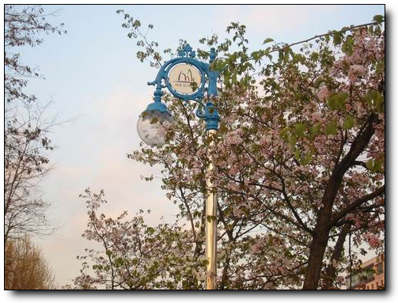

# 지난 일기장을 본다

- 2009/03/21 23:30

회사가 한강에 가까이 있습니다. 그래서 매일 저녁시간이면 한강으로 갑니다. 뭐 운동이라는 목적보다는, 그냥 하루 종일 사무실에서만 있다보면, 답답하게 그 답답함이 내 자신을 참 재미없게 만들어버려, 그것을 타개하러, 일부러 바람을 쐬려는 마음에서라도 한강에 갑니다.

몇주전까지만 해도, 황량한 길이었는데, 어느덧 새순이 돋아나고, 봄이긴 봄이나 보다 하고 생각을 합니다.

높이 쌓아 올린 제방 둑에 꽃도 피고 하여, 제법 사람사는 곳 같네요.

이 길로 주욱 가면, 7호선 고속버스터미미널, 센트럴씨티로 가게 되죠.

오늘따라 도로가 한산하네요..

길을 걷다보면, 그래도 가장 걷기 좋은 길이 바로 이 길입니다. 산책로가 꽤 잘 만들어져 있거든요. 왼편으로는 초등학교도 있고, 나무 고아원도 있어, 숲이 있지요.

잠원초등학교인데, 담이 없더군요. 그래서 이 운동장을 가로질러 자주 가기도 하죠.

가로등 중에는 서초구의 가로등이 제일 보기 좋은 것 같아요. 뭐라까 나무랑 잘 어울리죠..

회사에서 한강쪽가면 바로 나오는게, 반포지구에 있는 이 인공섬입니다. 유채꽃이 심어져 있는데, 다음 달이면, 화사한 노란색벌판이 되겠네요.

아직은 한산한 섬 주변.

날씨는 맑은데, 공기가 그리 맑지 못해 강넘어 북쪽엔 아파트만이 뿌옇게 보이네요.

고개를 오른쪽으로 돌려봐서, 시원스런 풍경은 아닌, 광저우처럼 스모그만이 보여, 왠지 우중충해 보이는군요.

[null](../6166980.html#6166980_1)

