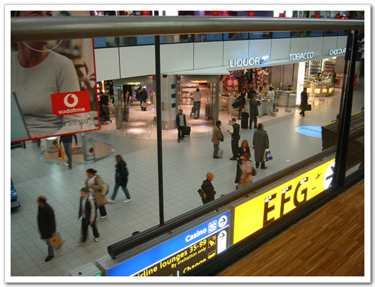
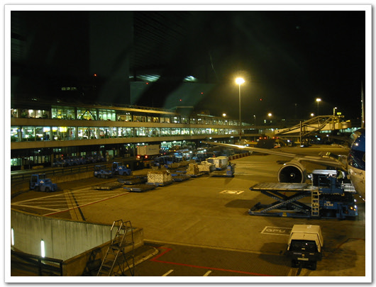

# 온라인앨범 사이트 버블쉐어가 문 닫는군

이집트를 가게 됐다. 가기 하루 전 결정되어 부랴부랴 비행기표 예약하고 갔다. 대한항공에서 카이로까지 가는 직항이 있긴 한데, 그건 목요일 밤에 출발하는 거라, 수요일 바로 출발하기 위하여, 암스테르담을 거쳐가는 네덜란드 항공을 타게 되었다.

이집트의 통화는 이집트 파운드다. 1파운드가 200원 정도된다. 공항 지하 외환은행에서 환전하면 수수료가 싸다고 하여 공항 지하로 갔다. 현금이 13만원 밖에 없어 13만원 어치만 환전을 했다. 이집트 돈이 별로 없어서인지 이집트 돈이 있는지부터 확인한 다음 창고 들어가서 돈 꺼내고 하느라 환전하는데 10여분 넘게 걸렸다. 씨티카드로 5만원을 더 찾아 2층에서 환전을 하려는데, 다들 이집트 돈은 취급안는다고 하더군.

13시 30분 출발하는 비행기다. 네덜란드 항공이 KLM 이고, 편명은 KL로 시작하더군. 내가 탔던 게 보잉 747 비행기였고, 내 자리는 33G, 통로석이다. 장시간 비행이라 통로석으로 달라고 했다. 내 자리 뒤에 화장실이라 조금밖에 안젖혀지는 자리인데, 그래도 의외로 그리 불편하지는 않은 편이었다.

-암스테르담까지 나를 실어준 비행기

비행시간은 암스테르담까지 11시간 반. 암스테르담에서 환승하느라 두시간, 그리고 이집트 카이로로 4시간하여 총 18시간이 소요되는 긴 시간이다. 그래서 난생 처음으로 비행기내에서 세끼를 다 먹어봤다. 점심, 저녁, 밤참. 이렇게 세번.

점심은 스테이크가 나오더군. 여기서 김치와 고추장이 따라 나오더군. 밥도 안주면서 김치와 고추장을 왜 주는지 이해가 안되었지만, 평소 기내식은 남기지 않고 다 먹기에, 스테이크를 썰어 고추장에 찍어먹기도 하고 김치에 쌈도 싸먹었다.

\- 점심 메뉴

저녁은 암스텔담 도착 3시간 전쯤 나왔다. 이번엔 닭고기밥이다. 맛있었다. 이 네덜란드 항공은 자세가 된 것 같다. 중국항공은 밥도 부실하고, 불친절하고, 한국어 설명도 전혀 없는데, 이 항공은 방송도 한국어로 해주고, 화면에도 한글자막이 나오고, 우리나라 뉴스도 틀어주더군. 그리고 이 한국반찬과 녹차가 주니 말이다.

저녁 먹은 후 두시간 쯤 후, 또 한번 간식이 나오더군. 라면과 아이스크림 중에서 뭘 먹겠냐 하길래 아이스크림 먹었다.

\- 저녁 메뉴

11시간 반 후, 그러니까 우리 시간 새벽 한시반, 네덜란드 시간 17시 30분에 도착하였다. 환승까지는 두시간이 남았기에, 공항 구경을 조금 했다. 여긴 허브공항이라 그런지 입국하는 사람들과 출국하는 사람들이 섞여 있었고, 여기저기 잘 되어 있어 보였다.

-환승하러 가는 길

\- 공항내 인터넷을 사용할 수 있는 곳. 사람이 많아 못해봤다. 15분에 3유로.

\- 역시 공항 내부. 난 이 자리에서 노트북 충전하고 있는 중이다.

\- 카이로로 가는 내가 탈 비행기

\- 나랑 같은 비행기 탈 사람들

19시 30분 카이로발 비행기를 탔다. 잠 좀 자볼까 하고 음료수 줄 때 레드와인달라고 하여, 레드와인 반잔을 먹으니 만취상태가 되어 정신이 해롱해롱하더군. 그래도 기내식은 먹고 자기 위해 강렬한 의지로 잠을 안자고 버텨 기내식 먹은 후 잤다. 기내식은 닭고기와 스파게트중 뭘 먹겠냐 하길래 닭고기를 골랐다.

\- 레드와인. 저 컵으로 무려 반잔이나 먹었다.

\- 밤참 메뉴

이집트 시간 새벽 1시, 우리시간 오전 8시, 드디어 카이로에 도착했다. 비자를 15달러에 사서 붙이고, 입국심사대를 거쳐 나왔다. 마중나오기로 했던 김문호씨를 찾았으나 안보여, 택시를 타고 갔다. 역시 이 곳도 수많은 택시 삐끼들이 있더군. 그중 한국말로 감사합니다를 할 줄 아는 삐끼를 골라 택시를 탔다. 내가 묵을 매리어트 호텔까지는 75파운드가 들었다.

매리어트 호텔은 나일강 근처에 있더군. 체크인을 하고, 방에 들어와 짐을 푼 다음 여자친구에게 전화했다. 정신이 혼미한 상태라 덧셈 계산을 잘 못해, 여기시간 두시 반이 한국시각 7시 반인줄 알고 여자친구에게 일어나라고했는데, 지금 생각해 보니 그 때가 9시 반이었더군.

\- 내 방. 1236호. 즉 12층이다.

\- 야경도 쥑인다. 저 강이 나일강인가 보다.

\- 해뜰 무렵의 모습. 시차 적응이 안되서, 잠은 못 잤다.

