# 가산동 맛집 - 정성본샤브칼국수

알아자르와 칸엔칼릴리 시장

인터넷상에서 추천하는 카이로내의 명소가 콜틱카이로와 시타델, 알아자르와 칸엔칼릴리 시장, 이집트 박물관 등이 있었다.

알아자르로 가보기로 했다. 알아자르는 10세기에 세워진 최초의 피라미드 형태를 한 사원이며 이슬람 교리를 배우는 곳으로도 가장 오래되고 중심적인 역할을 하는 곳이라 한다.

이번엔 택시를 타고 가보기로 했다. 또 미리 카이로의 택시비가 얼마인지 이전 여행기를 봐 보았다. 가까운 거리면 은 3~5파운드란다. 1년 반이 된 여행기지만, 대충 그 정도 되겠지 하며, 택시를 잡고, 알아자르까지 얼마냐고 하였다. 13파운드란다. 이거 바가지구나 하며 3파운드 불렀다. 무조건 13파운드란다. 흥정을 하는데, 뒤에서 차가 빵빵거려 우선 차를 타고, 20여 미터 갔다. 그래 5파운드까지 봐주겠다고 하고, 5파운드를 불렀는데, 여전히 13파운드란다. 그래서 내렸다. 안 잡더군.

다시 길에서 택시 하나를 세웠다. 알아즈라까지 얼마냐 물으니 10파운드란다. 5파운드 OK? 하고 물어보니, 대답도 않고 갈려는 게 아닌가? 인터넷에서 본 정보들이 왜 맞는 게 없는 거야 하면서, 그냥 그 택시를 탔다. 알아자르까지는 그리 가까운 거리는 아니더군. 한 30여분 간 것 같다.

여기는 호텔주변 도로 상황과는 비교가 안되었다. 우리나라 남대문 거리랑 비슷했다.

후세인 모스크가 알아자르 바로 앞에 있는데, 후세인 모스크도 꽤 유명한 모스크다. 라마단 기간이라 라마단을 나타내는 천막이 있었고, 그 안에 뭔가 라마단을 위한 자리가 있는 모양이었다. 내가 갔을 때 예배시간이 시작하는지, 사람들이 들어가고 있었다. 골목골목 울리는 경읽는 소리가 무슬림도 아닌 나에게까지 경건함을 갖게 하더군.

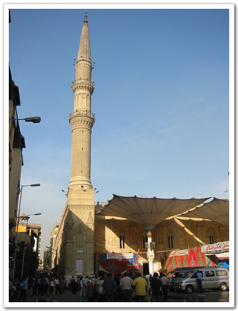

-후세인 모스크. 가장 유명한 모스크중의 하나란다.

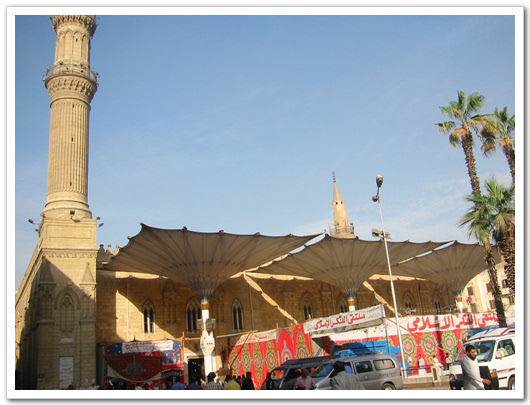

-모스크 앞의 위로 펼쳐진 모양이 인상적이다.

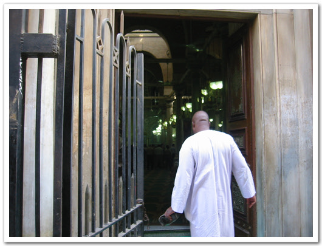

-예배 시간이 되어, 예배 드리더 안에 들어가는 사람..

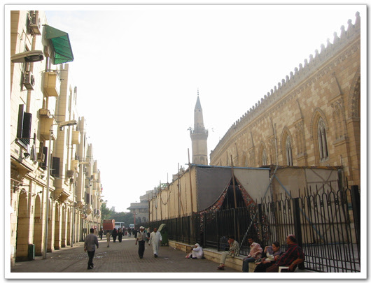

-모스크 옆 길

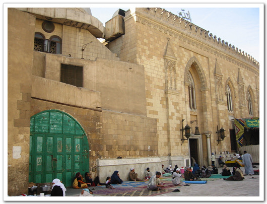

-모스크 밖에도 사람들이 자리를 깔고 기도를 하고 있었다.

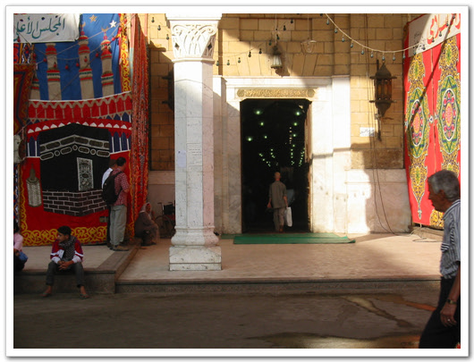

-앞에 있는 천막. 라마단 기간 중 해가 지고 나면, 이 천막 안에서 다 같이 식사를 한다고 한다.

후세인 모스크 옆으로 아랍 최대의 시장이 있는데, 그게 칸엔칼릴리 시장이다. 보니, 동대문보다 조금 더 큰 듯 했다. 내가 또 시장을 좋아하다보니, 시장구경을 하였다. 뭐 신기한 장난감 없나하고..

규모가 큰 시장이다보니, 외국인들도 상당히 많았다. 이집트 가이드북이 있으면 대충의 가격을 미리 좀 알 수 있을까하고 아쉬웠다. 시장에도 삐끼투성이었다. 다들 친구, 친구하면서, 어깨를 잡곤 하였다. 여기서 돌로 된 피라미드와 사자의 서에 나오는 돌조각을 샀다. 그리고 파피루스도 샀다. 피라미드 세 개에 11파운드, 돌조각 한 개에 20파운드 정도, 파피루스 한 장에 2파운드. 깎았다고 깎았지만, 물론 현지인들보다 훨씬 비싸게 산거겠지..

이곳 칸엔칼릴리 시장에서 가슴 아픈 일이 마지막날 발생했다. 내가 바가스지를 쓴거다. 김문호씨가 공항에서 20달러하는 크리스탈 피리미드를 사달하고 했는데, 조금이나마 싸게 살까 하여 이곳에서 샀는데, 엄청난 바가지를 쓰고 만거다. 미리 가격을 알고 있음에도 불구하고, 계산을 잘못하는 바람에, 하나에 200파운드씩 3개를 산 거다. 나중에야 알았는데, 정말 가슴이 미어지는 줄 알았다. 다시는 남이 부탁하는 것들은 사지 말아야겠다. 꼭 남이 부탁하는 물품에서 실수를 한다.

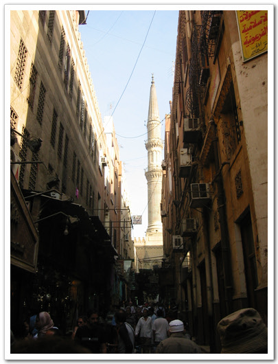

-후세인 모스크 옆의 칸엔칼릴리 시장. 여기서 후세인 모스크를 보니 더 멋있어 보이는군..

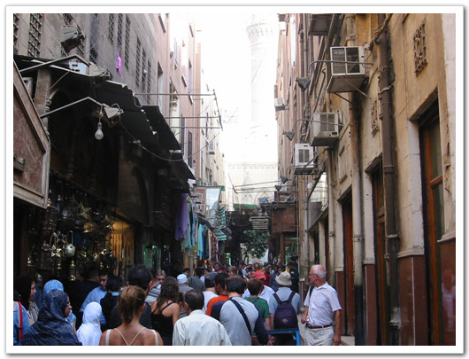

-여행온 관광객들로 좁은 거리는 더욱 더 좁고..

알아자르로 갔다. 들어가는 외국인 안보여서, 들어가도 되나싶어, 우선 근처의 경찰에서 물어보았다. 관광객들의 입장이 가능하냐고. 가능하다고 하더군. 신발을 벗고 들어갔다. 멋있었다. 대리석으로 쭉 깔린 중앙 바닥이 하늘로 열려 있고, 그 곳에서 사람들이 코란 책을 읽고 있는 모습들이 진짜 종교인의 모습이었다.

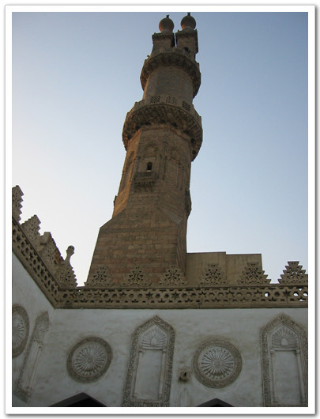

-이 곳이 알아자르 모스크. 제일 오래된 모스크란다.

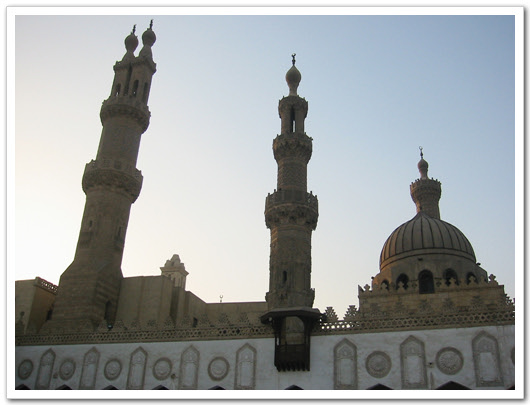

-솟아 있는 사탑도 세개나 되는군..

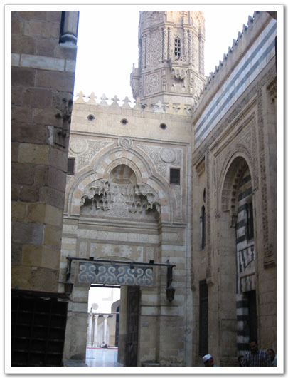

-들어가는 입구

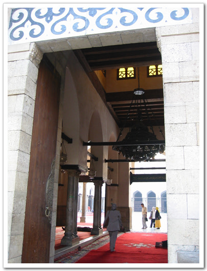

-이곳부터는 신발을 벗고 들어가야 한다

-신발을 벗고 들어가니, 펼쳐져 있는 넓은 바닥과 뻥 뚫려 있는 하늘.

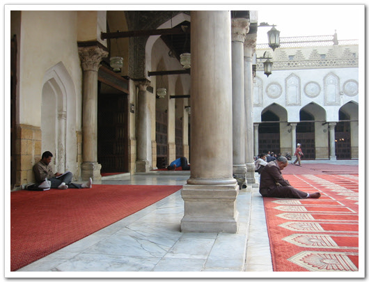

-벽에 몸을 기대어 코란을 읽는 사람들..

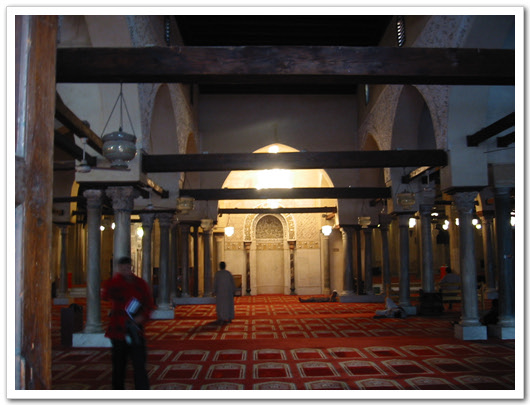

-실내도 있는데, 이 곳은 관광객 출입이 안되었다.

-밖에서 보였던, 쌍둥이 사탑

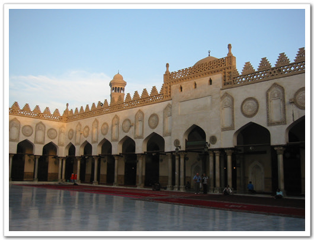

-외곽을 둘러싼 마치 성벽과도 같은 외벽

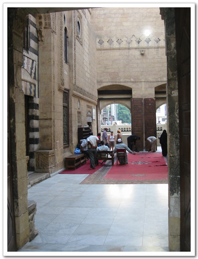

-다시 신발을 신고 밖으로

알아자르 근처도 시장이었다. 현지인들의 시장 같았다. 닭고기도 있고, 야채, 과일도 있더군. 이슬람이라 돼지고기를 안 먹어서인지, 보통 우리에 보이는 돼지고기 대신 양고기들이 널려 있었다. 아랍인들의 주식인 펠라카의 빵도 팔더군. 물어보니 하나에 1파운드란다. 생긴 것은 꼭 중국호떡 공갈빵처럼 생겼다. 이 빵 속에서 콩등을 채워 먹는 게 여기 사람들의 주식이란다. 하나 샀다. 나중에 호텔에서 먹는데, 괜찮더군. 주식답게 별 특이한 맛 없이 질리지 않는 맛이었다. 속에 채워 먹을 것은 없었기에, 그냥 껍데기인 빵만 먹었지만..

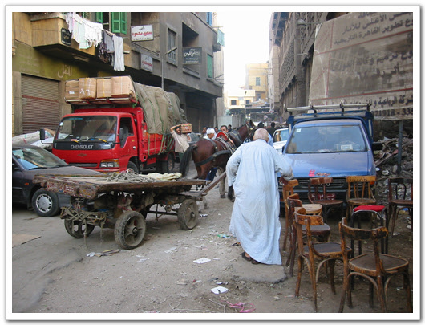

-진짜 시장같은 거리

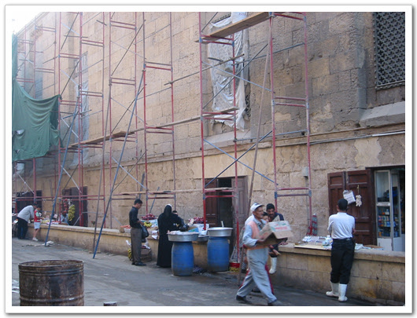

-그리 빽빽하지는 않더군.

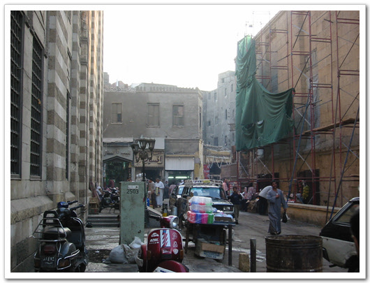

-해가 질 시간이 가까워져서인지 사람들이 별로 안 보인다.

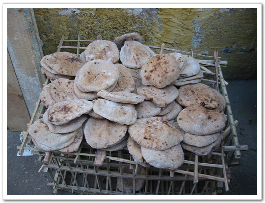

-내가 1파운드 주고 사 먹은 빵. 생긴 거에 비해 맛있다.

더운 날씨에 돌아다니다 보니, 목이 마르더군. 마침 해가 떨어져 라마단 기간도 끝나고 하여, 사람들이 우르르 쏟아지고, 주스 파는 노점상들도 나왔다. 그 노점상에게서 하나 사먹었다. 색깔이 검은 색이기에 뭐 포도쥬스겠거나 하며 사 먹었다. 50피아스트랜다. 0.5파운드인 거다. 우리 돈 100원이네? 여기서 먹을 거냐? 가져갈 거냐 묻더군. 먹고 갈 거다 했다. 컵에 가득 따라 주더군. 포도 맞았다. 그것도 100% 포도즙. 맛있더군. 다른 사람들은 가져갈 것인지, 비닐봉지에 담아 가더군.

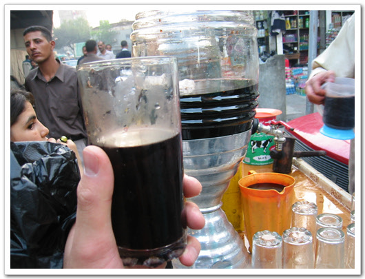

-50파이스트짜리 원액 포도주스. 정말 맛있더군.

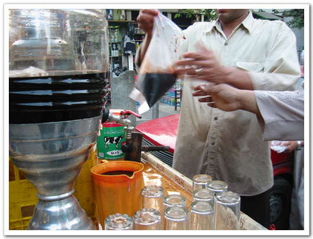

-포장도 된다.

