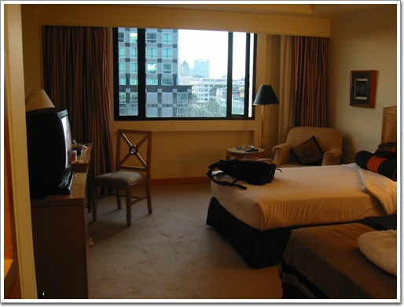
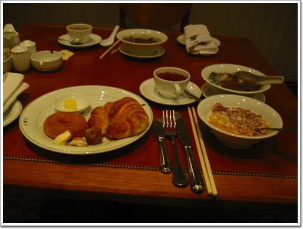

# 3월 중순의 퇴근길 폭설

호치민에서의 베트남 쌀국수

베트남 쌀국수를 한번 먹어 보고는 싶었는데, 기어코 베트남 현지에서 먹어보리라 다짐하고, 우리나라에 그리 많이 생긴 포호아에 아직 한번도 가보질 않았다. 기다림끝에 베트남에 가게 되었다. 예상보다 세달이나 늦게 간 거다. 드디어 본토 쌀국수를 먹어 볼 수 있는 것이다.

베트남에서의 이번 임무는 베트남의 SK인 SLD에 팔 CDMA 폰 버그 수정하고, 그곳에서 인증을 받아 오는 거다.

정성두씨와 같이 갔다. 출발은 9월 21일 일요일이다. 일요일 출발이라 귀중한 휴일을 회사에 고스란히 바치는 셈이다. 안타깝지만 베트남에 간다는데 그정도야 감수해야겠지..

일요일 오후 회사에 가서 짐을 싸서, 센트럴씨티 도심공항터미널로 갔다. 아시아나항공이라서 그곳에서 탑승수속을 받을 수 있었다. 비행기는 8시 비행기였는데, 공항에 도착한 시간이 6시쯤 되었다. 남은 시간을 주체하기 위해 공항 곳곳을 샅샅히 뒤지고 다녔다.

-나를 태울 준비를 하고 있는 비행기

-왼편의 이 사람이 정성두씨이다. 사진기앞에서 친한 척 하고 있음.

서울에서 호치민까지는 5시간 반정도가 걸린다. 이코노믹클래스에서 이 시간동안 앉아 있기에는 꽤 긴시간이지. 그래도 비행기 타는 것은 재미있다. 비행기가 이륙할때 그 시속 270km 정도에서 나를 태운 그 무게운 쇠 덩어리가 올라가는 게 아직도 신기할 따름이다. 그리고 내가 좋아하는 기내식이 있어서 좋다. 오늘의 메뉴는 쇠고기 덮밥이다. 비행기를 타기 전 김밥을 많이 먹어서인지 그다지 맛은 없더군.

\- 기내식 쇠고기 덮밥

비행기에서는 그 무료한 시간을 달래기 위해, 이번에도 영화를 봤다. 난 출장을 갈 때만 항상 노트북에 영화 두편 정도를 가져간다. 그래서 갈 때 한편 보고, 올 때 한편을 본다. 이번의 영화는 Tears of the sun 이란 미국영화다. 여주인공이 쭉쭉빵빵인 모니카벨루치란 것을 제외하면 아주 가증스런 영화였다. 미국이란 그 가증스럽고도 위선적인 모습을 어찌 그렇게도 선의 대명사로 표현을 하는지..

호치민에 도착한 시각은 현지 시각 11시 30분 정도다. 베트남과 우리나라의 시차는 두시간 차다. 고로 우리나라시간으로는 1시 반 정도가 된거다. 호치민은 베트남의 제 1의 경제도시로서 예전명칭은 사이공이다. 베트남의 수도 하노이가 북쪽에 있고, 경제수도인 셈인 호치민은 남쪽에 있다. 위도 10도 근처라 아주 더운 지역이지. 베트남의 통화는 동(VND)로 그네들 돈 10,000동이 우리나라돈 8,000원정도 한다. 단위가 큰편이지. 그래서 베트남에 있는 동안 돈 계산이 꽤나 힘들더군. 기본적인 것에 몇십만동인데, 단위가 크다보니 계산이 잘 안되더군. 그리고 베트남은 자기네들 화폐인 동보다도 미국달러를 더 좋아하는 것 같더군. 달러가 기본적으로 통용이 된다. 그리고 공항세도 동으로 내는 게 아니라 달러로 계산을 하더군.

호치민의 떤선넷공항은 한 김포공항정도 되보이더군. 입국심사의 심사관들을 보니 작은 중국같다는 느낌이 들더군. 사회주의 국가다 보니 공무원의 위세가 있어보이더군. 그리고, 입국자가 전원 수화물 검사를 받더군. 나의 짐을 수상히 여기더군. 장비에 케이블에 복잡스런게 많은데다 이번엔 멀티포트까지 가져갔는데, 멀티포트를 가지고 트집을 잡더군. 뭐냐고 묻길래 컴퓨터 부품이다 그러면서 설명을 했는데, 심층조사쪽으로 가라더군. 거기서 또 심층 검사를 받고 나왔다. 그다지 유쾌하지 않은 입국절차였다.

이 떤선넷공항은 택시외에는 별다른 교통수단이 없었다. 고로 우리는 택시를 타야만 했다. 베트남여행안내서를 보니 베트남의 택시는 별로 좋지 않다하더군. 입국장을 나오니 여러 택시기사들의 호객행위가 벌어졌다. 한 택시기사가 시내까지 7달러를 부르더군. 몇번 베트남 와본 정성두씨가 5달러하니까, 값 올려주기를 기다리며 있더군. 한참후, 5달러 알겠다고 하며, 출발을 했다. 공항에서 시내까지 미터요금으로는 기껏해야 3달러밖에 안나오는 것인데, 어쩌겠는가, 그네들 시스템이 그러한 것을..

우리가 묵을 곳은 사이공프린스호텔. 응우후엔거리에 있는 호텔로 별 4개짜리란다. 하루 방값은 80달러였고 내 방은 512호.

\- 여기가 사이공프린스 호텔. 후에 이름을 Duxton 호텔로 바꾸더군.

\- 여기가 내 방

\- 이게 내가 매일 아침 먹던 식사. 오른쪽 상단이 베트남 쌀국수다.

다음날 아침, 즉 월요일이지. SLD 사무실로 갔다. 위치는 조금 북쪽에 있는 belco 건물. 우리가 거기에서 작업하는 공간은 교환기실. 무척이나 시끄럽고, 추운 곳이지. 장비의 온도때문에 에어콘 온도를 18도 맞춰놓고 있던데.. 그 때문에, 감기에 걸리기도 했지. SLD의 한국사람들의 대부분 SK telecom 사람들이다. 즉 갑과 을에서 갑이다. 고로 거기에 있는 동안 을로서의 불리한 점이 있었기에 아무 불평없이 갑에게 공손해야 했었다. 우리는 아주 열악한 환경에서 일을 했다. 랜도 없었고, 밥먹을 때도 전혀 물어봐 주지를 않더군. 거기서 오후까지 버그 수정을 하다가 호텔로 복귀를 했다. 점심은 재꼈다. 나 혼자라면 현지의 길거리 음식을 먹었을텐데, 정성두씨가 좀 음식을 가리다 보니, 같이 동참을 하느라, 같은 안 먹었다.

\- 여기가 SLD가 있는 Belco 건물. S telecom이 SLD인 것 같다.

\- 일하는 동안 교환기와 서버들은 시끄럽게 동작하고 있었고,

\- 일은 이런 포즈로 하였다.

호텔로 돌아와서는 세면세족 등 개인위생 철저를 한 후, 물과 기타 먹을거리를 사러 슈퍼마켓으로 갔다. 베트남 호텔에서는 그냥 제공되는 물도 없더군. 수도물이 식수가능해서 그럴지도 모르겠지만.. 그리고 칫솔,치약, 면도기도 제공되지 않더군. 슈퍼마켓은 호텔 근처의 국영백화점 2층에 있는데, 가는데, 한 3분정도 걸리는 거리다. 그 3분을 가는동안 비가 내리더군. 열대성 비인 스콜이란다. 하루에 한번은 꼭 내려서 그런가, 이곳 사람들은 우산 쓰는 사람들이 없더군. 보통 비옷을 입거나, 아니면 비가 멈추길 건물 안에서 기다리더군.

\- 멀쩡하다가 갑자기 쏟아지는 비

\- 보행자들은 이렇게 건물안에서 비 그칠 때까지 기다린다. 이건물은 씨티은행 건물

\- 간혹 이렇게 비옷을 펼쳐들고 여럿이 뛰어 가는 경우도 있긴 하지만..

40여분 정도를 기다리니, 비는 멈추었고, 우리는 슈퍼마켓으로 갔다. 그곳에서 생수와 맥주3캔, 쥐포등을 사고 호텔로 다시 돌아왔다. 날은 일찍 저물었다. 7시 반이었는데, 어둑어둑해지더군.

\- 석양의 호치민시

9월 23일 화요일. 호치민에서의 이틀째다. 나의 탐험정신 구현을 위하여, 6시에 일어났다. 호치민시 지형정찰을 하기 위해서. 적도에서 가까운 곳이라 그런가 꽤 해가 일찍 뜨더군. 그 때문인지, 이곳 사람들도 꽤 일찍부터 하루를 시작하더군. 6시인데도 거리엔 사람들이 많고, 아침식사를 하는 사람들도 많았다. 이곳에선 오토바이가 주 교통수단이다. 거리엔 오토바이가 제일 많다. 어지간한 사람들은 모두 오토바이를 타고 다닌다. 그 많은 오토바이가 좁은 도로를 다니다 보니, 속도가 절로 줄어들어, 차든 오토바이든 시속 30km를 넘지 못하고 다니더군. 중국에선 자전거가 그리 많던데, 여기선 자전거는 상대적으로 별로 없더군.

-전 차선을 다니고 있는 오토바이들

-인도에 까지 주차를 해 놓고 있는 오토바이

\- driving restaurant

\- 오토바이를 탄 채로 식사꺼리도 사고

\- 보이는건 오토바이, 들리는 건 오토바이 엔진 소리-다다다다

\- 출근시간인지 러시아워인 도로

\- 신호 대기중인 오토바이와 씨클로, 자동차들

6시에 일어나 내가 간 곳은 전쟁기념관이다. 베트남 전쟁에 관한 박물관이다. 그다지 크지 않은 규모임에도 많은 사진들과 자료, 그리고 무기들이 진열되어 있었다. 그 중 베트남전에 대한 사진들이 끔찍하더군. 무고한 시민들과 베트남의 독립과 통일을 위해 싸운 베트콩들이 미군들과 그 이하 다국적군들에게 얼마나 처참히 살해됐는지를 느낄 수 있었다. 그 전쟁기념관에는 미국편에서 파병한 나라들의 사진들이 나와있는데, 우리나라의 청룡부대도 나와있더군. 부끄러운 사진이다. 한나라의 주권을 짓밟는데 동조를 하였다니..

\- 여기가 전쟁기념관 입구. 입장료는 10,000동이다. 우리돈 800원정도다.

\- 베트남전에 사용된 미군탱크

\- 수용소를 재현한 건물

\- 단두대. 프랑스 식민지 식민지 시절 많은 독립운동가들이 그야말로 형장의 이슬로 사라졌다 한다. 위의 칼날을 보니 의시시하군.

\- 베트남전에 파병한 국가들중에 있는 한국. 우리나라 또한 무고한 많은 베트남인들을 죽였다.

전쟁기념관 바로 앞에는 통일궁이 있었다. 1966년에 지은 남베트남 정권 시대의 대통령 관저라고 한다. 1975년 해방군의 탱크가 이 부지안으로 진입하면서 전쟁이 끝났다고 한다. 크기는

\- 통일궁 정문

\- 통일궁

이렇게 두시간 정도의 1차 지형정찰을 마치고, 호텔로 들어오니 8시. 정성두씨를 깨워 아침을 먹은 후 다시 SLD로 가 재미없는 일을 했다. 이날 한국 SK의 품질보증팀에서 두명이 인증을 위한 테스트를 위해 왔다. 역시 본사 사람이다 보니, 여기 SLD 사람들이 그 두 사람에게 깍득하더군.

저녁은 호텔로 돌아온 후, 호텔앞의 동코이 거리의 베트남 음식점에서 먹었다. 볶음밥과 춘권을 시켜서 먹었다. 베트남 정통 음식인지는 모르겠다.

\- 볶음밥은 1인분인데도 꽤 많더군.

-교환실의 강력한 전자파로 하루새에 10년이나 늙어버린 내 초췌한 모습

\- 이식당은 특이하게 화장실을 안내해주는 할머니가 있더군. 오른쪽이 화장실이다.

