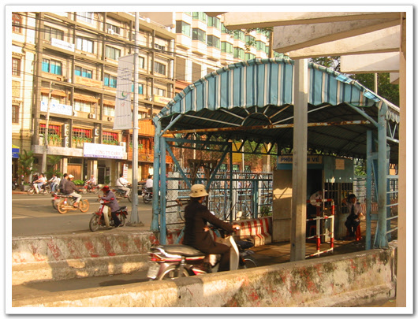
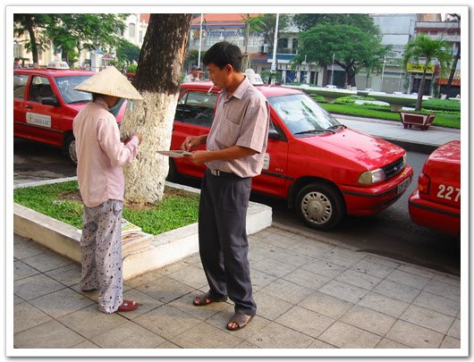
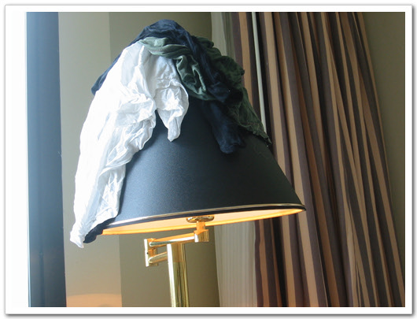

# 새 잎이 나고 있다

수요일 아침. 베트남에서 3일째 아침이다.

오늘도 아침 지형정찰을 위해 5시에 기상하였다.

오늘의 코스는 사이공 강과 인민위원회 청사.

\- 이게 사이공강의 모습이다.

이 강가를 걸어가는 동안, 수많은 시클로들이 따라 붙었다.

하지만 여행안내서에서 시클로는 바가지의 온상이라 타지 말라고 하여, 안 탔다.

예전 중국에서 인력거 타면서 바가지 써 본 기억이 있고 해서 별로 타보고 싶은 생각은 들지 않더군.

여기 호치민도 강북과 강남이 있어, 사이공 강은 잘 개발이 되어 있는데, 강남은 아직 개발이 시작되지 않았다.

혹시 여기 강남에 땅이 있으면, 나중 우리나라처럼 강남 졸부가 되지 않을까 생각해 본다.

\- 강남의 모습

\- 다리를 통과하는 사람들.

\- 저게 바로 시클로다.

사이공강 동서로 오가는 배가 있는데, 한번 타볼려고 했는데, 돌아오는 날까지 타보지는 못했다.

\- 여객선. 오토바이가 주를 이룬다.

\- 강 건너 동쪽

\- 터미널

\- 강가에서 걸레 빠는 사람

\- 여행 안내문

\- 배를 타기 위해 들어가는 곳. 오토바이를 탄 채로 돈을 내고 들어간다.

\- 여기는 배에서 내리는 곳.

\- 누구를 마중나오는 사람들인지, 뭔가를 기다리는 모습이다.

시간은 벌써 6시 반쯤. 해가 뜨니 금새 더워지더군. 움직일때마다 땀이 나더군.

중국만큼 공원이 많지는 않아 보였다. 강가에 조그만한 터가 있는데, 여기서 많은 사람들이 운동을 하더군.

\- 태극권 비슷해 보이는 무술

\- 제기차는 사람들

\- 아오자이를 입은 아줌마

계속 걸어서 간 곳은 인민위원회 청사.

호치민에서 제일 유명한 건물로 엽서등이 많이 나온 모양이다.

프랑스 식민지 시절에 지어진 건물인데, 일반인은 들어갈 수 없는 건물이라 밖에서만 구경을 했다.

\- 이게 동코이 거리에 있는 중앙인민위원회 청사이다.

\- 신문파는 아줌마

아침 산책을 마치고 호텔로 들어온 시간은 8시.

더운 날씨에 돌아다녔기 때문에, 샤워를 했다. 그런 다음 여느 아침과 다름없이 아침 식사.

뷔페이기는 하지만 똑같은 음식이기에 먹는 것은 한정될 수밖에 없었다.

빵 몇 개와 쌀 국수 그리고 오믈렛이다.

\- 베트남의 노점 의자들은 상당히 작다.

\- 베트남 현지인들의 길에서 아침 먹는 모습. 나도 먹고 싶었는데, 못 먹어봤다.

\- 앞에 보이는게 리츠인데, 저것도 먹어보고 싶고..

본격적인 테스트를 받기 위해 SLD 사무실이 있는 다이몬드 플라자로 갔다.

이 건물은 포스코에서 건설한 거라고 하는데, 호치민에서 가장 물 좋은 곳이라고 한다.

백화점이 들어서 있어, 명품 족들이 이곳을 찾는다 한다.

사회주의국가라 포스코가 계속 소유하는 것이 아니라, 10년간만 소유하고 그 다음 국가로 넘기는 방식이라 한다.

여기 SLD 회사도 마찬가지이다. 그래서 그런가 10년간 이익이 다 빼기 위해, 수익 발굴에 여념이 없어 보인다.

사무실에서 하루 종일 테스트를 받았다.

SLD 현지직원인 베트남인 두 명과 sk 두명이서 한 것인데, SK 사람들은 실제 테스트보다도 무슨 네트워크가 어떻고 망이 어떻고 하는 것으로 시간이나 끌고 있었고, 베트남인들은 테스트항목과 별개인 기능상 추가했으면 하는 사항을 말하면서, 정신없이 떠들어냈다.

\- 사무실에 가고 올 때 저마, 저 가방 가득히 짐을 풀었다 담았다 한다. 상당히 귀찮은 일이다.

\- 오늘도 여전히 완전무장하고 질주하는 아녀자가 있고,.

\- 이곳이 SLD 사무실

점심은 옆 건물에 붙어있는 한국식당에서 먹었다. 깔끔한 식당이었다.

우리는 다른 사람들이 시키는 대로 육개장을 시켜먹었다.

계산은 SK 사람들이 낸다고 하여 얻어먹은 셈이 됐다.

이 얻어먹은 일이 두고두고 "갑에게 밥 얻어먹은 최초의 사람이니, 을에게 자신들이 인간적인 자신들이니 하는 온갖 자랑"을 들어야하면 했다.

그깟 4000원짜리 밥하나 사주고 말이다.

그것도 우리들 사주려고 한 게 아니라, 여기 SLD 사람들에게 사주려고 했던 것이었음에도 말이다.

자기네들이 제조자에게 밥을 산게 아마 전무후무할꺼라더군.

오후에도 실제 테스트보다도 딴 짓하느라 시간을 다 보내고, 결국 "이 기능이 되죠? 이 기능도 되겠죠?" 하면서 말로 물어보고, 내부 인증을 냈다.

그리고 우리에게서 저녁을 얻어먹었다. 한국식당가서 삼겹살에 소주를 샀다.

그러고 나서, SK사람들이 머무는 까르벨라 호텔에서 소주한잔을 더 하고 집에 들어가 바쁜 하루를 마감했다.

25일 목요일.

내부인증을 받았기 때문에, 처음으로 늦잠을 잤고, 아침도 느지막이 먹었다.

내부 인증은 나왔지만, 여기 SLD에서 정식 인증을 내 주어야 하는 거라 Belcoi 건물로 가서 일을 하고, 저녁은 포24에서 쌀 국수를 먹었다.

금요일.

호텔에서 처리해야 할 버그들을 수정하면서 하루를 보냈다.

베트남은 주 5일제라, 토요일 일요일은 회사들이 쉰다.

고로 여유가 있는 날이라 저녁때 정성두씨와 벤탄시장과 국영백화점을 갔다.

출장의 낙이라 할 수 있는 쇼핑이다.

벤탄시장은 호텔에서 그리 멀지 않은 거리에 있다. 뛰면 한 5분정도, 걸어가면 20분 정도 걸리는 거리다.

호치민에서 제일 큰 시장이라고 한다.

여행안내 책에서도 쇼핑하는 방법이 나와 있던데, 방법이란 게 국영백화점에서 가격을 확인한 후 벤탄시장에서 같이 물품이 싸면 사라는 것이다.

벤탄시장은 천 평 정도 되는 크기에 의류에서부터 식구류, 음식들까지 파는 곳이다.

가격 조사를 미처 못 했기에 여기서는 그냥 눈 구경만 했다.

\- 아침 먹는 사람들. 진짜 맛있겠다..

\- 다른 거리에는 수산물을 파는 노점들이 있고..

\- 베트콩 모자를 쓴 나. 모자를 작은 걸로 사서 그렇지, 내 머리가 너무 커서 그런 것은 아님.

\- 호텔에서같이 일하는 모습. 아니 그런데 정성두씨는 메신저하고 있군.. 흠.

\- 빨래는 이렇게 말리고 있다. 화재 위험이 있기에, 내가 방에 있는 동안만 저렇게 말리고 있다..

일요일.

원래 이 날 귀국할 예정이었지만, 정식인증이 나지 않은 통에 체류기간을 연장했다.

"내가 또 언제 베트남에 와 볼 것인가? 조금이라도 시간이 나는 족속 돌아다녀야지. 한번 왔으면 뽕을 뽑는다"는 내 신조에 따로 이 날 아침도 5시에 일어나 지도를 펴고 어디를 가볼까 하다 대학교에 갔다.

프랑스 식민지 영향 때문인지, 대학교 이름이 있는 게 아니라, 사회과학대 공과대 이런 식으로 단과대별로 떨어져 있었다.

큰 캠퍼스 같은 것은 없어 보였다.

대학교에 들어가 보니, 밖에서 보는 모습보다 건물에 들어가 보는 모습이 더 색달라 보였다.

교실이 있고, 복도가 따로 없이, 테라스처럼 그냥 밖으로 뚫려 있는 게 예전 내 고등학교 시절 몰래 극장에 들어가 보았던 18금 영화 "연인"에서 봤던 그 학교의 모습이었다.

\- 대학옆의 프랑스풍의 건물

\- 가는 길에 보인, 전기 감전 주의 표시. 눈을 관통하는 저 모습이 아주 자극적이군..

\- 이 근처는 다른 곳에서 도로가 한가하다. 나무도 울창하고..

\- 대학 내의 캠퍼스 모습. 캠퍼스라고 할 게 없이 작고, 벤치만 몇개 있을 뿐이다.

\- 이게 캠퍼스 전체 모습이다.

\- 강의실의 모습. 창문하고 배치가 특이하다.

\- 우리나라처럼 복도가 벽으로 되어 있지 안고, 뚫여 있어 시원스럽다

\- 역시나 시원스러워 보이는 복도

\- 계단도 뻥 뚫어있다.

\- 또 다른 강의실 내부

\- 밑에서 올려단 학교의 모습

\- 오토바이가 주 교통수단이라, 학생들도 오토바이로 타고 다니고, 주차 시스템도 오토바이를 기준으로 되어 있는 것 같다.

\- 이게 오토바이 주차 관리 시스템이다.

\- 이방인이라 한눈에 주목을 받는군.. 쑥스럽게 시리..

\- 학교의 주차장도, 오토바이 위주다 보니, 효율성이 높아 보인다.

\- 또 다른 건물. 시험 기간이 학생들이 교실에 안 있고, 다 복도에 있는군..

\- 복도에 서서 환담하는 학생들

사회과학대 옆에는 호치민작전박물관이 있었는데, 문도 열려있고, 지키는 사람도 없어 그냥 들어가 보았다.

월남전에 쓰였던 무기들이 전시되어 있었다.

\- 호치민 작전 박물관. 내부는 아직 문을 안 열어어, 밖에만 구경을 했다.

\- 베트콩에게 격추된 미군 헬기의 잔해. 요 며칠전 이라크에서 격추된 미군 치누크 헬기가 생각나는군.

\- 역시 격추된 비행기 동체

\- 그 비행기의 프로펠라

오전 정성두씨와 호치민시 구경을 하기로 했다.

베트남에 두 번째 와 본 정성두씨로도 첫 구경이지.

그런데 딱히 구경할 것도 없고 하여, 다이아몬드 플라자에 가서 구경좀 하다가 꼭대기 층에 있는 KFC에서 점심을 먹었다.

내가 좋아하는 음식은 아니지만, 그냥 먹었다.

오락실이 KFC옆에 있었는데, 거의가 우리나라에서 중고로 수입된 듯 해 보였다.

동전 투입구 옆에 100원, 500원 이렇게 써져 있더군. 그러고 나서 바로 앞에 있는 성모마리아 성당과 중앙우체국으로 갔다.

이 성당이 꽤 유명한 성당이라더군.

100년 전에 지어진 성당이라 한번 들어가 봤지.

성당 내부는 뻥 뚫려 있는 게 색다르더군.

우리나라 성당도 내가 별로 가본 곳은 없지만, 이 성당은 예배당 외에 다른 부속 시절이 없었다.

방으로 막혀 있는 곳도 없었고, 개방적인 공간이었다.

\- 성모 마리아 교회

\- 이 앞에서 사진 한장

\- 성당 내부. 숨겨진 공간이 없다.

\- 하나의 공간으로 된 성당 내부

\- 중앙 우체국

\- 그 앞에선 정성두씨

\- 우체국 내부도 멋있었다. 안에는 국제전화를 하기 온 외국인들이 많았다.

\- 우체국 내부 중안에 이렇게 테이블도 마련되어 있더군.

베트남에서 일주일이 지나니, 이제 쌀 국수도 질리기 시작했다.

SLD에 최종 release를 주기로 한 날인데, 아직 버그들이 남아있는 상태다.

호텔에서만 작업을 했고, 저녁 먹을 때까지 호텔 밖을 벗어나지 않았다.

점심도 요며칠전 한국인상점에서 사두었던 컵라면으로 먹었다.

저녁은 마찬가지로 쌀 국수.

정성두씨는 며칠 더 머물러야 했고, 나는 화요일 그냥 귀국하기로 하여, 베트남에서의 실질적인 마지막 밤이다.

그래서 남은 베트남 돈을 소진하기 위해 마트에 갔고, 거기서 난 허접한 카메라 가방을 22,000동(2천원), 커피필터를 17,000동(1,500원)에 샀고, 정성두씨는 2만 원짜리 여행용 가방을 샀다.

\- 그 맛있던 쌀국수가 일주일째 아침 저녁으로 먹으니, 질리더군. 다시 보니 군침이 돈다.

호치민에서의 마지막 아침.

어제 못쓴 베트남 돈을 소진하기 위해, 아침 7시 벤탄 시장으로 갔다.

7시쯤에는 문 을 열 줄 알았는데, 문 연 곳이 거의 없더군.

한 30여분을 주변에서 서성이다 15,000동짜리 아오자이인형 3개와 55,000동짜리 목갑, 그리고 25,000동짜리 사과받침대를 샀다.

\- 마지막 아침과 번잡한 아침

\- 버스 정류장이라 더더욱 사람이 많고, 시끄러운 장소다.

\- 벤탄 시장 내부. 여기가 가장 냄새가 많이 나는 음식 코너

망 테스트를 위해 아침 일찍 벨코이 건물로 갔는데, 시작은 11시가 되어서야 시작되었다.

A/S 센터 교육도 하여야했기에, 난 업그레이드 지침 문서를 만든 후, A/S 센터로 갔다.

하루에 한번씩은 비가 쏟아지는 베트남이지만, 이날은 무척이나 많이 오더군.

A/S 센터로 가는 길이 침수되었는데, 자동차 바퀴 반까지 잠기더군.

차 밑바닥에 찰랑거리는 소리가 들리는데, 마치 배를 탄 듯한 느낌이 재밌더군.

도중 정성두씨로부터 전화가 왔는데, SLD 건물이 벼락을 맞아 네트워크가 맛이 가 테스트 중단된 상태라고 하더군.

맛이 간 네트워크는 내가 A/S 센터에서 교육을 마칠 때까지도 복구가 안되었더군.

A/S 교육은 거기의 요원 3명을 데리고 하였다.

교육은 예상보다도 훨씬 수월하고, 재미있게 진행할 수 있었다.

꽤 유머 있는 사람들이더군.

여기서 베트남 커피도 얻어먹었다. 아주 맛있더군. 이걸 먹어 보고나서 나중에 베트남 커피도 한 통 사갔다.

저녁 시간은 마지막날이고 하여, 여유가 있는 저녁이었다.

이곳 가져온 CD중 Miss Saigon을 방에서 들었다.

내가 가장 좋아하는 뮤지컬 중의 하나다.

줄거리는 오페라 나비부인과 비슷한, 베트남전때 미국인과 베트남인의 사랑의 사랑의 미국의 입장에서 만든 것이긴 한데 곳곳에 아름다운 곡들이 많다.

그 Miss Saigon을 여기 본토 사이공에 와서 들으니, 더더욱 가슴깊이 스며들었다.

창 밖에 통해 보이는, 인민위원회와 이전에 보았던 전쟁박물관, 대통령궁등의 장소가 바로 내가 듣는 이 곡의 각 막의 배경이어, 정말 여주인공 킴이 바로 저기 저만치서 노래하는 듯 했다.

\- 미스 사이공을 들으면서, 바라본 밖의 모습. 분위기가 받혀 준다.

\- 사이공의 마지막 밤은 이렇게 저물기 시작한다.

정성두씨를 남겨두고, 나먼저 출국을 했다.

공항에서 우리나라 남자와 국제결혼하려는 것처럼 보이는 여자들이 있었다.

대부분 아오자이를 입고 있었고, 한명은 한복을 입고 있더군.

원래 아오자이가 몸에 딱 맞게 입는다. 그래서 몸매가 훤히 드러나기에 시각적으로 즐거울 수밖에 없다.

그런데, 이곳 공항에서 한국으로 가는 비행기를 타는 그 여인들을 보니, 왠지 안타까워 보였다.

저 여자들이 오로지 먹고 살기 위해, 한국 남자들과 결혼하는 걸 보니....

비행기 안에서는 내 뒤에 한 마흔쯤 되보이는 한국남자와 스무 살 쯤되는 베트남여자가 앉았다.

대충 들리는 말을 듣고 상황을 유추해 보면, 베트남 와서 선을 보고, 결혼하여, 곧장 한국으로 오는 것 같더군.

비행기 처음 타는 여자는 멀미까지 하던데, 안쓰럽더군.

