# 두번째 일본출장

첫 일본 출장 갔다 온 지 얼마 안되어 또 가게 되었다.

지난 출장도 회의만 하고 온 터라, 별 재미가 없었는데 이번에도 회의만 하는 출장이었다.

출장기간은 2월 19일(일) ~ 2월23일(목).  갔다 오고나서 꽤나 바쁜 일상으로 한달만에야 블로그를 쓴다.

이번 출장은 더구나 일요일에 출발하는 거였다.  어지간하면 월요일 아침에 출발하고 싶었지만, 월요일 아침 일찍부터 일본에서 회의한다고 하여, 소중한 일요일을 비행기 타는데 썼다.

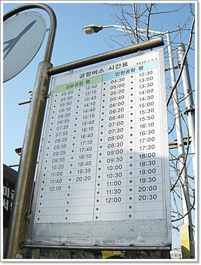

\- 오리역에서 16:30에 출발하는 김포공항행 공항버스 탑승

1시간 반후에 김포공함에 도착했다.

19시 40분 하네다행 비행기를 타고 2시간반을 날라, 밤 10시에 하네다 공항에 도착했다.

\- 이번엔 하네다공항이 만차인지, 게이트에 바로 연결안되고, 비행기에서 버스로 옮겨탔다.

지난번과 동일한 호텔, 동일한 사무실에서 회의한터라 별 신기한 것은 없었다.

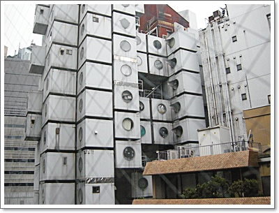

\- 회의 도중 쉬는 시간, 창 넘어 보이는 특이한 건물.

저 하나하나가 방인가 보다.

지난 번에는 입맛에 맛는 음식을 못 찾었는데, 이번엔 괜찮았다.

입맛에 맞는 식당을 찾았다.

바로 일본의 김밥천국이라 불리는 '스키야'

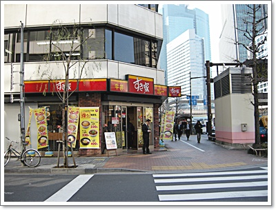

\- 길건네 김밥천국 '스키야'

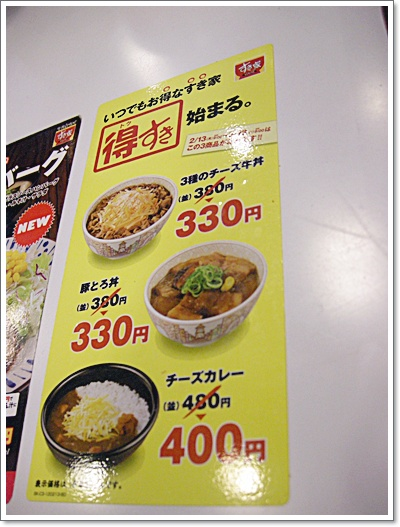

\- 할인하고 있는 음식.  이 중 소고기덮밥이 괜찮아 보였다.  가격은 330엔.

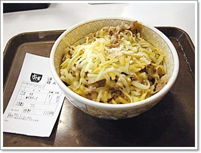

\- 주문한 치즈소고기덮밥.

여기에 100엔을 추가하면 된장국과 단무지를 준다.

내 입맛에 꼭 맞았다.

역시 내 입은 정통 일식보다는 이런 싸구려에 맞다.

아침부터 밤까지 회의만 하고 가기엔 너무 아쉬울 것 같아, 한 밤중에 호텔 밖으로 나섰다.

호텔 근처에 있는 밤새 영업하는 만물 판매점을 찾았다.

"동키호테"인데 제법 유명한 것 같았다.

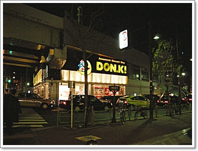

\- 오밤에 찾은 동키.  긴자9 거리에 위치하고 있다.

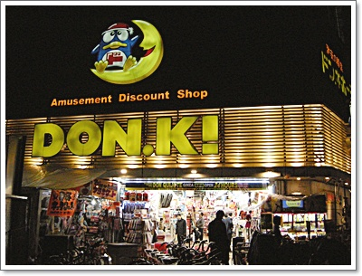

동키가 amusement discount shop이로군.

여기가 입구.

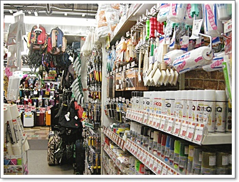

\- 들어가니, 제품 종류는 정말 많았다.

할인마트를 압축해 놓은 것 같았다.

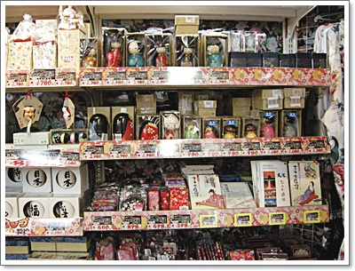

\- 일본 전통 인형도 있었다.  그런데 가격이 1000엔은 다 넘더군.

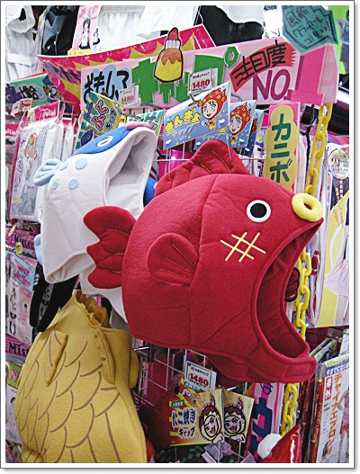

\- 사유리가 식탐여행에서 쓰고 나온 모자도 팔고 있더군.

가격은 1,489엔.  우리돈 2만원.

메이드인차이나 가격에 익숙한 나에게 너무나 비싼 가격이다.

그리고 옥션이나 인터파크에도 팔겠지하고 사고 싶은 마음을 참았다.

나중에 검색해보니 우리나라 쇼핑몰에서는 안 보이더군.

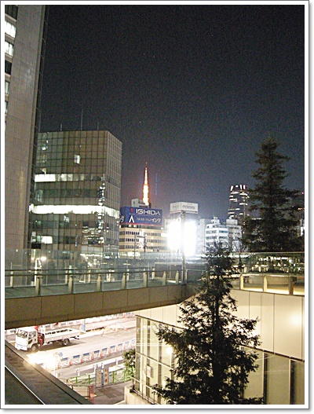

\- 도쿄의 밤거리를 이렇게 걷는다.  조용하다.

이번엔 호텔의 길 건너편 지하에 편의점을 가 보기로 했다.

밤중이니, 어디 갈 곳이 없으니 편의점이나 탐험.

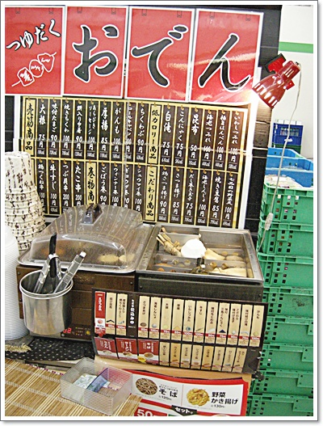

\- 편의점에 팔고 있는 어묵이 눈에 띄었다.

어묵향이 아무 맛있어 보여, 어묵 세개를 집어들었다.

가격은 290엔.  우리돈 5천원정도 가격.

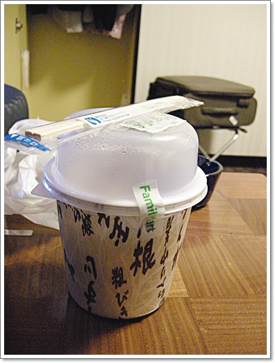

\- 방안에 가져와 먹기 위해 테이블 위에 올려놓고 한방.

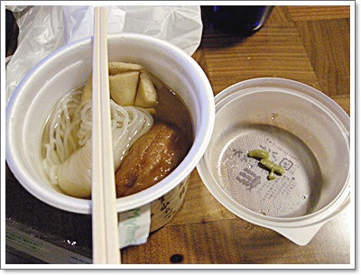

\- 뚜껑을 여니 아주 맛있는 냄새가 솔솔 난다.

맛도 아주 좋았다.

우리나라 오뎅바에서 먹었던 오뎅보다도 훨씬 맛있었다.

일본와서 먹은 것 중 제일 맛있었다.

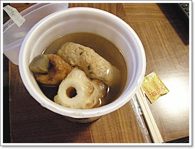

\- 다음날 밤에도 또 편의점에 가 또 사 먹었다.

아침에 일찍 일어나는 편이라, 아침 시간 활용에는 산책이 최고.

그런데 아침 시간 마땅히 산책할 곳이라고는 쓰키시 어시장밖에 마땅한게 없어, 지난 번에 가 본 적이 있었지만 또 갔다.

이번에는 식당 구경 위주로 탐색.

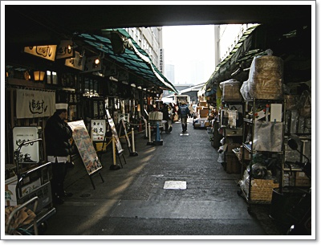

\- 여기가 어시장의 식당가.

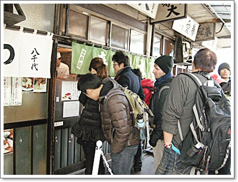

\- 아침 7시인데도, 사람들이 식당에 줄을 서 있다.

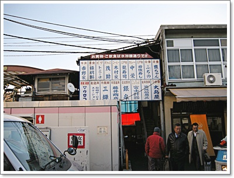

\- 시장 끄트머리에도 식당가가 있는데, 이곳은 줄 선 사람이 없는 걸로 보아 별로 유명하지 않은가 보다.

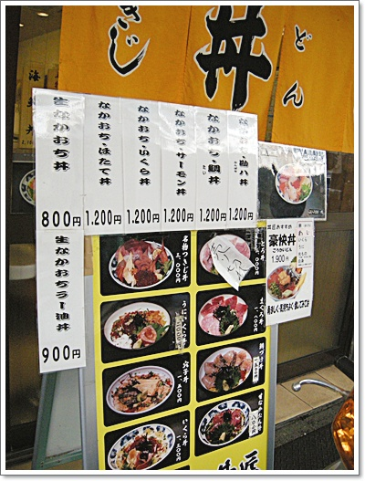

\- 가격을 보니, 꽤나 비싸군.

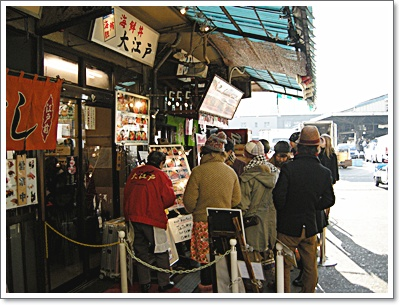

\- 이집에 줄이 제일 긴 걸로 보아, 이 집이 제일 맛있나 보다.

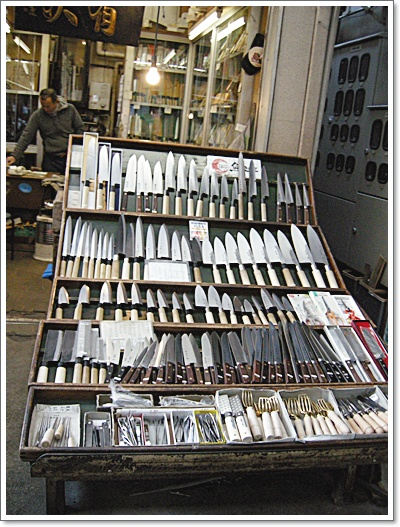

\- 식당가 옆에 있는 칼 가게.

이상이 4박5일 출장가서 구경한 일본.

이번 출장의 소득은 호텔 앞 편의점에서 파는 어묵이 맛있다는 점과 쓰키야에서 파는 치즈소고기덮밥이 맛있다는 점.

