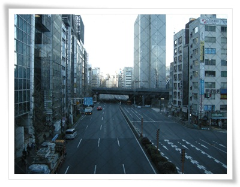

# 도쿄 동네 탐험-하마마츠쵸와 산바시

아침부터 저녁 8시까지 쭉 회의를 하고, 저녁을 늦게 먹게 되니, 산책할 시간을 아침밖에 없었다.

그래서 아침에 잠깐 호텔 근처 동네 산책만 했다.

\- 이게 호텔.  건물의 반만 호텔이라서 입구가 건물만에 있다.

\- 호텔에서 밖으로 나가는 길.  통유리인데, 밖에는 온통 초고층 빌딩이다.

저녁 늦게 오느라, 모노레일에 내렸던 하마마츠쵸 역까지 한번 걸어가 보기로 했다.

\- 하마마츠쵸역 방향으로 걷는 중.

\- 옆에 전철과 기차길이 있다.

\- 한 10분 걸어가니, 조그만 정원이 나왔다. 이것도 유료 입장이더군.

\- 정원 길 건너편이 하마마츠쵸역.  생각보다 가깝더군.

\- 하마마츠쵸역

\- 하마마츠초역에 도착했다.  여기가 입국시 호텔 가기 위해 택시 탔던 곳.

이제 다시 호텔로 복귀.

가는 길은 길 건너편으로 해서 가 본다.

\- 저 앞에 있는 건물 오른편이 호텔이 있는 건물.

\- 공사중인 다리 밑도 지나고,

\- 교토통신이라고 하는 건물도 지나

\- 시오도메역에 도착

\- 시오도메역.

다음날 아침은, 호텔 길 건너편인 산바시지역으로 산책.

\- 무슨 카페같은데, 건물 외부를 꽤 재미있게 꾸며놨다.

\- 생각보다 한산한 도로.

\- 산바시역내부

\- 산바시역이 JR선의 환승역인가 보다

\- 산바시는 그래도 유흥가라 식당들이 많다.  저 건물에서 첫날 저녁을 먹었었다.

\- 산바시 거리.  밤에는 꽤 번화한데, 아침엔 조용하다.

