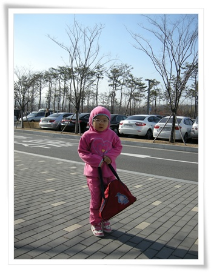
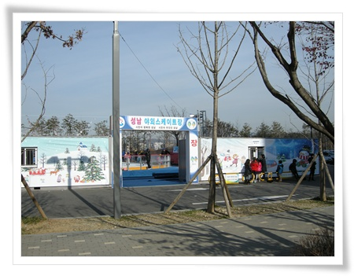
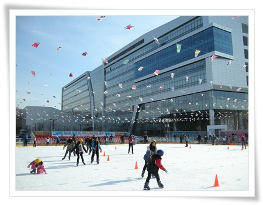
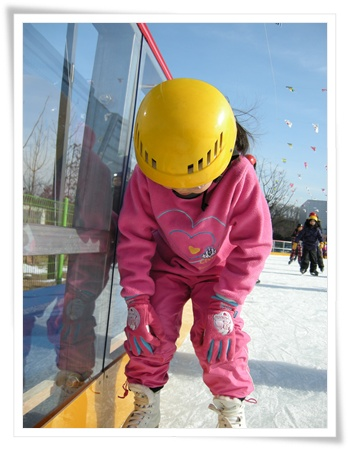
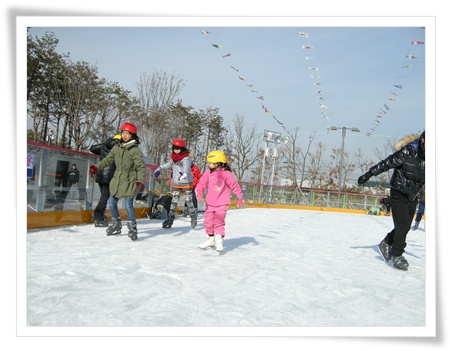

# 성남시청 야외스케이트장에서 딸내미와 스케이팅

rss 리더기로 구독하는 [성남시블로그](http://mrpeople.tistory.com/1131) 에 12월 17일 성남시 야외스케이트장이 개장한다는 글이 있었다.

2년전에는 분당구청 잔디광장에 스케이트장을 운영했기에 이번에도 분당구청에도 하나 싶어 분당구청으로 갔었는데 없었다.

서둘러 핸드폰을 꺼내 다시 검색하니, 성남시청 주차장에 설치했다고 하더군.

성남시청이 분당구청과 그리 멀지는 않기에 바로 성남시청으로 향했다.

호화청사로 유명한 청사답게 주차장도 넓고, 휴일에는 무료 개방을 하여, 주차는 아주 편안하게 남은 공간에 주차할 수 있었다.

\- 딸내미는 최근 중고로 구입한 스케이트를 들고 갔다.

차에서 내려 아직 몸이 안풀린 상태라 움츠린 상태로 가고 있다.

\- 청사 좌측 뒷편에 개장을 했더군.

우측이 매표소.

입장료+스케이트와 안전모 대여료 포함 1인당 천원.  아주 싸고 좋다.

딸내미는 최근 구입한 피켜스케이트화를 신고 입장했고, 나도 1997년 군대 있을 때 샀던 스피트 스케이트화를 신고 입장하려 했으나, 안전상 피겨스케이트화 이외에는 안된다고 하여 대여해주는 스케이트화를 신었다.

군대에서 스케이트 타던 생각이 나더군.

겨울이면 여단본부 주최로 대대 대항 스케이트 대회가 있었다.

군대에서는 여느 대회든 전투처럼 하듯이, 스케이트도 1등을 차지해야했기에, 매일 아침 상황보고가 있기 전 대대앞 논에 물을 대어 만든 스케이트장에서 1시간 의무적으로 스케이트를 탔었다.

그리고 내가 대대에서 내 계급의 출전 대표가 되어 여단 스케이트 대회에 출전했다.

한탄강 물이 꽁꽁 얼어붙은 1월, 강 한가운데 설치된 트랙에서 탔었다.

비록 1등은 못했지만, 다행히 대대장 자신이 스케이트를 타지 못한 탓에 질책으로 이어지지는 않았다.

군생활의 좋은 추억중이 하나다.

\- 역시 야외 스케이트장에 스케이트를 타니 겨울을 즐기는 듯한 기분이 든다.

\- 딸내미도 처음엔 내가 시킨대로 자세를 잡아보려 했다.

\- 헌데 바로 자세 생각않고 바로 지 멋대로 탄다.

개장초기라서 그런지, 날이 아직 많이 추워서 그런지, 사람이 그렇게 많이 북적되지않아 타기도 쾌적하더군.

