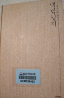

# [책]백범일지

너무 유명하고, 내용도 어느 정도는 알고 있다고 생각하지만, 실제로 읽지는 않았던 책 백범일지를 읽었다.

난세가 아니었던 때가 언제 있었느냐만은 지금의 암울한 시대도 그렇고, 개인적으로도 뭔가 침체된 느낌이 지속되고 있어, 위인전을 읽어봐야겠다 생각했다.

그래서 난중일기를 읽었고, 그 다음으로 백범일지를 도서관에서 빌렸다.

우리나라 사람이 가장 존경하는 인물로 설문조사를 하면 항상 1~2위를 차지하는 분이 백범 김구인데, 그렇게 고생과 희생을 하고서도 해방이후 권력을 차지하지 못했고, 결국 암살되었다는 사실이 참담하기는 하다.

노무현 대통령의 '운명이다'라는 책에서 우리나라 현대사의 위인은 왜 패배자뿐인가하며 존경하는 인물을 백범김구에서 워싱턴으로 하기로 했다는 구절이 생각나더군.

고난과 역경의 시대에 자신을 나라에 바친 사람과 그 후손들이 오히려 더 비참하게 살고 있는 것도 사실이고 말이다.

김어준이 서울시장후보 박원순을 변호하면 한 말이 생각났다.

잘 나가던 변호사가 자신 재산을 털어 시민운동을 하였다.  이런 사람이 온갖 네가티브로 매장당하면 그걸 보고 앞으로 누가 시민운동을 하고, 의로운 행위를 할 것인가라고 한 것이.

백범일지를 읽으며 인상적이었던  부분

1\. 자신의 조상이 반역자라고 첫 문장부터 쓴 점.  그런데, 실제로는 김자점의 후손은 아니라고 하는군.

우리선조는 안동 김씨로 김자점씨의 방계 후손이다.  김자점씨가 반역죄를 저질러 온 집안이 화를 입을 때... 숨어 살았다.

우리 조상들은 양반이 싫어서 상놈 행세를 한 것이 아니라 감자점의 일족임을 숨기고 집안이 화를 입는 것을 피하기 위해 일부러 상놈 노릇을 했다.

2\. 치하포에서 왜놈을 죽이고, 자신의 정체를 방을 붙이고, 도망가지도 않은 점.

'국모의 원수를 갚기 위해 이 왜놈을 죽이노라'라고 밝히고, '해주 백운방 텃골 김창수'라고 써서 사람들이 지나다니는 길거리 벽에 붙이게 했다.

3\. 고문하는 일본 순사의 최선함에 자신을 반성하던 일.

왜놈들이 밤을 꼬박 새우면서 신문하고 온 힘을 다해 자신들의 맡은 일에 최선을 다하는 것을 볼 때 스스로 부끄러움을 견딜 수가 없었다.  나는 평소에 무슨 일이든지 성심껏 한다는 자신이 있었다.  그러나 국가를 구하고자, 곧 나라를 남에게 먹히지 않게 하겠다던 내가, 남의 나라를 한꺼번에 삼키고 씹어대는 저 왜구처럼 밤새워 일해 본 적이 몇 번이나 있었던가?

4\. 윤봉길 의사 의거전 윤봉길에 들려주는 자신의 신념.

가지 잡고 나무를 오르는 것은 그다지 대단할 것은 없어나, 벼랑에 매달려 잡은 손을 놓을 수 있어야 장부라 할 수 있다.

5\. 한창 광복군의 국내침투 계획중 일본 패망 소식을 듣던 심점.

축주석은 전화실로 들어가더니 잠시 후 뛰어나오며, "왜적이 항복한답니다." 한다.

그것은 내게 기쁜 소식이라기보다는 차라리 하늘이 무너지고 땅이 꺼지는 듯한 일이었다.  몇년 동안 고생하면서 참전을 준비한 것도 모두 허사가 되고 말았다.  서안과 부양에서 훈련받은 우리 청년들에게 각종 비밀무기와 무전기를 휴대시켜 산동반도에서 미국 잠수함에 태워 국내에 침투시켜 주유 지점에서 각종 공작을 전개하여 인심을 선동하고, 무전으로 연락하여 미국 비행기로 무기를 운반할 계획까지 미국 육군성과 다 약속해 두었었다.  그런데 이제 그런 계획을 한번 실행해보지도 못하고 왜적이 항복했으니, 진실로 지금까지 들인 정성이 아깝고 앞으로 닥칠 일이 걱정되지 않을 수 없었다.

책을 다 읽으면서 어떻게 이렇게 비현실적으로 투철한 위인의 삶을 산 사람이 있을까라는, 정말 위대한 분이라는 생각이 들었다.

백범의 후손도 다른 독립군의 후손들처럼 비참한 삶을 살지는 않은지 검색해봤다.

장남만 해방을 못 보고 죽은 것 외에는 차남은 공군참모총장,장관,국회의원도 지냈고, 손자들도 높은 위치에 있더군.

그나마 다행이다.

