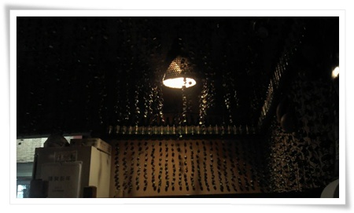

# 피맛골 일지매

삼색모임의 송년회로 피맛골로 정해 그곳에 있는 일지매라는 술집으로 갔다.

피맛골로 간 것은 이에 대해 추억이 있는 것은 전혀 아니고, 한두달전 가 보고 종로바닥에 이리 한산한 곳이 있었나라는 점이 맘에 들었기 때문.

그 때 들어간 일지매라는 곳도 그냥 주인 아저씨의 호객행위를 무시하고 가다가, 가던 그 길목에 더 이상 적당한 식당이 없어 그냥 들어간 사소한 이유.

연말인데도 이 곳은 여전히 한산하다.

천정에는 소주병 뚜껑으로 장식을 했다.

이곳의 시스템은 들어가면 서비스로 오뎅국과 파전을 기본으로 준다.  오뎅국은 무한리필.

그래서 안주값이 덜 들어간다.

유티때 같이 놀던 김대원선임,임동함선임,유성호선임,허진원선임,그리고 나 5명.

그 시절 참 재미있는 회사생활을 터라, 그 시절로 돌아간 듯한 느낌.

술보다는 안주발을 세우는 천진난만한 어른답게 안주로 배 채웠다.

이번에 먹은 안주 파전(8,000), 골뱅이소면(15,000), 고갈비(10,000), 닭도리탕(15,000).

나이를 먹긴 먹었나 보다.  시끄러운 장소에 가면 귀가 아프고 정신사나워지니 말이다.

피맛골이 한창 재개발중이라 몇년 후면 이 곳도 없어지겠구나.

