# 백담사 두번째 여행

[지난 여름 휴가로 백담사를 갔다.](../10764436.html)

그리고 늦가을 백담사를 갔다.

두번째 가서 똑 같은 것만 보고 느낀다면, 별 의미 없을 것이다.

그래서 이번엔 미리 공부를 해 두었다.

지난 11월 1박2일의 강원도 여행의 한 코스.

[​서바이벌 게임](../10805777.html) 을 마치고 백담사로 향했다.

넉달만의 방문이라 바뀐 것이라고는 그 때 녹음이 우거지던 것이 이제 낙엽이 되어 다 떨어진 늦가을 산.​

마을에서 운영하는 버스를 타고 백담사까지 올라갔다.

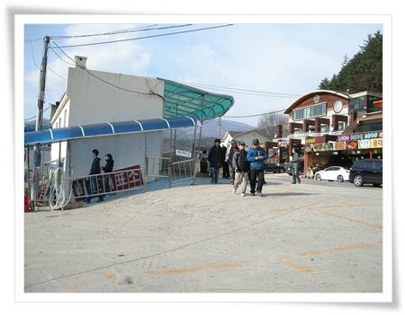

\- 백담사의 시작은 저 앞 매표소부터

\- 백담사 올라가는 버스안에서 딸내미

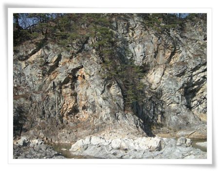

\- 버스에서 바라 본 계곡.

역시 내 사진은 실제 느낌을 전혀 전해주지 못하는군.  계곡은 입장 불가.

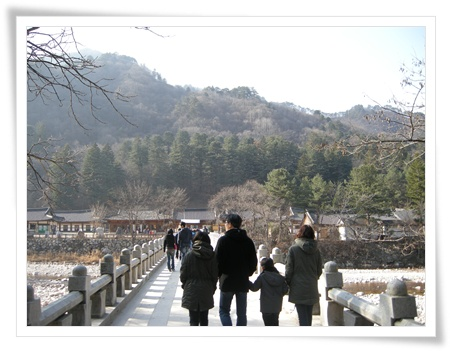

\- 버스에서 내려 조금 걸어가면 금강문으로 연결된 다리가 나오고,

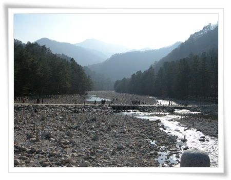

\- 저 멀리 보이는 봉우리가 설악산 대청봉인가?

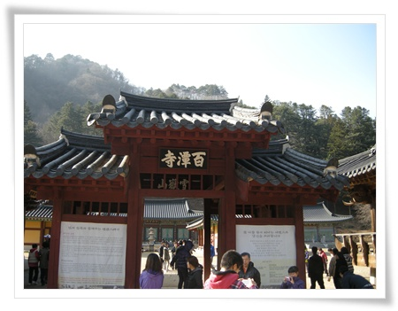

\- 다리건너 바로 백담사 사천왕문.

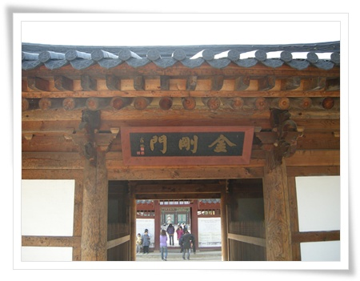

-금강문

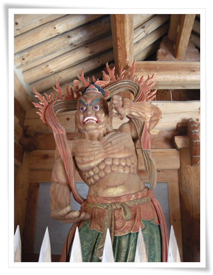

\- 금강문안에 있는 금강역사.  입을 벌리고 있으니 아금강역사인가 보군.

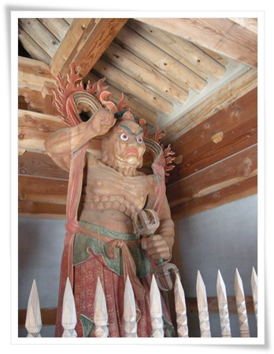

\- 입을 다물고 있으니 흠금강역사겠군.

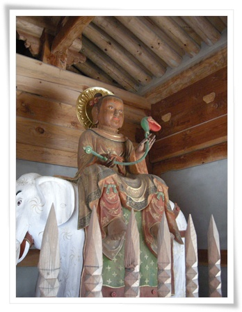

\- 흰코끼리를 타고 있는 이 분은 누구지?

흰코끼리 타는 것은 보통 문수보살인데, 문수보살이 보통 금강문 안에 같이 있는 것인가 보다.

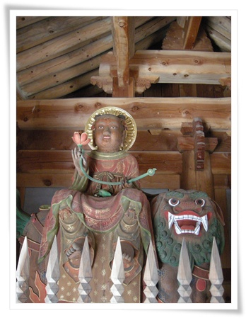

\- 사자를 타고 있으니, 보현보살인가 보다.

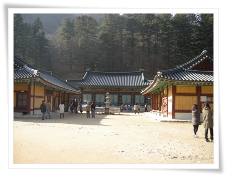

\- 탑하나에 전각하나 배치하는 모양인가 보다.  탑 뒤 전각이 극락보전.

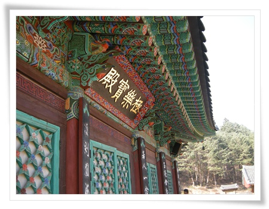

\- 극락보전.

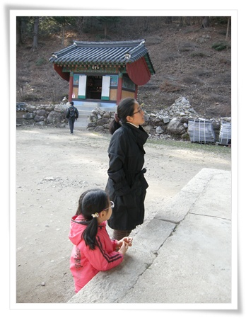

\- 극락보전 벽면에 그려진 그림을 보고 있는 아내와 딸.

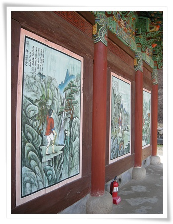

\- 극락보전 벽화는 십우도.

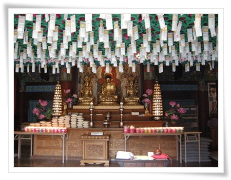

\- 극락보전이니까, 가운데가 아미타불.  좌우 협시 보살이 관음세음보살과 지장보살인가 보다.

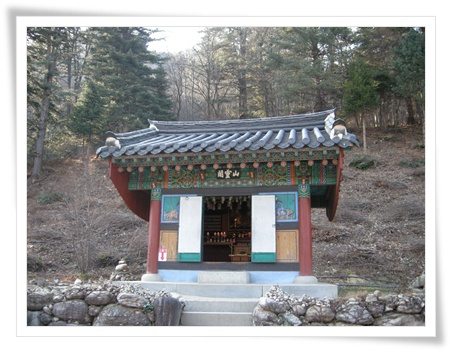

\- 극락보전 뒷편에 있는 산령각.

보통 산신각이라 하는데 백담사에서는 산령각이라고 하는군.

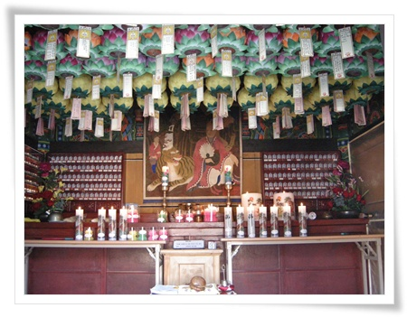

\- 산령각 내부.  호랑이와 함께 있는 산신이 그려진 탱화.

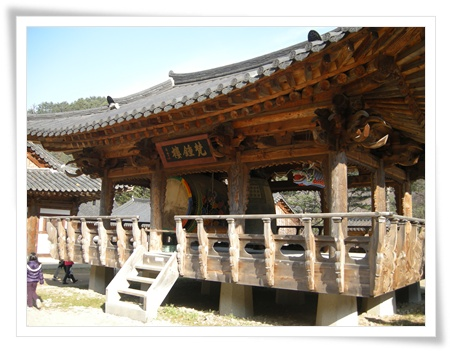

\- 종각.

전부 나무로 되어 있어, 고풍스럽다.  현판에 써진 한문은 뭔지 모르겠다. 나중에 찾아봐야겠다.

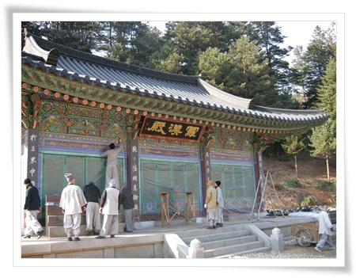

- 나한전에 비닐로 방풍작업을 하시는 스님들.

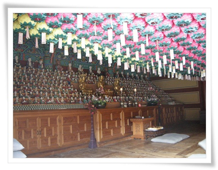

\- 나한전 내부.  부처님과 500나한을 모신 것인가 보다.

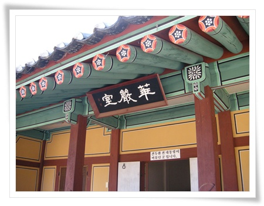

\- 화엄실.  전두환 있었던 게 무슨 자랑거리인지...

백담사가 유명한 것은 만해 한용운이 있어서이고, 그래서 백담사 내에 만해 기념관이 있다.

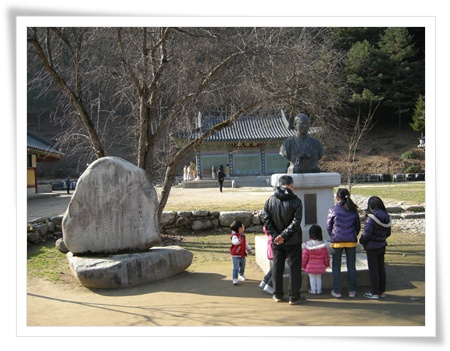

\- 만해한용운 동상.

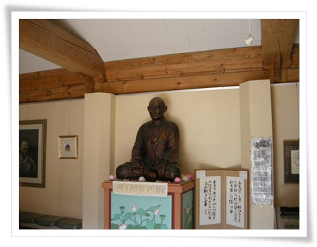

\- 만해기념관 내부.  1층과 지하 2층으로 되어 있다.

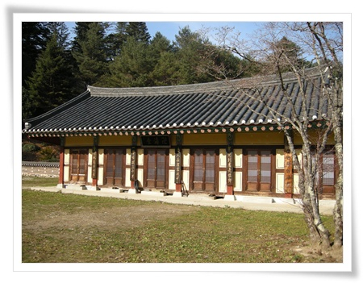

\- 이 건물은 만해당. 관광객에게 공개되지는 않은 듯 하다.

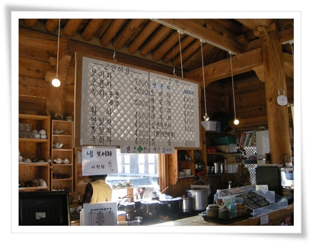

\- 백담사 내에 있는 찻집겸 기념품 판매점.

차 가격이 그리 싸지는 않다.  카드도 안되고 현금만.  그리고  셀프서비스.

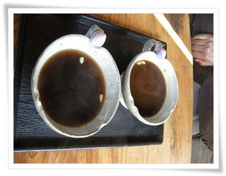

\- 각각 사천원인 십전대보탕과 대추차를  먹었다.

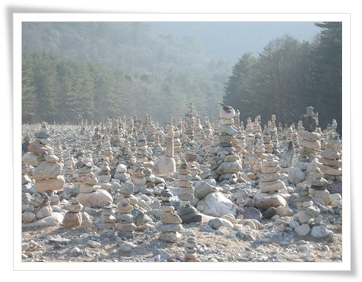

\- 여름에 왔었을 때는 이정도는 없었는데, 돌탑이 많이 늘었다.

비가 많이 오면 탑들이 싹 쓸려갔다가, 비가 한동안 안 오면 늘어나고 그러나 보다.

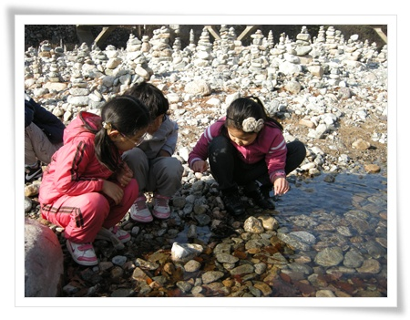

\- 같이 간 애들이 역시 물장난.

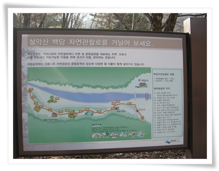

\- 자연관찰로도 있던데, 시간이 많이 않아 못 가봤다.  다음에 가 봐야지.

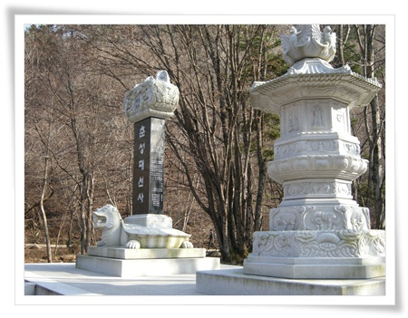

\- 춘성대선사비.

대선사가 승려를 가리키는 직위중 가장 높은 거라더군.

춘성대선사는 만해 한용운의 유일한 제자라고 한다.

승려를 기리는 비는 보통 사찰 전각 밖에 위치한다는군.

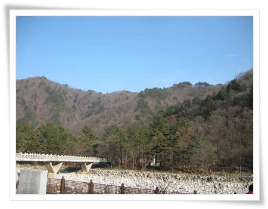

\-  늦가을 산에는 푸른 빛깔이 얼마 없다.

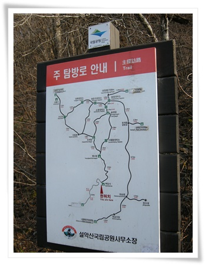

\- 이 길로 쭉 올라가면 설악산하고도  연결되나 보다.  가보고 싶다.

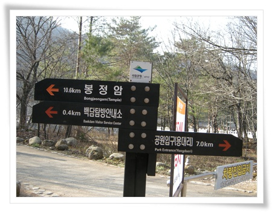

\- 10km가면 설악산 봉정암.

\- 돌아가는 버스를 기다리며.  산중이라 해 떨어지니, 기온이 급속히 떨어졌다.

마을로 내려오는 버스를 타고 마을로 내려와, 다시 버스를 타고 숙소로 향했다.

숙소는 인제군 기린면 방동리에 있는 방태산황토펜션.

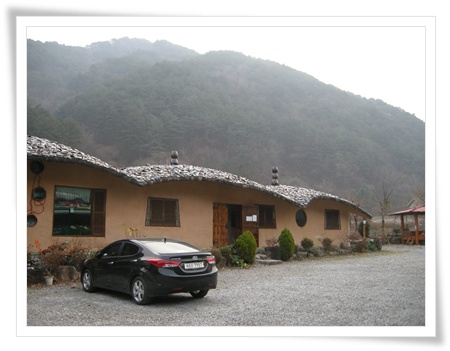

\- 방태산황토펜션.

펜션이 별로 좋지는 않았다.

방 내부에서 화장실이 있긴 한데, 화장실에 세면대가 없었다.   무슨 생각으로 이렇게 만들었을까하는 생각이 든다.

아침을 펜션에서 운영하는 식당에서 먹었다. 아침 메뉴 백반으로 나온 것은 전날 구운 것으로 추정되는 다 식어 빠진 생선과 그리 밥상에 올라가고 싶어하지 않아 보이는 콩나물과 고사리 나물..

그런데도, TV에 출현한 식당이라고 사진이 보였다.

앞으로 TV에 출현한 식당은 득보다 실이 많지 않을 지...  안나온 집보다 나온 집이 더 많으니 희소성이 없다.

