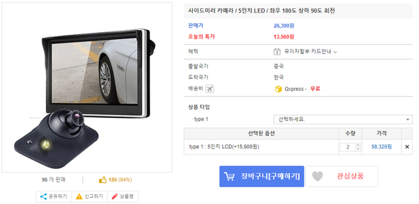
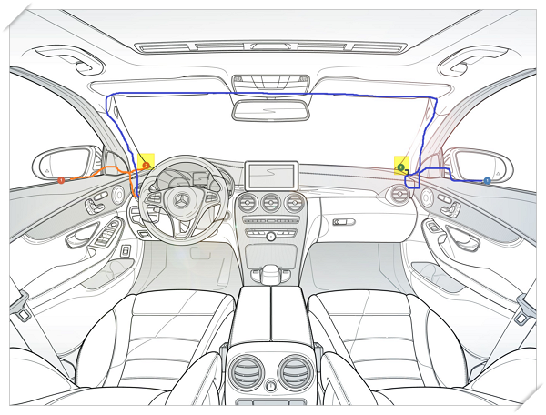
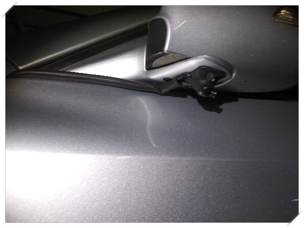
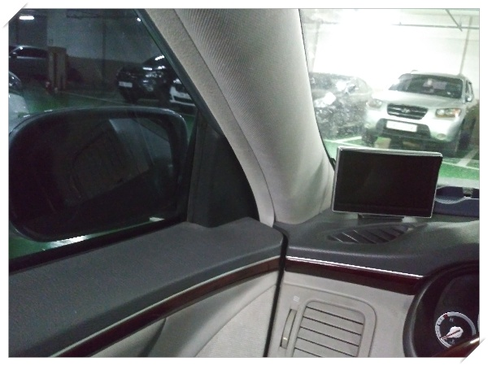
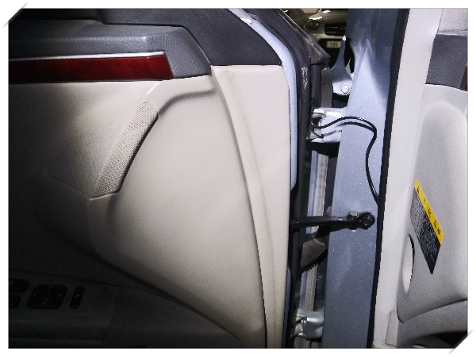
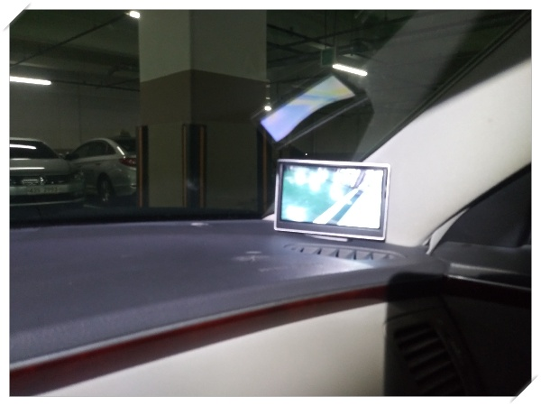

# 사이드미러 카메라 장착 DIY

쇼핑이라는 게 별로 필요하지도 않는 것을 지르게 된다는 것이 문제다.

11.11 자칭 광군절이라고 하는 시기 사이러미리 카메라를 봤다.

가격은 두 세트해서 52,250원.  카메라와 5인치 LCD까지 포함이라 쌌다.

지금 가격을 확인하니, 크게 차이나지는 않는군.

원래 중국에 주문하면 잊을만 할때 배송와야 하는데, 이 놈은 일주일만에 배송왔다.

아직 마음의 준비도 안되었는데..

막상 받고 나서도 DIY할 엄두는 쉽게 나지 않았다.

거의 2주간을 차 트렁크에 넣고 다니다니, 드디어 설치를 했다.

항상 배선이 문제다.

카메라와 LCD 모니터 사이는 문이 있기는 한데, 어차피 잘 보이지 않는 부분이라 문틈으로 가게 했다.

전원선은 생각을 많이 했다.

조수석으로 나와 있는 선이 없기에 어떻게는 왼쪽 휴즈박스까지는 가야했다.

위 그림처럼 A필러와 지붕을 통과하는 길을 선택했다.

시거소켓은 과감히 잘라, 퓨즈박스내 ACC 휴즈에 직결했다.

\- 사이드 미러 밑에 양면 테잎으로 고정하여 카메라 설치

\- 왼쪽 설치 모습

\- 카메라와 모니터를 연결하는 선

\- 그리고 조수석.  주차선은 잘 보인다.

장착하고, 한 2주간 운행해 본 소감.

괜한 짓을 했다.

제품의 목적 자체는 사이드미러의 사각지대를 해소하는 것이 목적인데, 저거 없어도 내가 원래 숄더체크를 하는 습관이 있어 굳이 필요는 없었다.

그리고 대시보드가 좀 너저분해보인다.  게다가 야간 운행시 모니터 불빚때문에 가끔 눈부실때가 있다.

그래도 장점이 없지는 않다.

정체길 주차시, 옆 차선에 누가 오는지, 특히 오토바이 잘 보인다.

그리고 주차시, 주차라인이 아주 확실히 보인다.  주차할 때만큼은 거의 어라운드뷰다.

