# LG사이언스홀 구경

회사에서 이벤트로 한 사이언스 관람에 신청했는데, 선정됐다.

원래 워낙에 횡재운이 없는터라, 뭐하나 당첨되는 되는 법이 없는데, 이번 건은 아무래도 경쟁률이 별로 안 되었던것 같다.

서울과 부산 2군데 있고, 서울에 있는 것이 최근에 개장한 듯 싶었다.

위치는 여의도 트윈타워 중간.

사이언스홀이니까, 우리말로 그냥 과학관이다.

과학관하면 아주 어렸을 때 어린이회관인가, 어린이대공원인가에 있던 과학관이라고 촌스럽게 된 것 가본 게 처음이다.

그리고, 중고등학생 시절 안국동에 있는 정독도서관 가면서, 그 근처 와룡동에 있던 국립서울과학관은 몇번 갔었다.

마지막으로 가장 최근에 가 본 건, 서울대공원 앞에 있는 국립과천과학관.

사이언스 홀이니까, 뭔가 사이언틱한 분위기가  재미있는 장난감들이 있을거라 기대가 조금은 있었다.

그리고, 주말 하루 딸내미한테 그래도 뭔가 보여줄게 생겼다라는 안도감을 가지고  갔다.

공식적인 관람시간은 2시간인데, 주차지원은 1시간.

밥먹고, 기다리고 그러면, 주차비가 꽤 나올 것 같았다.

지도에서 가장 가까운 공영주차장을 뒤졌다.

여의나루역에 있는 한강 주차장이 가장 가까운 주차장이고, 그나마 싼 가격이 이었다.

최초 30분 2,000원, 이후 10분당 200원이었던 같았다.  주차료 한 오륙천원정도 나오겠다 싶었다.

한강 주차장에 주차하고, 길 건너 바로 있는 트윈타워로 입장.

그래도 명색이 회사 지원 이벤트라, 밥이 제공되었다.

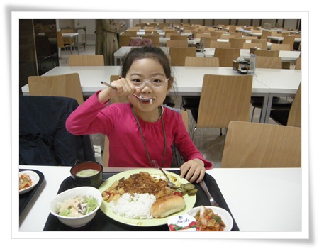

\- 점심으로 먹은, 돈까스.  맜있더군.

올라가는 것은 중앙 계단을 통해 올라간다.

자유 관람이 아닌, 회차당 15식구 남짓한 사람들이 한꺼번에 이동하는 거였다.

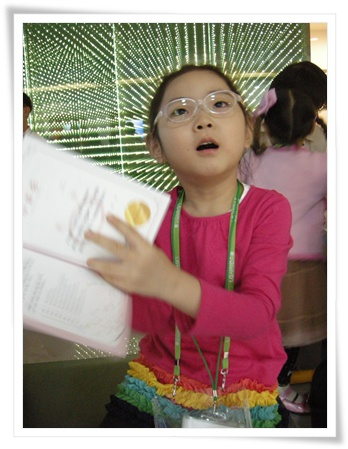

\- 명찰과 패스포트식으로 뒷면에 수료증이 있는 공책을 먼저 수령.

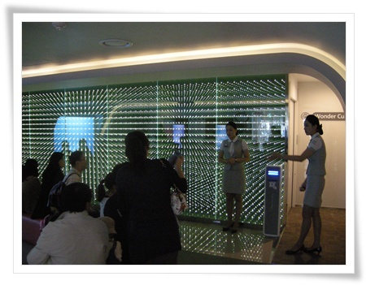

\- 그리고, 오른쪽 문으로 입장.

첫 번째 방은 전면, 좌우가 전부 LCD인 곳이고, 그 벽에서 애니메이션으로 된 과학이야기가 시작되었다.

애니메이션 끝난 후 전면 벽이 갈라졌다.  이게 제일 멋있던 것 같다.

그리고 그  다음 방으로 입장.

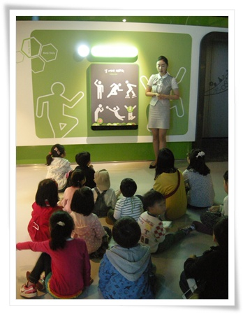

\- 방이 꽤많던데, 이동시 마다, 이렇게 설명을 하고, 자유관람하고 다음 방으로 이동하는 식이다.

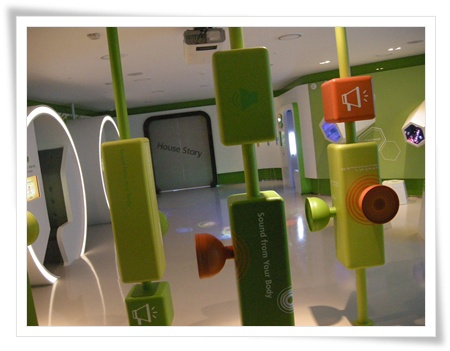

\- 이게 두번째 방의 모습.  딱히 어른에게 흥미를 주는 장치들은 아니었다.

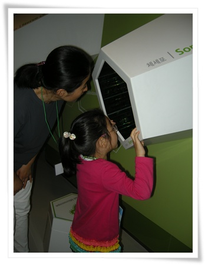

\- 이건 체세포를 보여주는 기구

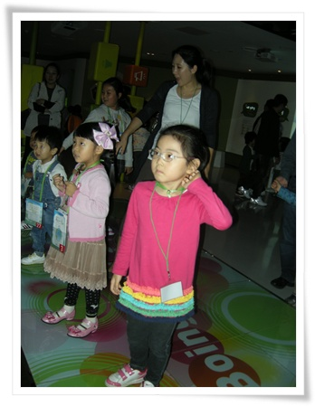

\- DDR처럼 된 발판에 위에서 화면을 보고, 게임하는 아이들

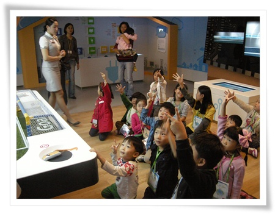

\- 가장 인기있던 것.  로봇청소기로 축구하는 것인데, 게임하고 싶은 사람 손들라고 하니, 손 드는 애들.

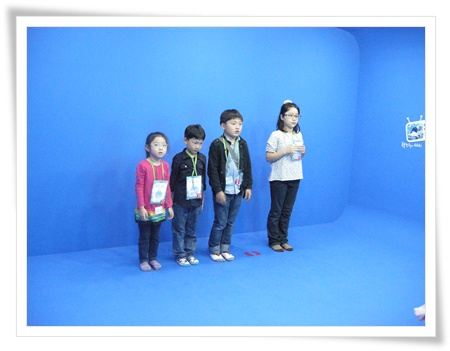

\- 이건 배경영상을 합성하는 장면,

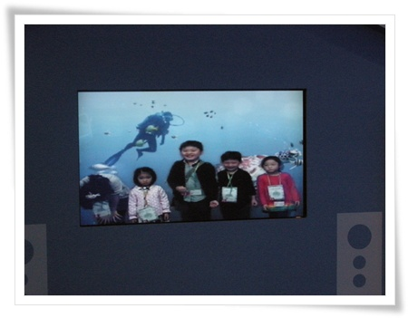

\- 위의 퍼런 화면에서 동작한 것을 이렇게 바다 동영상과 합성해서 보여줬다.

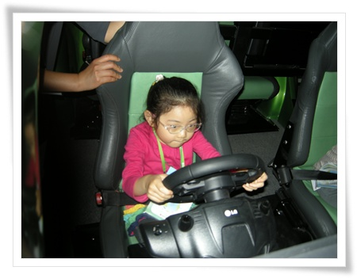

\- 가장 인기있던 자동차 게임.  오락실처럼 의자가 상하좌우로 움직이는 거라, 나도 해 보고 싶더군.

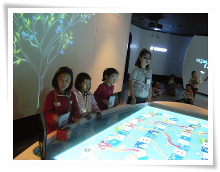

\- 이건 브루마불같은 형식의 지구를 지키는 오락.

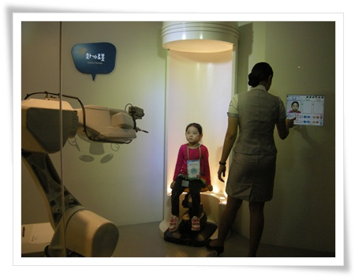

\- 로봇 화가가 그리는 그림.  사진을 찍어, 그 사진에서 윤곽선을 찾아 그리는 방식이더군.

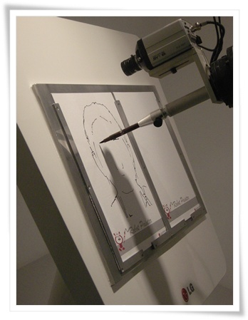

\- 윤곽선 찾았으면, 이렇게 열심히 그린다.

나에게 가장 재미있있던 것은 두명의 남녀배우가 나와 과학교실을 하는 거였다.

연기도 자연스러웠고, 청중과 반응하는 것도 좋았다.

이걸 찍었어야 하는데, 정작 가장 좋게 생각했던 것은 몰입하느라 안 찍었나 보다.

관람시간 2시간동안, 쉬지 않고 계속 여러 방들과 각 기기들을 설명->체험->다른방이동-> 을 반복하다보니, 두번째 방을 지나면서부터 부모들은 지치기 시작하더군.

창문없고, 모든 벽이 다 닫혀 있어, 도중에 화장실도 가기 힘든 구조라, 처음 입장 전 화장실을 다녀오라고 안내 하더군.

공기가 쾌적하지 못해서 그런가 피곤이 일찍 찾아오는 듯..

아이들에게도 2시간은 길었나 보다.

처음엔 호기심을 가지다가, 슬슬 산막한 아이들이 늘어나 보이더군.

아무래도 정해진 순서대로 움직이는 거라 그런가 보다.

무엇보다 2시간동안 안내하는 진행요원이 가장 수고가 많은 것 것 같다.

나중 사이트좀 검색해보니, 이 사이언스홀이 엄청 예약이 힘든거라고 하더군.

예약받기 시작한 시간이 되면, 광속마감이 된다던데, 암튼 좋은 경험이었다.

