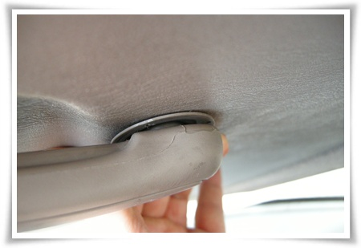
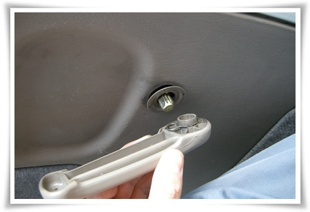
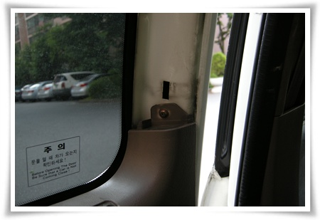
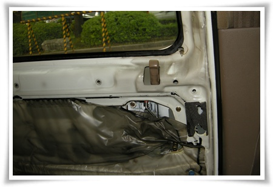
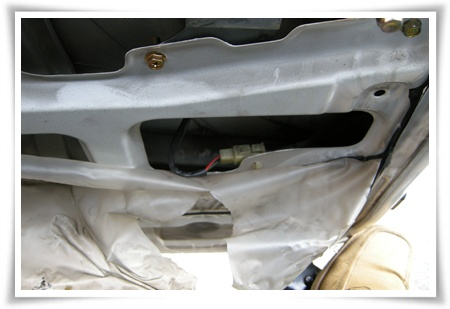
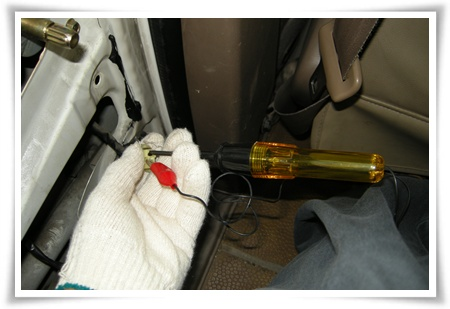
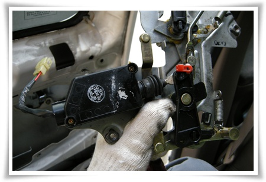
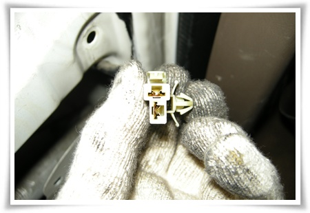
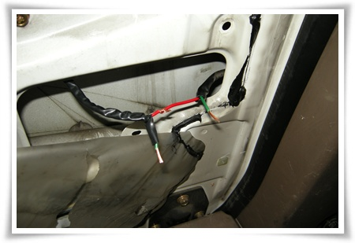

# 카니발 2열 도어 액추에이터 수리 DIY

나의 카니발.

2000년 출생으로,  이제 12년밖에 안된, 24만5천킬로밖에 안 뛴 막 길들여진 차.

이 차가 한 1년전부터 2열 문짝이 자동으로 안 잠겼다.

그래서 나의 사회적지위와 명예와 맞지않게, 딸내미가 앉는 2열 문을 열때는 운전석 문을 먼저 열고나서 손을 2열로 집어넣어 락을 풀어 열었었다.

그 생활을 1년을 하다보니, 지겨워 고쳐보기로 했다.

첫 난관은 안쪽 문 손잡이 뜯는 것이었다.

인터넷에서 문 손잡이 뜯는 방법을 익힌 후, 작업에 착수했다.

\- 손잡이 틈색를 벌려, 오메가형 링을 풀면 손잡이 분해가 되는 구조다.

\- 분해된 안쪽 손잡이

그리고 나서, 도어트림을 뜯으려는 잡아당겨도 안 나오는거다.

그래서 위쪽 도어트림부터 뜯으니, 나사가 숨겨져 있었다.

\- 상단의 도어트림을 뜯어서야 나타난 나사.

\- 이제 도어트림 분해 완료.

\- 저 선이 도어액추에이터에 전원을 공급하는 선.

\- 커넥터를 분리해, 공급선쪽에 검전기를 연결해 전원이 제대로 공급하는지 확인.  전원이상 무.

그래서 엑추에이터가 고장이구나하고 생각하고, 정말 엑추에이터인지 점검하기 위해 직접 12V전원을 공급해보기로 했다.

\- 분리한 엑추에이터뭉치.

엑추에이터에 직접 12V전원을 공급했다.  그런데 동작하는 것이다.

전원공급부도 이상없고, 엑추에이터도 이상없으면 대체 왜 도어락이 동작안하는 것일까 한참을 고심.

\- 그래 이 커넥터가 접촉불량일것이다라고 결론지었다.

\- 커넥터 잘라내고 직접 연결.

이렇게 연결하고, 도어락을 동작시켜보니, 철커덩철커덩 잘 동작한다.

조립은 분해의 역순.  마무리 짓고 뿌듯한 마음으로 차문을 닫고 문을 잠그는데, 어째 2열문만 거꾸로 동작한다.

다른 문 다 짐길때 혼자 열리고, 다른 문 다 열릴 때 혼자 잠긴다.

결선을 반대로 한 거다.

허탈한 마음을 뒤로 하고, 다시 문짝 뜯었다.

다시 다 분해한 후, 결선도 풀어서, 결선을 옳게 하고 재조립.

1년만에 정상적으로 동작하는 문짝이 되었다.

총 작업시간 2시간.

작업의 난이도 좀 있는 편이다.

작업 결과에 만족.

