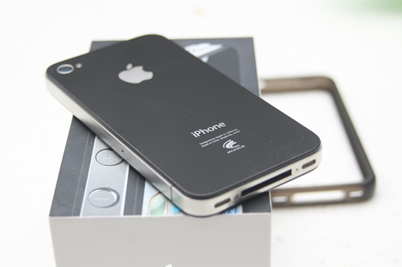

# 굿바이 아이폰

제 돈 다 주고 산 최초의 핸드폰 아이폰.

스마트폰 쓰면서 처음으로 불편을 거의 못 느끼며 사용했던 폰.

그 폰을 아쉬움속에 지난주 60만원에 팔아치웠다.

그리고 안드로이드폰으로 왔다.

\- 장터에 내놓기 위해 곱게 찍은 모습

물건을 애지중지하며 쓰는 타입이 아니라, 보호필름없이 생폰없이 썼는데도 앞면은 기스가 전혀 없더군.

역시 강화유리가 좋긴 하다.

애플빠는 아닌데, 작년 예약판매 5차로 아이폰을 6개월 쓰면서 어느듯 애플빠 비슷하게 된 것 같기도 하다.

유일한 불편함은 아이튠즈였으니...

주로 사용했던 프로그램은 아이팟, 그중에 팟캐스트였다.

정말 편리했다.  이에 mp3를 잘 안 듣는 내가 출퇴근시간 이어폰을 끼고 있었다.

좋아하는 팟캐스트는 '김영하의 책읽는 시간', '라디오북클럽', '박경철의 경제포커스'.

그리고, 페이스북, RunKeeper, 인터넷 브라우저.

그래도 안드로이드로 오니, 그렇게 많이 불편하지는 않더군.

팟캐스트도 google listen을 통해 불편하게나마 가능하고,

ui도 반응 느린 것 외에는 참을 만하고,..

그래도 아이폰의 레티나화면과 화사한 카메라성능이 생각나긴 한다.

아이폰때문에 스마트요금제를 맛을 들여, 여전히 스마트 요금제를 쓴다.

원래 한달 평균 20분정도밖에 음성통화를 안 해서, 150분이라는 이 거대한 음성통화시간을 아직도 거의 반밖에 못 채우고 산다.

