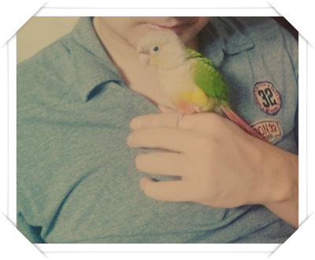
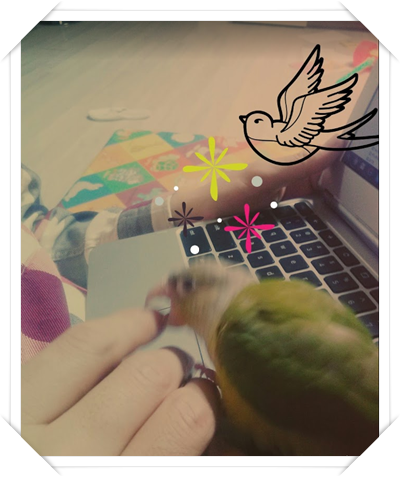
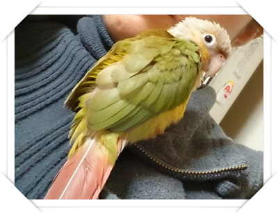
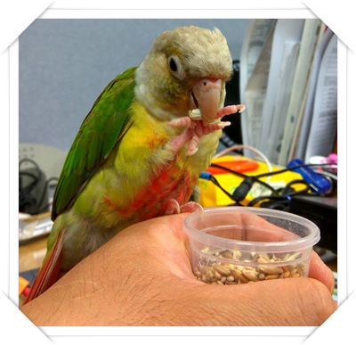
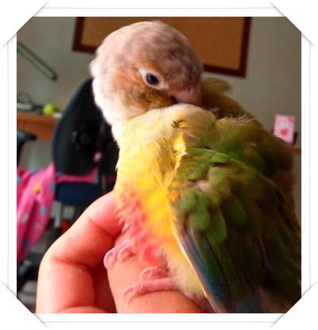
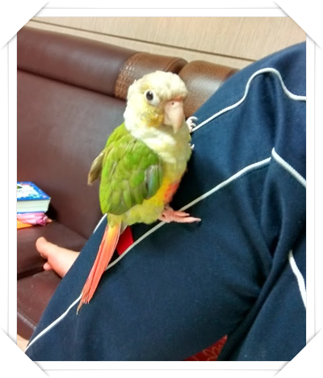
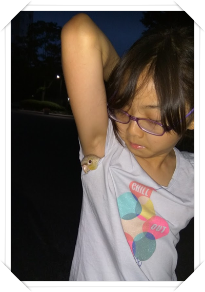
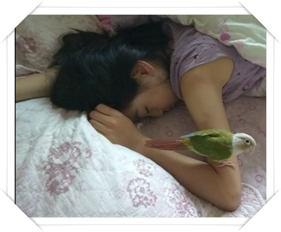
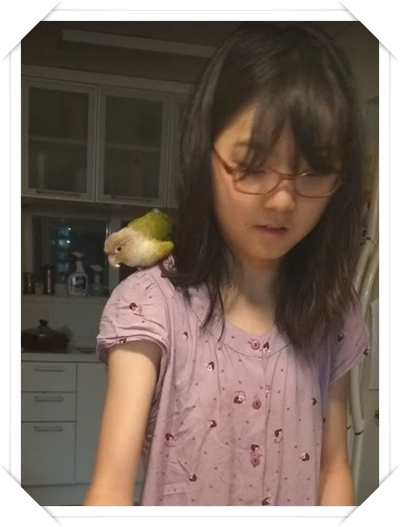
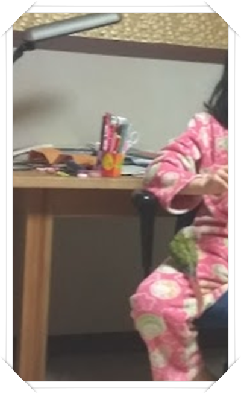

# 쪼쪼를 추모하며

2년간 한 식구였던 앵무새 쪼쪼가 이제 없다.

바로 오늘 죽었다.

있다가 없을때의 빈자리가 너무 크다.

쪼쪼에 대한 기억이 희미해지기 전에 추억을 정리해본다.

2016년 2월.  한살짜리 시나몬코뉴어 앵무새가 우리집에 왔다.

내는 소리가 쪼쪼처럼 들려서 이름은 쪼쪼라고 했다.

사람을 좋아하여 언제나 우리몸에 붙어 있었다.

내 어깨에, 아내 옷자락에, 딸내미 품속에..

집에 있을 때도, 산책할 때도, 여행갈 때도 같이 했다.

현관 번호키 눌리는 소리가 들리면 주인 들어오는지 알고 반갑게 소리를 냈다.

낮선 장소에 갈 때는 품안에 들어와 머리만 밖에 내밀고서 호기심어린 눈으로 바깥을 구경했다.

추울 때는 목덜미에 붙어 있는 것을 좋아했다.

그리고 내 손안에서, 손 위에서 자는 것을 좋아했다.

\- 2016년 2월 21일.  식구가 된지 얼마 안된 때.  이때는 아직 아기새 모습을 하고 있었구나.

\- 2016년 3월 2일.  호기심이 많아 모든 것을 입으로 물어서 확인하다.  내 손가락도 마찬가지.

\- 2016년 3월 19일.  아내 목에 붙어 있다.

\- 2016년 3월 29일.  사무실까지 따라왔다.  내 손에 앉아 밥 먹는 중.

\- 2016년 3월 29일.  털고르기도 내 손 위에 앉아서..

\- 2016년 4월 30일.  쇼파에 누워있는 내 다리에 앉아있다.

\- 2016년 6월 12일.  외출할 때는 품안에 있으면서, 목만 바깥 구경.

\- 2017년 7월 11일.  늦잠 자는 딸내미 팔에 얌전히 앉아있다.

\- 2017년 7월 25일.  딸내미의 단짝친구로 항상 어깨에 붙어 같이 움직이고, 뭘하는지 호기심어린 눈으로 본다.

\- 2017년 11월 28일.  내 손위에서 저렇게 얼굴을 파묻고 자는 것을 좋아했다.

\- 2017년 12월 25일.  내가 가진 쪼쪼의 마지막 사진.

평균수명 17년이라 하여 오래동안은 함께 할 줄 알았는데, 이렇게 갑자기 가는구나.

보고 싶다.

너무 일찍 보내서 미안하다.

