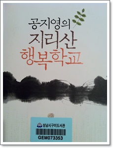

# \[책\] 지리산행복학교

좋아하는 팟캐스트중의 하나가 [라디오 북클럽 김지은입니다](http://www.imbc.com/broad/radio/fm/rabook/podcast/index.html).

그 팟캐스트에서 두어달 전에 소개된 책이 공지영작가의 "지리산 행복학교"였다.

그래서, 구미도서관에 대출예약 시도를 여러번 했으니, 도서관 대출 예약은 예약자 두명인가, 세명까지만 되기 때문에 인기있는 책은 예약도 하기 힘들어, 시간이 좀 지난후에야 빌릴 수 있었다.

책의 거의 첫 부분이 낙장불입시인편이었다.

이 낙장불입시인편이 내가 가장 인상깊은 이유가 이 시인이 "오랜만에 오신 삼촌 간첩인가 다시보자"라는 반공표어를 지은 사람이라는 거였다.  저 표어가 참 기억에 남는 것이(내 기억이 틀릴 수도 있겠지만,..) 도덕교과서에서 저 표어를 주제로 하여, 아버지가 낯선 사람과 밤에 이야기하는 것을 도덕책 그 단원의 주인공이 이불을 뒤집어 쓴고, 엿듣는 내용이었기 때문이다.

초등학생 어린이들에게 반공의식 고취와, 신고정신을 북돋아주기 위한 내용이었다.

기억상 내가 서울로 전학오기 전인 5학년때까지 매년 반공웅변대회도 했었었다.

저 유명한 반공표어를 63년생인 낙장불입시인이 초등학교 5학년 지어 상장을 받았다고 한다.

그런데 그의 어머니는 시인 위로 남매 둘을 낳고 남편을 잃었는데, 그 아버지가 빨치산을 따라 산에 들어가 있는 통에 수시로 경찰이 그의 집에 들이닥치고, 어머니는 시도 때도 없이 끌려갔었다고 한다.

그래서 그 상장을 받고 기뻐하는 아들 앞에서 어머니는 아주 어두운 표정이었다고 한다.

인생이 순조롭지 않았던 낙장불입 시간이 지리산으로 온 과정이 가슴아팠다.

하지만, 이 시인의 성장과정편을 빼고는, 책 내용은 제목처럼 아주 행복했다.

지리산 근처, 섬진강가에 사는 이 마을에 사는 사람들의 생활모습은 너무 행복해보여, 오히려 비현실적으로 느껴진다.

과연 이시대에 정말 그렇게 살까하는 의문이 들 정도로...

