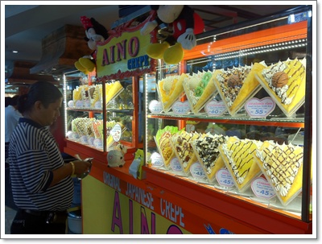

# 팟퐁커리

태국에서의 마지막 날.

오전에 딸내미 좋아하는 수영장에서 잠깐 물놀이 후, 체크아웃.

짐은 호텔에 보관 요청하고 작은 가방만 메고 호텔을 나섰다.

마지막으로 먹어야할 것은 팟퐁커리.  카레소스로 만든 게요리로 똥양꿍과 함께 태국을 대표하는 음식.

왕년에 수쿰빗거리에 있는 씨푸드마켓에서 홍콩인 켈빈과 같이 먹었던 적이 있었는데, 암튼 무척이나 비싼 음식이다.

혹시나 마분콩쇼핑몰에 있을까하여 쇼핑겸 찾아보러 갔다.

-마분콩가는 길 Nation Stadium역에서 사먹은 망고말림.  250바트(만원).

비싸긴 한데, 맛은 정말 좋더군.

마분콩 쇼핑몰 푸드코트에서 혹시 팟퐁커리없나 찾아봤는데, 없었고 대신 아내는 일식스테이크에 눈에 꽃혀 결국 점심은 일식철판요리를 먹었다.

-5층 푸드코트입구에 있는 오이시 철판요리점.

비프스테이크 189바트(7,500원)과 새우스테이크 169바트(7,000원)인데, 맛은 훌륭했다.

팟퐁커리를 먹기전까지 아내말로는 방콕에서 제일 맛있었던 음식이라고 했다.

\- 딸내미는 먹음직스렇게 생긴 크레페 사달라고 하여 50바트주고 사먹음.  맛은 별로.

\- 충분히 맛난 음식으로 기분 좋은 딸내미.

팟퐁커리를 포기할 수 없었다.

여행안내서에 태국의 씨푸드 전문체인점으로 쏨분씨푸드가 유명하다고 했다.

지도를 보니 마분콩에서 가까운 쏨분씨푸드가 쌈얀역 근처에 있었다.

마분콩에서 택시타고 쌈얀역으로 이동.

\- 쌈안역 바로 뒷 건물에 저렇게 쏨분씨푸드라는 간판이 보였다.

\- 쏨분씨푸드 레스토랑 내부.  제법 고급스런 식당이군.

\- 팟퐁커리 메뉴판.  스몰 200바트, 미들 300바트, 라지 600바트

라지사이즈를 시켰다.

-요리된 팟퐁커리.  생긴거는 별로 많지 않게 생겼는데, 먹다보니 배가 많이 부르더군.

\- 같이 시킨, 아스파라거스 요리 150바트(6천원)

\- 그리고 새우튀김 350바트(12,000원)

\- 세요리.  잠든 딸내미때문에 둘이서 다 먹느라 배터지는 줄 알았다.

팟퐁커리까지 다 먹었으니, 할 것은 했다.

새벽 1시에 출발하는 비행기시간까지 시간을 보내야 해야 했기에, 호텔근처로 마사지 받으러 갔다.

전날, 카오산로드에서 30분짜리 타이마사지를 받긴 했다.

호텔근처 마사지샾은 발마사지, 타이마사지 각각 1시간 200바트(8천원).

나는 발마사지, 아내는 타이마사지에 어깨추가로 했다.  그래서 아내는 250바트(만원).

\- 내 옆자리에 누워 맛사지 끝나기를 기다리는 딸내미.

내가 몸이 뭉친 부분이 없어서 그런가, 시원하거나 한 느낌은 없었다.

헌데, 이날 받은 호텔근처 마사지샾은 특히나 잘하지 못했다.

기본적으로 마사지는 아저씨나, 덩치큰 아줌마가 시원하게 잘 하는 편이다.

카오산로드는 배낭여행객위주로 하니, 덩치큰 아줌마가 많아 시원하게 잘 하는 편인데, 호텔근처나 시내는 아무래도 힘보다는 외모위주로 젊은 여자들이 좀 많다보니, 기술과 힘이 많이 딸린 느낌이 든다.

\- 3박5일의 마지막 방콕 수완나폼 공항.  신청사인데도 영 후지다.

**2월 17일 목요일**

06:00 기상

08:00 ~ 08:30 아침식사

09:20 ~ 10:20 수영장에서 물놀이

11:30 ~ 12:30 호텔에서 마분콩 쇼핑몰으로 이동 25바트 x2

13:00 ~ 16:00 마분콩 쇼핑몰 쇼핑

                   망고말림 : 250바트

                   와플 : 15바트

                   딸내미 옷 250바트

                   아내 썬글라스 150바트 x2

                   딸내미 장난감 : 100바트

                   오이시 철판요리 : 189바트 + 169바트

                   과일말림과 사탕 : 300바트

16:00 ~ 16:30 쌈얀역까지 택시 : 100바트

17:00 ~ 18:00 쏨분씨푸드 : 600마트, 350바트, 150바트, 60바트x3 = 1400바트

18:00 ~ 19:00 쌈얀에서 수쿰빗역까지 지하철 : 24바트x2

19:30 ~ 20:30 호텔근처에서 타이마사지와 발마사지 : 450바트

21:00 ~ 21:50 호텔에서 수완나품공항까지 택시 : 400바트

22:00 ~ 22:30 티켓팅

22:30 ~ 23:00 출국심사

**2월 18일 금요일**

01:10 ~ 08:30 방콕->인천공항으로 비행

08:30 ~ 09:30 입국심사와 짐 찾기

09:30 ~ 11:00 집으로 복귀

여행비용을 계산해봤다.  어른둘 아이한명 총 세명

항공권+호텔 : **210만원**

공연(씨암니라밋) : 3,450바트 + 30바트 =  **139,200원**

왕궁입장료 : 700바트 = **28,000원**

수상시장 : 750바트 + 450바트 + 10바트 + 10바트 = **48,800원**

교통비 : 24,000원 + 380바트 + 60바트 + 50바트 + 120바트 +

            50바트 + 100바트 + 68바트 + 70바트 + 50바트 + 100바트 + 48바트 + 400바트 = **83,840원**

식비+군것질 : 31,100원 + 20바트+68바트+ 300바트+100바트+30바트 +

                    500바트+500바트 + 70바트 + 30바트+20바트+20바트 +

                    500바트 + 25바트 + 210바트 + 490바트 + 30바트 + 250바트 +

                    15바트 + 189바트+169바트 + 300바트 + 1400바트 = **240,540원**

쇼핑 : 250바트 + 300바트 + 100바트 = **26,000원**

마시지 : 200바트 + 450바트 = **26,000원**

구급약 : 6,000원

이번 태국 여행에 쓴 총 비용은 270만원.

