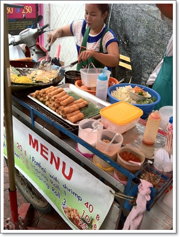
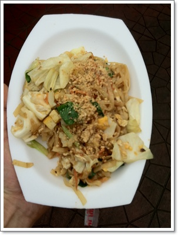
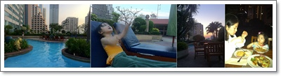
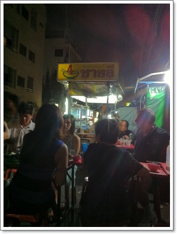
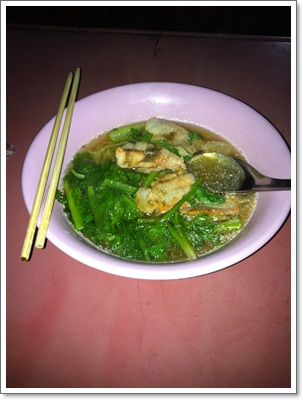
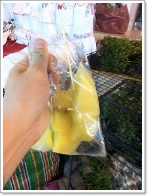

# 똠양꿍과 팟타이, 껭쯧운쎈무쌉

태국여행의 묘미는 역시 맛기행.

음식의 천국답게, 맛있는 것들로 넘쳐난다.

수상시장 투어를 마치고 도착한 카오산 로드에서 점심을 먹었다.

하지만, 촌스런 입맛을 가진 아내덕에 현지태국인들이 가진 식당에서 먹지는 못하고, 외국인들이 주로 이용하는 고급식당밖에 이용할 수밖에 없었다.

\- 오른편 국이 그 유명한 똠양꿍.  새콤한 맛이 아주 좋다.

하지만 이 식당에서는 팍치를 전혀 넣지 않았더군.

카오산로드에 맛있는 길거리음식들이 많다.

이미 점심으로 똠양꿍을 먹었음에도 팟타이를 발견하고 다시 식욕이 발동했다.

\- 팟타이파는 노점상.  즉석에서 조리하는 면요리.

\- 맛있는 팟타이.  25바트(1,000원).  이걸 들고 그냥 걸어가며 먹었다.

똥얌꿍과 팟타이를 먹으니, 이제야 태국에 온 소정의 목적을 이룬 듯 했다.

카오산로드에 오니 인터넷도 사용할 만했다.

호텔의 인터넷은 30분 150바트(7,000원), 1시간 300바트(12,000원), 하루에 600바트(24,000원)으로 무지무지하게 비싸다.

출장목적으로 오지 않는 한 감히 사용하기 힘든 요금이다.

그런데 카오산로드의 카페들은 그 카페를 이용하면, 1시간 10바트(400원)에 WiFI를 이용할 수 있었다.

그래서, 맥주와 망고주스를 먹으면서 가져간 아이폰으로 인터넷을 해 볼 수 있었다.

다시 호텔로 들어가기 위해 택시를 잡았지만, 호텔의 위치인 수쿰빗으로 어떤 택시도 가려고 하지 않았다.

그래서, 전철 노선도를 보니, 카오산로드에서 가장 가까운 역이 후알랑풍역이었다.

택시로 후알랑풍역까지 이동해서, 지하철타고 호텔까지 갔다.

호텔 도착해서는 딸내미가 가장 좋아하는 수영장으로 바로 이동.

특급 호텔이라 그런가, 수영장 시설이 좋았다.

14층 야외에 있는데, 고층이라 바람도 선선하게 불어, 해변가보다 더 괜찮은 느낌.

\- 수영장에서 저녁까지 수영하고, 저녁식사도 수영장에서..

물론 촌스런 입맛을 가진 아내는, 태국까지와서 스파게티와 피자따위나 먹었다.

그래서, 나는 다시 현지 음식 음식을 먹으로 호텔 밖을 나왔다.

호텔정문 노점에 다행히 내가 먹고 싶던 돼지고기면요리가 있었다.

\- 호텔앞 노점.  내 앞 테이블이 수끼를 먹더군.

\- 30바트(1,200원) 짜리 껭쯧운센무쌉.  팟치도 아낌없이 들어간 아주 담백하고도 시원한 국물맛이 죽여준다.

\- 후식으로 길거리에서 파는 20파트짜리 노란수박.

**2월 16일 수요일 오후**

13:30 ~ 14:00 수박주스, 똠양꿍, 스파게티 : 500바트(2만원)

14:00 ~ 14:30 타이마사지 : 100바트x2 (8천원)

14:30 ~ 15:00 팟타이 25바트(1,000원)

15:00 ~ 16:00 망고주스, 인터넷, 맥주 2병 : 210바트(9,000원)

16:00 ~ 17:20 후알람풍 전철 : 68바트 (2,800원)

                    카오산로드->전철역 택시 : 70바트 (2,800원)

17:20  호텔도착

17:30 ~ 20:00 수영장에서 물놀이하고 수영.  수영장에서 저녁식사 490바트(2만원)

20:00 ~ 21:30 저녁 30바트짜리 먹고, 길거리 구경

22:00  취침

