# 왕궁과 왕실사원

태국에서 둘째날.

원래 계획했던 수상시장 투어는 너무 피곤할 것 같아, 다음날로 연기했다.

수상시장 대신 왕궁을 구경하기로 했다.

그래서 아주 여유있는 아침을 보냈다.

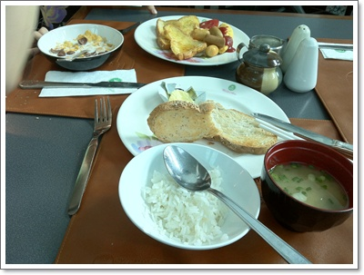

\- 호텔 아침 식사.  아주 맛있다.  이제껏 묵었던 호텔중 가장 맛있는 곳이다.

왕궁을 어떻게 갈까하다가, BTS타고, 수상보트 타기로 했다.

쑤쿰빗역에서 BTS타고, 씨암역에서 갈아타, 사판탁신역에서 내려 수상보트타는 곳으로 갔다.

뭔가 사람들 많이 줄서 있는 곳에서 보트를 탔는데, 너무 서두르다보니 실수를 했다.

원래 태국사람들이 타는 일반배를 탈려고 했는데, 관광객용 보트를 탄 거다.

일반배는 18바트인데, 관광객용은 25바트.

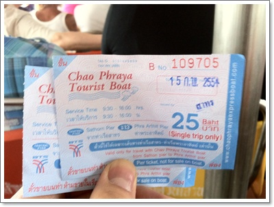

\- 사톤항에서 마아랏항까지.

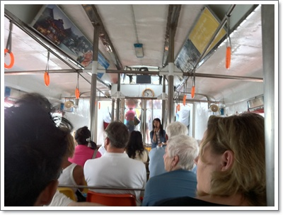

\- 관광객용보트라 탑승객들 거의가 외국인이다.

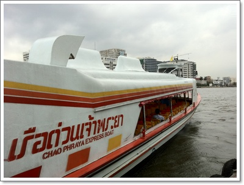

\- 이렇게 생긴 주황색 배다.

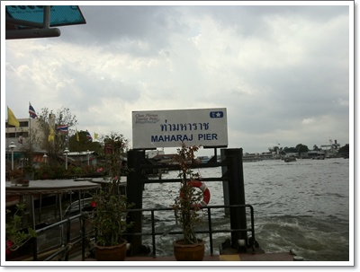

\- 왕궁주변항구인 마아랏 선착장.

마아랏 선착정에서 10여분 걸어가니 왕궁사원 입구가 나왔다.

입장료 350바트x2(28,000원)을 내고 왕궁사원 입장.

태국을 여러번 왔었지만, 입장하기는 처음이었다.

여러 이유가 있지만, 입장료가 너무 비싸서였다.

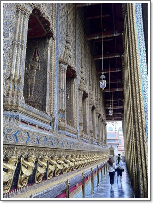

\- 왕실사원인 왓프랏캐우의 애머랄드사원.  내외부가 아주 화려하다.

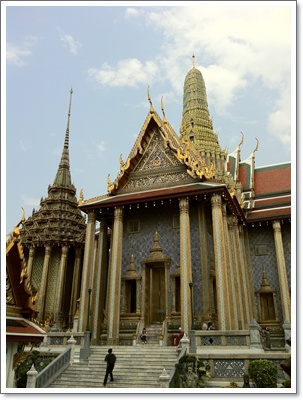

\- 사원의 다른 건물들도 아주 번쩍번쩍하다.

오래전 마르코폴로가 동방견문록을 썼을 때, 동양에는 황금이 아주 흔해, 황금으로 지붕을 올리고, 탑도 만든다고 썼었다고 한다.

그 황금건축물은 바로 이 태국의 왕실사원으로 보고 묘사한 거라고 하더군.

그 후 그 동방견문록을 읽은 서양인들은 황금을 찾아 동양으로 물밀듯이 몰려왔고,..

건물자체가 멋있기는 한데, 그래도 입장료가 너무 비싸다.

사원 지붕은 밖에서도 보이기 때문에, 굳이 비싼 돈 들여 들어가지 않아도 될 듯 해 보인다.

사원의 출구가 왕궁으로 이어져 있는데, 왕궁은 별 볼 것은 없었다.

아마 독일과 체코의 왕궁을 본터라, 그 웅장함과 너무 비교되어서 그런가 보다.

나름 태국의 겨울인데도 한낮의 더위는 강렬했다.

딸내미는 축 쳐서, 빨리 호텔로 돌아가자고 했다.

왕궁 옆의 타창 선착장에는 시장이 있어, 그 시장에서 과일을 사기로 했다.

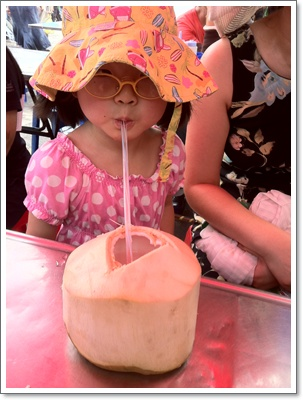

\- 30바트(1,200원)주고 사먹은 코코아.  촌스런 입맛을 가진 딸내미는 맛없다고 하여 나 혼자 다 먹었다.

\- 타창시장에서 산 망고스틴 1kg 300바트(12,000원).  아직 제철이 아니어서 그런가 새콤한 맛이 덜했다.

택시를 잡아타고 호텔로 돌아왔다.

호텔이 위치한 수쿰빗이 교통지옥인 방콕에서도 최고봉을 차지하기 때문에, 정말 오랜 시간을 택시안에서 보냈다.

반나절 왕궁투어만으로 넉다운.

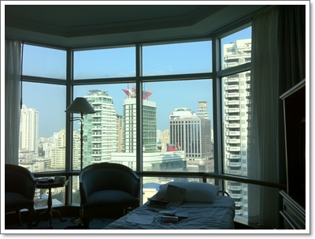

\- 다시 돌아온 호텔 방.  역시 에어콘 있는 호텔방이 좋다.

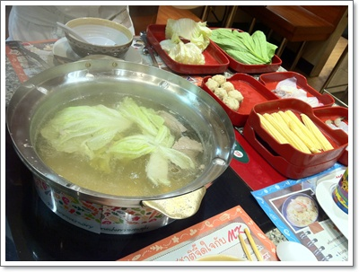

\- 저녁은 로빈슨 백화점 지하에 있는 MK수키에서...

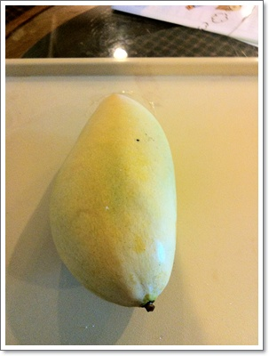

\- 큼직한 망고.  2개에 150바트주고 삼.  아주 맛있음.

**2월 15일 화요일**

06:00 기상

07:40 ~ 08:00 호텔 주변 산책

08:30 ~ 09:00 아침식사

09:30 ~ 10:00 모칫방향으로 BTS 탑승 (40바트x3= 4,800원)하여 사판탁신역으로 이동

10:30 ~ 11:00 수상보트타고 마아랏 선착장으로 이동 (수상보트 25바트 x2 )

11:30 ~ 13:00 왕실사원과 왕궁 구경 (입장료 350바트x2)

13:00 ~ 13:30 시장에서 과일 구매 (망고스틴 300바트, 망고 100바트, 코코아 30바트)

13:30 ~ 14:30 택시타고 호텔로 180바트(7,000원)

15:00 ~ 17:00 딸내미와 수영장에서 물놀이

17:00 ~ 20:00 로빈슨백화점으로 저녁식사(500바트=2만원, 슈퍼에서 먹을거리 500바트=2만원

21:00 취침

