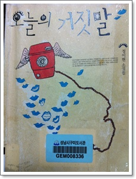

# \[책\] 오늘의 거짓말

정이현의 소설집 '오늘의 거짓말'을 읽었다.

즐겨듣는 팟캐스트 '김영하의 책읽는 시간'을 통해서 이 책의 '삼품백화점'편을 듣고 나서, 읽어봐야지하는 생각을 갖게 되었다.

이 책을 소개한 김영하 소설가의 설명을 들으니, 보통 소설가들은 자전적 소설을 쓰는 것을 꺼려한다고 하더군.

그런데 이 소설은 72년생인 작가 정이현의 자전적인 소설이라고 한다.

내가 소설을 잘 읽는편이 아닌데다가, 70년대 작가는 아예 아예 읽어본 적이 없었던 듯 싶다.

나와 같은 연대의 사람이면, 나도 혹시 작가와 비슷한 감수성을 가지고 있을려나 하는 기대를 가지고 읽었다.

이 소설집에는 상품평을 달아주는 일을 직업으로하는 여성이 등장하는 '오늘의 거짓말'을 포함하여 10개의 단편소설이 있었다.

그 중 '삼풍백화점'편은 기사체 문장으로 시작되었다.

1995년 6월 29일 목요일 오후 5시 55분 서초구 서초동 1675-3번지 삼풍백화점이 무너졌다.  한 층이 무너지는 데 걸린 시간은 1초에 지나지 않았다.

강남 8학군의 유복한 집안출신으로 대졸 미취업상태인 주인공과, 강북출신으로 같은 고등학교를 나와 상품백화점에서 점원으로 근무하는 주인공의 친구.

95년, 비록 나는 강북이기는 하지만 같은 서울에서 살았었고, 강남은 국립중앙도서관가느라 가끔 가 보았었다.

그래서 그런가, 등장인물들이 도서관 구내식당 같은 공간에서 밥 먹고 있었던 실제 사람처럼 느껴진다.

삼풍백화점이 무너졌을 때, 난 무엇을 하고, 무슨 생각을 했나 문득 궁금해져 일기장을 찾아봤다.

그런데 95년 5월,6월 두달동안은 일기를 안 썼더군.

95년은 내가 대학3학년 때였다.

그 때 대통령은 김영삼.

OECD 가입하였고, '샴페인을 너무 일찍 터뜨렸다'는 기사 제목이 나오던 시기였었다.

그리고, 비행기도 떨어지고 배도 가라앉고, 기차도 뒤집히고, 다리도 무너지고, 백화점도 무너지고, 헬기로 추락하고, 홍수로 군부대로 떠내려가던 시기였었더군.

