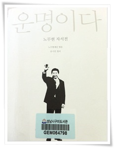
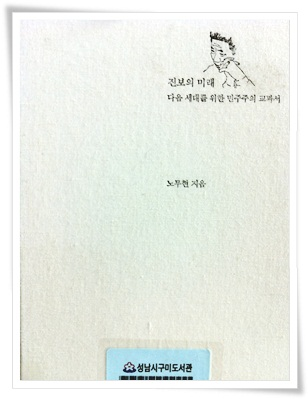

# 운명이다, 진보의 미래-다음 세대를 위한 민주주의 교과서

비극적 결말로 끝나는, 실패한 위인에 관한 책은 읽고 싶지 않았다.

그런 책을 읽고 나면, "어차피 세상은 정의가 어쩌느라, 도덕이 어쩌느니 해도 결국 정의가 승리하는 사례는 없네"라는 허무적인 생각만이 들 뿐이라 여겼다.

위인들중 독립운동가만 하더라고, 지금 그 후손들은 빈곤층에서 빠져나오지 못하고 있는데 반해, 매국노의 후손들은 사회의 기득권층으로 떵떵거리며 잘 살고 있는데, 그런 위인전을 읽고서 대체 무엇을 느껴야 하는 자괴감이 있다.

비교적 상식이 통했던 시대, 10년간의 기억은 이제 과연 그런 시절이 있었던가, 혹시 꿈은 아니었을까라는 생각마저 들게 한다.

기억도 좀 희미해져가기 시작하여, 감정의 격양도 이제 없겠구나 생각되어 보는 걸 주저하는 책을 봤다.

1\. 노무현이 존경하는 인물

\[

나는 백범 김구 선생을 존경한다.  김구 선생은 민족의 해방과 통합을 위해 목숨을 빼앗기는 순간까지 뜻을 꺾지 않았다.  그러나 그는 현실의 권력 투쟁에서 패배했다.  이런 의문이 들었다.  우리 현대사의 존경받는 위인은 왜 패배자뿐인가?  우리 역사는 정의가 패배해 온 역사란 말인가?  정의가 패배하는 역사를 반복하면서 아이들이게 옳은 길을 가라고 말하는 것이 얼마나 공허한 일인가? 나는 남북전쟁 종식을 눈앞에 두고 했던 링컨 대통령의 두번째 취임 연설문을 읽으면서 "정의를 내세워 승리한 사람"을 발견했다.

...

앞으로 존경하는 인물이 누구인지 물으면 링컨대통령이라고 대답하기로 결심했다.  링컨 대통령은 정의가 승리한다는 것을 보여준 겸손한 지도자였다.

\]

  -운명이다

2\. 진보에 대한 생각

\[

우리가 합의하고 계획할 수 있는 것이 사상과 제도예요.  국가가 뭘 해야 하나?  그렇게 사람들이 국가가 뭘 해야 한다고 생각하는 것 자체가 사상이니까요.  여기 국가가 뭘 해야 한다는 내용에 많은 제도들이 있는 것이죠.

군사가 있어야 작전을 하죠.  아무리 작전 계획이 정교해도 병사가 없으면 안 되거든요.  우리가 책을 쓰자는 것은 병사를 키우자는 것이거든요.

...

진보적 사상과 시민을 육성하지 않고는 그런 작전 계획만 갖고는 아무것도 안 됩니다.

\]

\- 진보의 미래

3 진보, 공산주의, 보수주의와의 비교

\[

공산주의 혁명이 뭐냐면 버스 딱 세워 놓고 몽둥이 들고 올라가서 "차주 내려와"하면서 패고", "기사 내려"하고 패고, 확 끌어내 버리고, "우리가 몰고 가자"하고 빵 가버리는 거거든요.

진보라는 건 그게 아니고 "차가 좀 비좁냐?  그래도 뭐 다 같이 가야 되는 사람들인데 타야 될 거 아이가?  우리도 좀 타자"  근데  못 타게 하니까 "왜 못타 얀마, 김해 사람은 손님도 아니야?" 이러면서 올타거든요.

"김해 사람은 손님 아니야?" 그렇게 하고 막 밀고 가는게 진보죠.  우리 진보.  요새 진보는 그 정도 얘기거든요.  "나도 좀 타고 가자" 이거죠.   ... 진보는 이거고,

보수는 "야 비좁다 태우지 마라.  늦는다.  태우지 마라"  이거죠.  내가 어릴 때 부산서 출발해서 김해에 오면 김해 정류장에서 늘 요 싸움하거든요.

\]

\- 진보의 미래

내가 평가할 만한 대상은 아니지만, 암튼 지금의 설치류 지배 상황과 비교하자니, 많이 그립다.

