# 양양 수산항에서 집단가출호 요트 체험

수요일 밤부터 목요일 아침까지 포레스트 전화가 왔었는데, 못 받았었다.

오후가 되어 전화를 걸었더니, 요트 타 볼 생각 있느냐는 것이다.

\- 포사장님의 DM

내용은 한 출판사에서 요트 여행 책 출판 기념으로 요트 승선 체험 행사에 자리가 비었다는 것이다.

럭셔리 스포츠의 최고봉이라 할 수 있는 요트를 내가 또 언제 또 타볼까하고, 가겠다고 했다.

[예문당 블로그에서 요트여행 책 도서후기](http://yemundang.tistory.com/262) 를 봤기 때문에, 대략 이거이겠구나라 예상을 했다.

시간은 금요일 저녁 8시 강원도 양양 수산항에서 집결하여 1박 2일.

이 행사를 기획한 가디언출판사로부터 확인전화가 왔다.

같이 갈 사람 있냐고 묻길래, 애도 데려가도 되냐니까 된다고 하더군.

그래서 아내와 딸 다 데려가기로 했다.

메일이 왔다.

\-\-\--

항해준비물 : 선글라스, 목장갑, 멀미패치, 운동화(슬리퍼 절대 안 됨), 우비(우천시), 식수, 간식, 신분증

야영준비물 : 침낭, 매트리스(이 둘은 혹시 선실에서 잘 때 더우면 요트 위에서 잘 때 필요합니다. 없으시면 안 가져 오셔도 됩니다)

일정

-13일(금)

20시 : 양양 수산항 마리나 집결 후 요트 타는 곳으로 이동

21시 : 참석자들 인사 후 소주 한잔(?) 먹으며 친해지는 시간

22시 30분 : 요트에서 취침(그날 기상 사정에 따라 달라질 수 있습니다)

-14일(토)

7시 30분 : 기상

8시 : 아침식사(컵라면 외 간단한 식사)

9시 : 출항(2시간 세일링, 날씨나 사정에 따라 돛을 펴지 못할 수 있습니다)

11시 : 요트 세척

12시 : 점심 식사 후 귀가

\-\-\--

시간표를 보니, 도착해서는 대화의 시간, 다음날 2시간동안 요트 세일링이었다.

4시간동안 가는 거리치고는 요트 항해시간이 너무 짧아, 간김에 캠핑도 하고 와야겠다하고, 캠핑 준비까지 다 했다.

회사는 오후반차를 썼다.

오후 4시 반 잠실에서 출발했다.

올림픽대로-경춘고속도로-미시령을 거쳐 양양에 갔다.

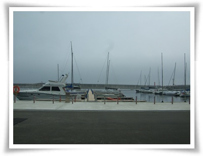

\- 양양 마리나 요트정박장.  어떤게 이번에 탈 요트일까?

양양 수산항에 7시에 도착하여, 뭘 먹을까 고민하다가, 어차피 선택의 여지가 없어 근처 횟집에서 물회를 먹었다.

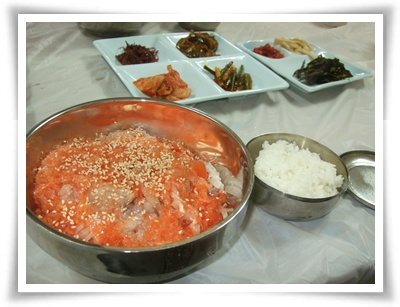

-1인분에 만원.  맛은 그럭저럭 괜찮았다.

요트팀은 8시 30분쯤에 다  모였다.

가디언출판사 팀장님, 집단가출호 송철웅님과 이지원님, 그리고 체험하러 온 여자 두분.

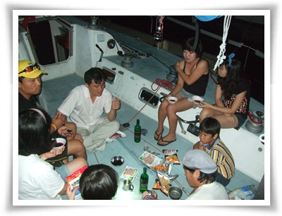

\- 체험객 5명.  선원 2명과 그 아들.  기획하신 출판사 팀장 1분.

요트 위에서 밤 12시까지 이야기를 나눴다.

딸래미는 송철웅님 아들래미 건이에게 푹 빠져, 건만 졸졸 따라다녔다.

여자들은 주차장에 텐트를 쳤고 거기서 자는데, 딸래미가 건에게 빠져, 텐트에서 안 잔다고 하여, 요트 선실에서 재웠다.

그 덕에 딸래미 수발드느라 힘들었다.

요트 안은 덥고, 습하고, 모기는 공격하고 암튼 괴로운 밤이었다.

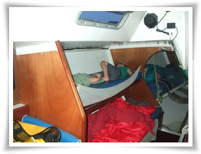

\- 선실안.  위칸에 딸래미.  아래칸에서 내가 잤다.

다음날 기상은 5시.  아침에도 습하고 더운 날씨였다.

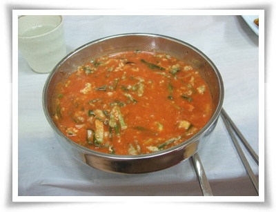

-아침은 섭국.

홍어를 매운탕죽처럼 만든 것인데, 맛 괜찮더군.  가격은 만원.

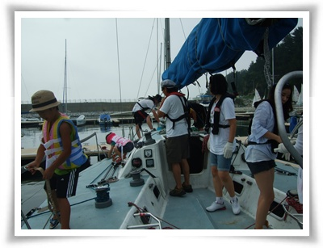

\- 요트에 오르고, 이제 출항 준비

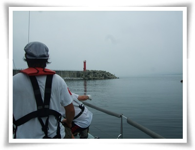

9시에 출항을 시작했다.

그런데 바람이 안 부는 거다.

엔진을 켜고, 바람이 불만한 곳까지 나갔는데도 바람이 안 불었다.

전날 파도 5M에서도 살아남은 무용담을 들여놓았는데도, 바람이 안 불어 행사를 기획하신 분들의 표정이 어두워졌다.

신나게 바람과 파도를 가르는 모습을 보여줘야하는데라는 이러면 안되는데라는 표정...

속초 동명항까지 거의 엔진 힘으로 갔다.

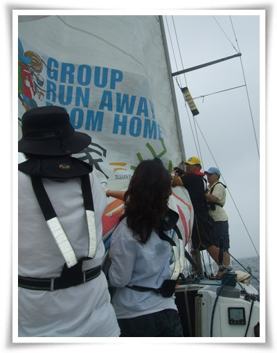

\- 돛을 내리는데, 모든 사람 다 동원.  엄청 무거웠다

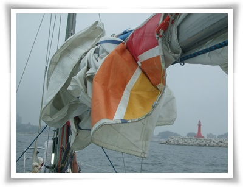

\- 돛을 체험객들이 개다보니, 이렇게 영 각이 안 나왔다.

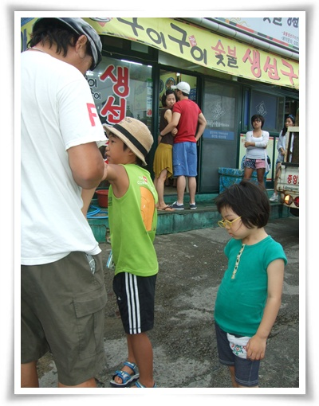

점심은 1박2일에서 강호동이 밥 먹었다는 생선구이집으로 갔다.

사람들이 줄까지 서서 먹더군.

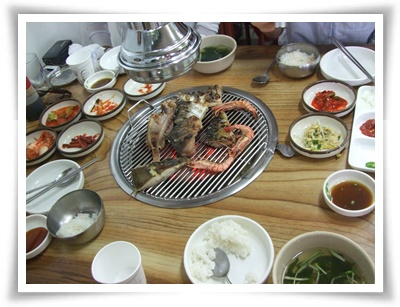

\- 1인분에 만원하는 생선구이

맛은,.. 뭐 그다지 감동이 없다.

그냥 종로 5가 뒷쪽의 생선구이 골목의 5천원짜리 생선구이가 오히려 더 낫더군.

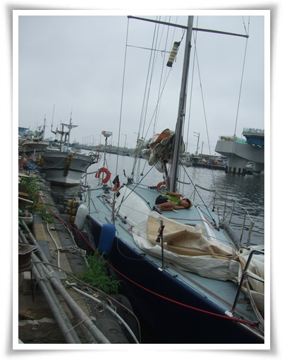

\- 동명함에 주차된 요트

점심을 먹고 나니, 비가 오기 시작했다.

다행이 비는 금방 그쳤고, 비가 그치고 나니, 바람이 제법 불었다.

기획하는 분들의 표정은 밝아졌고, 엔진은 끄고 순전히 바람이 힘으로 항해가 시작되었다.

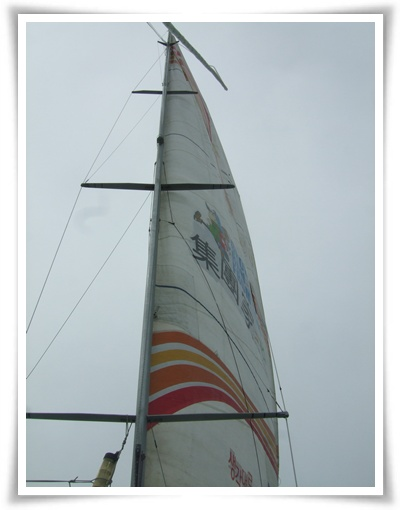

\- 집단가출호 메인돛.  워낙 커서 화각에 다 나오는군.

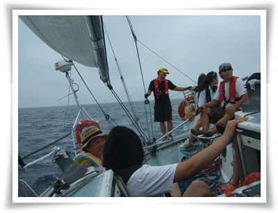

\- 진짜 요트맛을 느끼고 있다.

배는 거의 30도로 기운 상태로 물을 가르며 나갔다.

바로 이 기분에 요트를 타는구나라고 느낄 수 있었다.

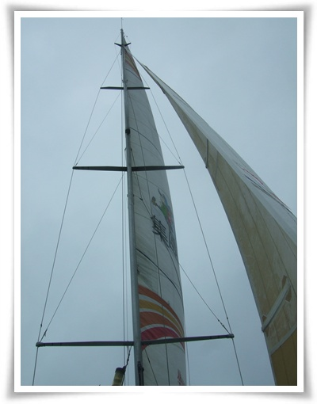

\- 바람을 팽팽히 받은 돛도 이제 위용을 갖추었다.

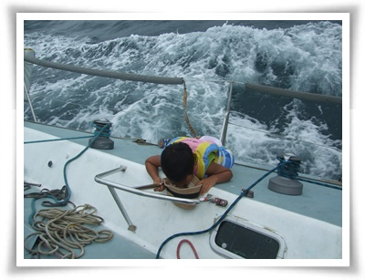

\- 선장님 아들래미는 태킹중에 위태롭게 잡고 있다.

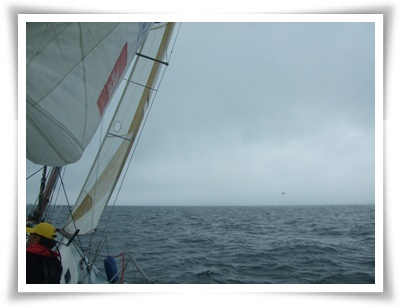

\- 바람을 가르며 나간다.

엔진소리없이, 오직 바람소리와 파도를 헤치는 소리만을 내며, 미끄러지듯 나가는 기분이 아주 좋더군.

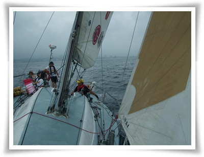

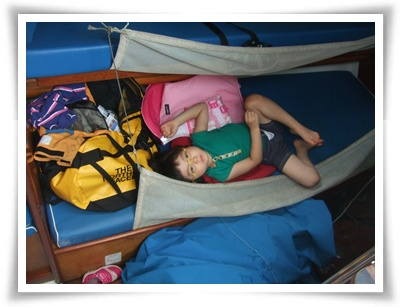

\- 이 와중 딸래미는 선실에서 잠잔다고 누워있다.

수산항에 도착하니, 오후 4시.

정리하고 하고 나니 5시.

하조대에서 1박 하려된 계획에 차질, 그래서 곧바로 집으로 출발했다.

집에 도착한 시각 밤 12시 반.

접하기 힘든 경험과 융숭한 대접을 받은 터라, 책 한권 구매하는게 좋을 것 같아, 교보문고 서현점에 가서 책을 샀다.

나온지 얼마 안된 책인데도, 구석탱이에 박혀 있어 책 찾는데 오래 걸렸다.

책에 등장하는 인물들과 1박2일동안 같이 보내고, 같은 경험을 하고 나니 책 내용이 너무 재미있어진다.

