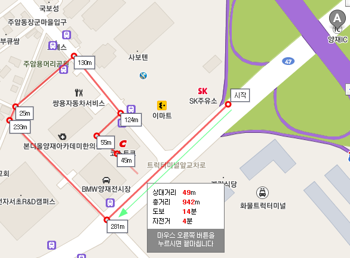
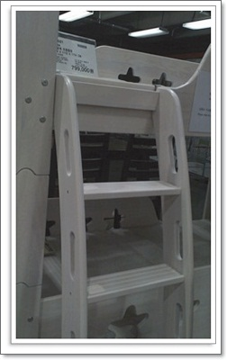
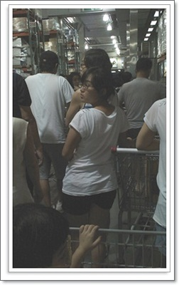
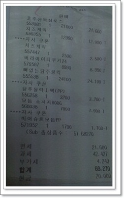

# 코스트코 가는 험난한 정체길

코스트코를 좋아한다.

가면 신기한 것들이 많이 있다.

코스트코 근처에 살 때만 해도,  한달에 두세번은 가서, 아이쇼핑이라도 하고 왔었다.

그 덕에 충동구매도 참 많이 했었다.

그러다, 분당 끄트머리로 이사온 이후로 코스트코양재점은 거의 안 갔었다.

휴가시즌 최절정기라 뉴스에서도 "서울시내 아주 한산" 이라고 나오길래, 간만에 가보기로 했다.

초보운전인 아내가 아직 서울쪽으로 운전이 자신도 없고 하여, 운전 연습도 시킬겸해서 출발했다.

\- 코스코 진입 경로

코스트코 정체는 예전부터도 악명 높았었다.

그래도 8월 1일 휴가 최절정기에 휴가도 안나고, 누가 쇼핑이나할까라는 내 예상은 완전히 틀리고 말았다.

양재 IC에서 나와, 우회전하는 281m 가는데 30분이 걸렸다.

이런 추세라면 주차장에 주차하는데까지만 대략 1시간 30분?

우회전지점에서 그냥 직진하여, 서울을 빠져나갔다.(100m만 가면 경기도라서..)

500m 앞 비닐하우스촌에 주차를 하고, 걸어와 코스트코에 들어갔다.

간만에 온 코스트코는 물건이 많이 빠졌음에도 불구하고 지름 욕구가 아주 강렬했다.

원목2층침대와, 접이식테이블, 휴대용LED렌턴, 카트가 그 중 특히 눈이 들어오더군.

\- 가장 눈에 들어온 80만원짜리 원목침대

특히 2층 원목침대는 아마 내가 삼성카드가 있었다면 그냥 질렀을지도 모르겠다.

왕년에 목공DIY를 조금 배웠기때문에, 저거 만드는데 얼마가 드는지를 대략 알고 있기 때문에, 저 가격에 눈이 뒤집혔다.

딸이 좀 크면 사볼까 [눈여겨 둔  반조립형2층침대가 70만원](http://www.77g.com/shopping/prod_wood_view_all.asp?reflg=1&ct=23&co=O1D18331&cd=H18332) 인데 말이다.  게다가 코스트코 저거는 매트리스트도 2개 포함이라니..

암튼, 그건 그렇고, 사람은 무지하게 많았다.

\- 지하 1층으로 내려가기 위해 대기하고 있는 줄

\- 이날 구매한 금액은 6만8천원.

지갑에 현금은 10만원밖에 없었기 때문에, 이렇게 절제된 코스트코 쇼핑을 마칠 수 있었다.

여기서 내가 고른 것은 것은 치즈케익뿐.

다시 한번 [삼성카드 해지](../10318233.html) 한 것을 다행으로 생각하고 있다.

