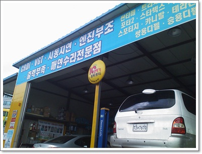
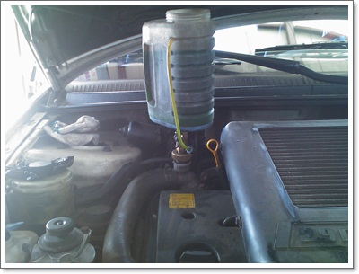

# 카니발 냉각수 교환, 하이드로백 교체

동생에게 맡긴 카니발을 석달만에 타보니, 냉각수 색깔이 탁했졌다.

그리고, 브레이크가 밀린다고 하더군.

냉각수야 교환시기가 되었고, 브레이크는 레간자와 비교해보니, 상당히 딱딱하더군.

브레이크를 밟은 채로 시동을 걸면, 브레이크가 엔진 압력으로 쑥 들어가야 하는데, 별로 안 들어갔다.

그렇다면 엔진이 브레이크 압력을 제대로 못 만들어주고 있다는 의미.

이번엔 분당에 있는, 또 다른 10년타기 정비센터인  남서울카센터로 가봤다.

\- 백현동에 있는 남서울카센터

[자동차10년타기 사이트](http://www.car1023.com/) 에서 평이 좋은 카센터였는데, 글쎄였던 것 같다.

부동액 교환은 33,000원에 했다.

그리고, 머플러 고정장치가 녹슬어 소음나는 부분은 그냥 손 봐줬다.

브레이크가 딱딱하니, 점검해달라고 하니 브레이크는 카센터에서 할 수 없으니, 1급정비소로 가라고 하는군.

고객에게 크게 신경을 쓰지 않는 모습같아보이기도 하고,  정말 FM대로 하는 것 같기도 하고.

사실 브레이크는 법적으로 1급정비소에서만 할 수 있는 정비이긴 하다.

카센터는 소모품류 교환만 하도록 되어 있는데, 보통 엔진까지 다 정비하기는 하지만, 법적으로는 위반이기는 하다.

일단 좋게 해석을 해 보자.

1급정비소로 가기엔 정비비용이 너무 많이 들것 같아, [주로 이용하는 포드카센터](../10374109.html) 로 갔다.

진단결과는 예상했던 대로, 하이드로백이라는 진공을 만들어주는 장치가 고장나, 엔진 압력을 제대로 브레이크로 활용못하는 점이었다.

견적은 하이드로백교체하는데 현금가 30만원.

카니발이 다른 차에 비해 부품값이 비싸 많이 든다고 하는군.

한참을 고민하다가, 그래도 브레이크는 안전 제1 요소이니 수리하기로 했다.

수리비 30만원에 하이드로백교체하고, 브레이크오일 교체.

