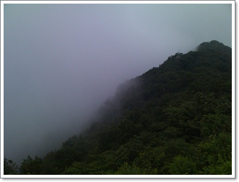

# 패러글라이딩 4일차 - 허탕

[지난 패러글라이딩](../10499517.html) 이후 한달만에 정광산으로 왔다.

주말마다 일들이 많았다.

장마고, 비도 온다고 했지만 새벽 일기 예보가 비에서 흐림으로 바뀌어 정광산으로 갔다.

오전 한시간은 이륙과 착륙에 대한 비행이론 교육.

점심 먹을 때쯤 다른 회원들도 와서, 나포함 5명.

두시쯤, 드디어 이륙장으로 이동.

\- 정상에서는 안개가 자욱하여 이륙 불가능.

안개가 걷히기만을 마냥 대기했다.

시간이 지나니, 서풍이 서서히 안개를 밀어올리고 있었다.

\- 이제 착륙장이 보이기 시작한다

\- 그런데 바람의 방향이 반대방향이다.  저게 거꾸로 되어야 이륙할 수 있다.

차라리 바람이 전혀 안 불면, 열심히 뛰어내려 비행할 수 있지만, 반대방향의 바람에선 무리였다.

2시간 가량을 바람 방향 바뀌기만을 기다리다가 결국 포기하고 다시 차를 타고 내려왔다.

오늘 쓴 비용은 일비 2만원 + 식비 5천원.

패러글라이딩을 타기 전까지는 주말에 비오는 것을 좋아했는데, 이제 비오는게 좀 싫어지는군..

