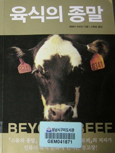

# \"육식의 종말\" 을 읽고

["왜 세계의 절반은 굶주리는가"를 읽은 김](../10518629.html) 에 비슷한 분야의 책을 더 읽었다.

제목은 "육식의 종말".

2년전 광우병 위험이 있는 미국산 소를 수입재개하려는 정부를 상대로 시민이 촛불집회로 대항하던 시기에 많이 읽혀졌던 책이다.

몰랐던 이야기도 많이 나온다.

그리고, 여러 매체와 PD수첩등에서 다뤄졌었던 미국의 축산, 도축 체계에 대해서도 이 책에 상세히 설명되어 있었다.

이 책에서 가장 관심있게 읽은 부분은 정작 육식의 문제점보다는 육식의 역사중 미국이 버팔로를 멸종시키다시피한  부분이었다.

미국이 서부를 인디언으로부터 뺏기 전까지 도처에 채이는게 버팔로였다고 한다.

6천만마리의 버팔로가, 미국의 버팔로 멸종 정책에 의해 멸종 직전까지 갔다가, 지금은 3만마리정도로 유지되고 있다고  한다.

멸종정책의 이유가 가관이었다.

인디언을 몰아내기 위해 인디언의 주요 식량이 되는 버팔로를 멸종시키다시피 한 것이다.

그 전에도 인디언을 학살하였지만, 전투에 백인들 손실도 있고, 비용대비 효과가 크지 않아, 보급을 차단하겠다는 생각으로 인디언들의 식량을 끊어버린 것이다.

그래서 목적은 달성되어, 먹을것이 없어진 인디언들은 어쩔 수 없이 굴복하고, 보호구역 안으로 들어가게 되었다고 한다.

버팔로의 운명과 마찬가지로 한 때 6천만명 이상으로 추정되는 인디언들이 지금은 25만명만이 남아 있다는군.

버팔로와 인디언들이 제거된 서부 평야에는 유럽에서 들여온 식용 소들을 방목했고,

그러고도 비용 절감을 하기 위해, 방목대신 공장에 가둬두고, 옥수수를 먹여 몸집을 키우게 했고,

풀 먹던 소가 곡물을 먹어 위장병이 생겨나니, 항생제를 먹이고,

항생제를 먹고도 병에 죽어가는 소가 많아지니,  강제로 일으켜 세우고 씻어 도축하게 했고,

검역관이 제대로 검역을 하지 못하도록 로비를 하였다는군.

전반적 논제는 아래처럼 이해되었다.

**부자들이 소고기를 먹는다.**

**중산층, 서민들도 부자들을 따라 소고기를 먹기 시작한다.**

**입이 늘어, 소가 부족하게 되니 더 많이 키운다.**

**이제 소가 먹을게 부족하니, 사람이 먹을 곡물도 소에게 먹인다.**

**소가 사람이 먹을 것까지 다 먹다 보니, 사람이 먹을 곡물도 부족하다.**

**사람이 육식을 하지 않으면, 소가 먹는 그 엄청난 양의 곡물을 사람이 먹을 수 있게 되어 세계의 기아는 해결된다.**

뭔가 인과관계가 그럴 듯 해 보이면서도 비약이라는 느낌이다.

각각의 챕터들은 공감이 가지만, 강한 주제의식을 갖고 씌여진 책이라 그런지, 전체로 이어지는 논제에 대해서는 받아들이기는 반발심이 생겼다.

"왜 세계의 절반은 굶주리는가?"는 기아의 근본적인 원인이 시스템에 있다는 것에 반해, 이 책은 너무 육식이라는 이유 하나로 몰고 나가는 듯한 인상이었다.

물론 책에 여러 출처가 명시되어 있고, 그게 거짓이지는 않을 것이다.

하지만, 팩트라고 해서 모두 다 진실은 아니다라는 말 처럼, 얼마들지 팩트를 선별하여 진실을 왜곡할 수도 있기 때문이다.

이 책의 시선이 자기의 주장을 독자들로 하여금 받아들이도록 하기 위해 과학적인 태도에서 좀 벗어난 게 아쉽긴 한다.

