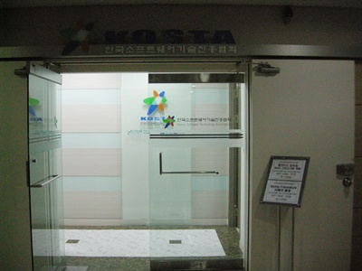
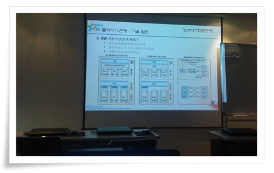

# 재미있는 클라우드 컴퓨팅 야간 교육 과정

한국소프트웨어진흥협회에서 하는 교육 "클라우드 컴퓨팅, SaaS 그리고 SW개발" 과정을 듣고 있다.

노동부지원과정으로, 5일간 18:30 ~ 22:30 까지 하는 교육.

가장 중요한 교육비는 무료.

장소도 가산동이라 회사 퇴근하고 바로 걸어가면 되는 거리.

가산동으로 출근하면서 처음으로 만족스런 점이다.

\- 우림라이온스 C동에 있는 강의장

\- 이건 지난번 들었던 SOA 교육

강의는 Nextree사의 부사장님과 개발차장님이 진행했다.

부사장이신 송태국강사는 이력이 특이하게도 육사출신이었다.

아직도 개발에서 손을 떼지 않으셔서 설명이 모호하지 않아, 이해가 잘 되었다.

아마존의 EC2, 구글의 앱엔진, 마이크로소프트의 Azure  일단 이 세 곳이 클라우드 시장을 두고 박터지게 싸운 듯 하다.

요즘 클라우드에 대한 많은 기사가 나오고는 있는데, 내가 정확한 이해를 못한 상태라 그냥 업체들의 마케팅용어이겠거니 생각했었다.

강의를 들으면서, 피상적으로 생각했던 것들이 상당히 구체적으로 이해되고, 미래의 모습에 전율도 느껴지곤 했다.

클라우드가 미래, 그중에서 개발관련 업종을 어떻게 바꾸게 될까?

내가 대학 전자공학과에 입학하는 시기가, 아날로그 엔지니어가 사라지는 시기라고 했었다.

그 전까지 한 분야의 많은 경험이 요구되는 아날로그대신 0과 1로 정확한 디지털IC가 모든 것을 대체했다.

그시기 들었던 소식으로는 인켈이나 태광에로이카같은 곳의 오디오 엔지니어가 할 일이 없어져 중국집을 차렸다는 이야기.

첫직장으로 웹쪽 일을 시작했을 때만 해도, 시장에 웹마스터라고 하여 6개월과정 수료 개발자들이 쏟아져 나왔고, 웹개발자하면 개발자중에서도 좀 무시받는 분야였다.  그 당시에 회사에서도 DB, RPC, 서버사이드개발쪽이 힘이 있었다.

지금은?  플랫폼이 많이 통합, 통일되면서 예전처럼 많은 인력이 필요없게 되었다고 하더군.

핸드폰 개발할 때, 거기서도 콜, 플랫폼쪽이 대우받고 UI 개발자가 가장 무시받는 편이었다.

업무분장에 갈등이 있으면 자주 들리는 말이, "이런 사소한 것들은 UI가..." 였었다.

주구장창 피처폰만 하다가, 스마트폰 프로토타입개발하는 것을 보며 든 생각이, "핸드폰쪽도 더이상의 진입장벽은 없겠구나"이었다.

진입장벽이라고 있었던 것이 보드와 jtag, 테스트장비등의 비싼 장비가 갖추어져 있어야 하고, 개발도 그냥 날로 된 C로 개발하는 거라, 노가다성 일이 많은 거였는데, 그런 것들을 OS와 플랫폼에서 지원을 하기 시작하니 없어지겠다 생각했었다.

클라우드가 대세가 되면, 어플리케이션을 개발하는 사람만이 살아남고, 그 외는 많이 없어지겠구나.

이러다가 플랫폼 레벨의 기술은 미국만 가지고 나머지는, 거기에 종속되지도 않을까 하는 걱정이 든다.  아마 그 걱정때문에 나라에서도 클라이드 대책 세우고 있는 거겠지만..

아마존 EC2, 구글 App Engine이 이번 교육과정중 실습내용이다.

EC2는 infra를 제공하는 IaaS, 구글 앤엔진은 플랫몸을 제공하는 PaaS.

EC2로 실습하다 보니, 우리나라 IDC센터와 호스팅업체들이 많이 위험하지 않을까 생각된다.

웹호스팅을 통해 개인 wiki를 설치하여, 거기다 일기쓰고 있는데, 한번 옮겨볼까하고 요금 계산해보니, 아직 개인용도로는 힘들겠군.   한달에 66달러면 7만원정도 드는군.  내가 지금 쓰고 있는게 일년에 6천원짜리이니..

그래도 서버호스팅업체든은 긴장하겠군.

