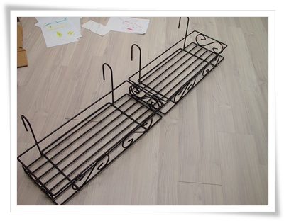
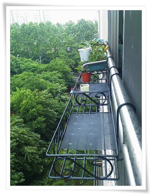

# 베란다 화분걸이대 

나에게 마당이 있는 단독주택을 동경하는 가장 큰 이유는 거기에 식물들을 키울 수 있기 때문.

아파트에 살면서 가장 아쉬운 점이 식물 키우기가 쉽지 않다는 것.

빛이 부족해도 잘 자라는 실내 식물위주로 조그마한 화분에 키우는 게 최선의 선택.

베란다에 화분을 더 놓고 싶어 베란다 화분 걸이대로 검색해봤다.

역시나, 나만 이런 고민을 한 것이 아니었군.

제품만 많이 팔고 있었다.

2개에 23,000원주고 주문했다.

\- 배송온 베란대 걸이다.  길이는 각각 66cm정도.

\- 장착 완료.  이제 화분을 더 놓을 수 있겠군.

