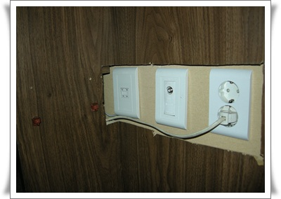
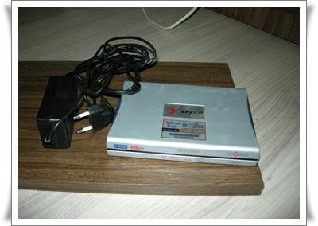

# 26만원받고 SK브로드밴드로 인터넷 갈아타다

집에서 사용하는 인터넷으로 LG파워콤을 썼다.

2년 약정으로 하여, 지난달로 2년 약정이 끝났다.

우리나라만 그런지는 몰라도 통신서비스는 장기가입자가 봉이다.

모든 혜택은 신규가입자에게만 주어진다.

인터넷서비스도 마찬가지로, 오래쓴다고 우대해주지 않는다.

어디로 갈아탈까 하다가, SK브로드밴드가 1년 약정에 26만원 현금지급으로 조건이 제일 좋아보였다.

한달 사용료는 3만원5천원.  파워콤이나 쿡인터넷이나 요금은 거의 비슷하더군.

우선 파워콤해지.

고객센터로 전화해서 해지한다고 하니, 해지사유가 뭐냐고 묻길래 좋은 조건의 다른 인터넷 회사로 옮긴다고 하니, 거기 끝나면 다시 파워콤으로 돌아오라고만 하더군.

인터넷 설치기사가 왔었는데, 책장으로 막아놓은 전화선때문에 설치못하고 돌아갔다.

그래서, 전동톱으로 책장에 구멍을 뚫었다.

\- 전동톱이 참 유용하긴 하다.  이렇게 예쁘게 구멍을 낼 수 있다니..

\- 이제 필요없게 된 파워콤 adsl 모뎀.

갈아타는게 귀찮긴 하지만, 그래야 혜택이 주어지니, 날짜 기억했다가, 내년 6월에 또 다른 인터넷 회사로 갈아타면 되겠군.

