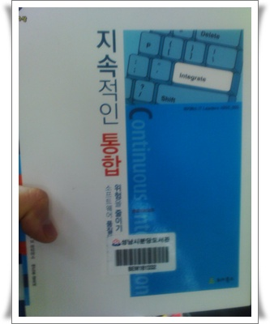
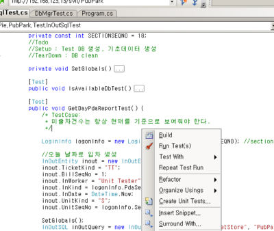

# 테스트 주도 개발(TDD) 조금만 더 일찍 공부해 둘 껄..

요즘 테스트주도개발을 따라 하고 있다.

부끄럽게도, TDD(Test Driven Development)자체는 작년에 처음 알았다.

계기는 근래에 읽은 "테스트주도개발"과 "지속적인 통합".

\- 도서관에 있는 빌려 읽은 테스트주도개발과 지속적인 통합

전산개론이나, 무슨무슨 자격시험에 항상 나오는 말인 단위테스트.

이 때까지 시간도 없는데 무슨 단위테스트냐 하며, 제대로 된 테스트를 안 했었다.

기껏 사용하는 것이 그냥 assert 문 정도..

이 책들을 보며, 얼마나 발전하는 세상에 뒤쳐지고 있었나 새삼 깨달았다.

전자계산기로 누르면 되는 세상에 주판만 열심히 튕기고 있었구나라는 생각.

\- testdriven.net plugin 으로 개발을 하고 있다.

개발 먼저 하고 나중에 테스트하는 전통적인 방법대신 테스트 코드부터 먼저 작성하고나서 개발을 하는게 TDD다.

소개글로만 봤을 때는 감이 잘 안왔는데, 책을 보면서 과정을 보니 이해가 확 오더군.

TDD에서의 테스트코드라는 것이 곧 스펙이었다.

스펙을 만족하는지 테스트 코드 작성하고서, 코드를 짜 나가니, 나중에 스펙대로 구현되었는지, 아닌지하는 논란이 줄더구.

test framework으로는 NUnit 을 사용했다.

Visual Studio에 MS Test 가 내장되어 있기는 한데, NUnit 이 더 오래되고 사용자층도 두텁고 해서 선택했다.

이제 남은 것은 지속적인 통합.   commit->자동빌드->자동테스트->자동배포

