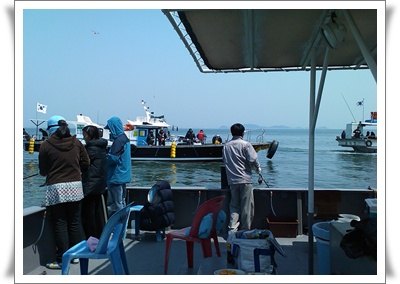
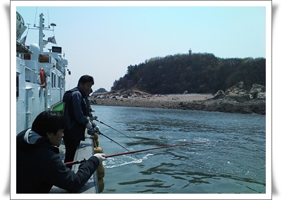
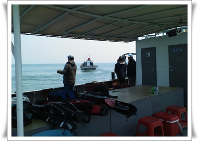

# 5월1일 서해 바다낚시

5월 1일 올해의 낚시을 개시했다.

무지 추운 날이었다.

예년이라면 3월부터 낚시가 시작되고, 5월부터는 잘 잡히기 시작하는 달인데, 이번엔 아니었다.

서해 바다 낚시는 보통 3월중순부터 시작하여, 12월말에 종료된다.

물고기가 변온 동물이다보니, 항온 동물과 달리 적정 체온이 되어야 먹이 활동을 시작하는데, 그 수온이 10도는 넘어야 한다.

헌데 4월 말이 몹시도 추운 4월이어서, 이날 서해 덕적도 인근의 수온은 6.5도였다.

그래서 낚시하는 사람도 별로 없었다.

보통 주차하기도 힘들고, 배에는 사람으로 북적되는데, 아주 한가했다.

4시 반에 출항하여, 6시 반부터 낚시를 시작했는데, 8시가 되도록 배에 아무도 물고기 잡은 사람이 없었다.

그래서, 배는 조금으로 따뜻한 당진쪽까지 내려갔다.

                                \- 인천연안 조업권을 가진 낚시배는 모두 당진발전소 인근에 다 모인 듯..

\- 세월을 낚으려는 게 아닌데, 마냥 물고기만 기다리고 있다.

\- 차츰 낚시를 포기하는 사람도 많아져, 안그래도 한산한 배가 더 한산해졌다.

이날 내가 잡은 고기는 놀래미 두마리.

나랑 같이 간 사람들까지 다 합해서 10마리.

그 10마리 배에서 회로 먹고 나니 끝.

이제 선선한 가을에나 다시 낚시해야겠다.

