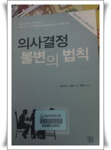

# 의사결정 불변의 법칙

관리업무가 개발하는 것도 더 많다 보니, 의사결정할 일도 많아졌다.

의사결정이라는 것이 참 쉽지가 않다.

결정을 내리고서도 정말 이 결정이 잘 한 것인가?  혹시 나중에 후회할 결정이 되지는 않을까?  라는 걱정은 따라다닌다.

그래서 의사결정에 관한 책이 그렇게나 많나보다.

이번에 읽은 의사결정 불변의 법칙.

간만에 정말 좋은 책을 읽었다는 느낌이다.

이런 류의 서적들이 보통 자기는 못하면서 너무 당연한 말들을 풀어서 쓴 경향이 많은데, 이 책은 달랐다.

의사결정의 사례를 들어가며 어떻게 하면 가장 나은 최적의 결정을 내릴 수 있는가를 설명하고 있다.  특히 첫부분에 나오는 의사결정을 하기 위한 요소들을 수치하는 방법은 많이 연습해봐야겠다.  '측정할 수 없으면 개선할 수 없다'라고 어떤 유명한 사람이 말도 있으니..

