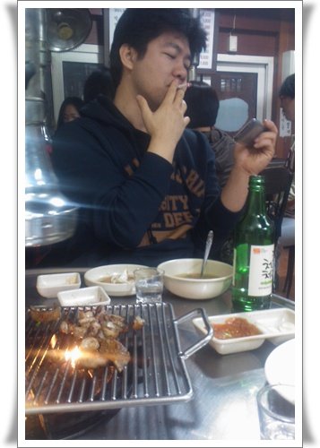

# 미금역 돼지부속집 돈방석

경률씨와 함께 간 돈방석.

미금역 근처에 있는 돼지부속집이다.

싸고, 맛도 좋아 이제까지 네번정도 갔었다.

동네 탐험이 많이 해야하는데, 2년이 다 되가도록 동네 맛집 분석을 못했다.

돼지부속을 시키면, 돼지 염통,간,껍데기,곱창등이 나오는데, 세명이서 2만원정도면 부족하지 않게 먹을 수 있다.

후식용으로 시킬 수 있는 국수도 맛있고..

최근 지른 아이폰 자랑을 하는 경률씨.

이번에 먹은 것은 돼지곱창.

예전 왕십리에서 곱창먹고 크게 탈 난 이후로 곱창을 잘 못먹었는데, 이제 극복이 된 듯하다.

경률씨가 바꾼 아이폰을 직접 만져보니, 좋긴 좋은 기기더군.

