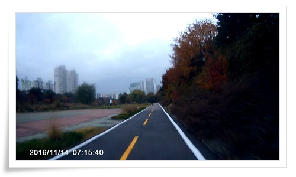
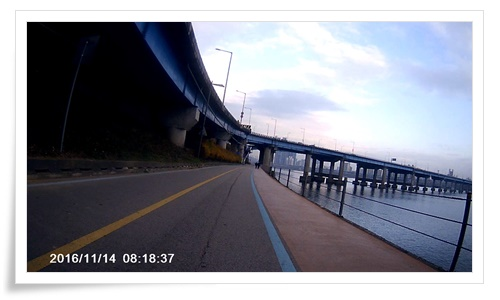
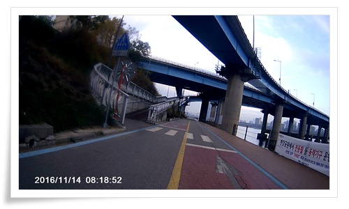

# 오리역에서 성수역까지 자전거로 출퇴근

집에서 회사까지 대중교통으로 가는데 걸리는 시간이 1시간40분 정도다.

적지 않은 시간이다.

너무는 지겨운 시간이다.

자전거로 출퇴근하는 것을 고려하고 거리를 측정해 봤다.

편도 30km가 나오더군.

역시나 짧지 않은 거리다.

그나마 다행인 것은 자전거 도로가 잘 되어 있어 그다지 위험하지 않다는 점.

올 해 여름부터 시작했다.

이용 자전거는 위 미니벨로 타입의 자전거.

헬멧 쓰고, 가방 메고, 자전거용 블랙박스까지 거치하여 타고 다니고 있다.

루트는 위와 같이 탄천을 따라가다 한강변으로 옮겨가 영동대교를 건너는 코스.

쉬지 않고 페달을 밟아 평속 22km정도를 유지했을 때 1시간20분이 걸린다.

문 앞을 나서는 것이 제일 힘들기는 하다.

아침 눈을 떠 이불 속에서 자전거 타지 말까를 수십분 고민을 한다.

타고 나면 잘 했다는 생각이 든다.

몸이 아주 개운해진다.

\- 늦가을 낙엽을 밟으며 달리는 기분이 좋다.

\- 출발한지 한 15분 소요 시점.  이 때부터 몸이 풀린다.

\- 지난 달까지만 해도 이 시간 자전거 타는 사람이 많았는데, 이제 많이 줄었다.

\- 탄천과 분당천 분기점.

\- 최근 탄천 자전거로 재포장이 되어 도로 사정이 좋아졌다.

\- 특히 성남비행장 근처 도로는 깔끔하게 깔아 노면 상태가 아주 좋다.

\- 성남 비행장과 나란히 뻗은 직전 도로.

여기가 중간 지점.

\- 비행장 근처가 탁 트여 경치가 좋다.

\- 이 부근이 가락시장 부근.  아마 서울과 경기도 경계지점 같다.

\- 이제 탄천을 건널 때.  여기서부터가 체력이 떨어지기 시작한다.

\- 수서에서 삼성동으로 이어지는 길.

이 길은 좀 지루한 감이 있다.

\- 양재천과 탄천이 만나는 지점.

\- 탄천 마지막 구간을 달린다.

탄천주차장과 운전면허시험장이 좌우로 있어, 썩 좋은 도로는 아니다.

\- 이제 한강변 도로로 진입.

\- 청담대교 밑.

\- 저 다리가 내가 건널 영동대교.

\- 영동대교는 자전거가 건널 수 있게 올라갈 수 있는 길이 있다.

\- 영동대교 올라가는 중.

\- 출근시간대라 차는 정체중이다.

\- 출근 코스중 가장 위험한 구간인 차도 건너는 구간.

꼭 자전거에서 내려서 건넌다.

\- 한강 북단 자전거 도로를 향해 내려가는 중.

\- 한강 북단 자전거 도로.

\- 올해부터 뚝도활어시장 활성화가 시작되어 조형물까지 세워졌다.

\- 토끼굴을 지났다.

\- 뚝도 시장 근처 길.

회사에 거의 도착했다.

