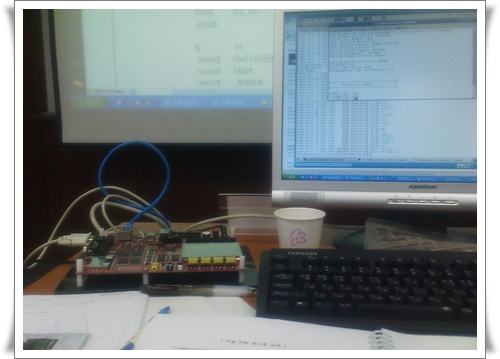

# 오랜만의 리눅스 

수원에서 4일짜리 임베디드리눅스 포팅과정을 들었다.

임베디드리눅스하니, 생각나는게 예전 2002년도 한창  퀄컴msm5100 가지고 폰 만들때, 남아도는 개발폰에 리눅스 한번 포팅해보자하고 동함과 말만 했으나,  arm cross compiler 설치하는 것에서부터 삽질하다 결국 포기했던 게 떠오른다.

유닉스계열을 처음 접한 것은 1990년도.

SCO-XENIX라고 하여,  5.25인치디스크 스무장정도 되었던 것 같다.

40메가짜리 하드에 DOS와 XENIX 파티션을 나누고, 설치하는데 몇일걸렸던 것 같다.

그때 설치했던 Xenix에는  X-window 패키지가 없어서, 그냥 몇달 가지고 놀다가 밀었었다.

그러다 1993년도. 커널버전이 0.6인가 0.9인가 했었던 리눅스를 슬랙웨어 배포판으로 다시 접했다.

3.5인치 40장정도 됐었던 것 같다.

그때 한창 하이텔 같은데 보면, 3.5인치 40장도 복사해서 파는 사람들도 있었다.

리눅스를 pc에 설치하고, 커널 빌드해서 X-window 뜨는 모습에 감격했던 기억이 난다.

첫회사를 포탈에서 시스템엔지니어로 시작하면서, Sun 서버를 주로 사용하면서, 저가장비로는 리눅스를 조금씩 사용하기 시작하면서, Sun에 비해 안정성이 떨어지는 리눅스에 좀 실망하기도 했었다.

교육받고 있는 내 실습화면.

한 8년만에 쓰는  vi 에디터인데도, 손가락이 왠만큼 기억을 하고 있더군.

좀 놀라웠다.  다시 vi  에디터를 메인 에디터로 써볼까?

예전 유닉스쪽의 실력의 판단은 누가 vi 에디터를 능수능란하게 사용하는가였던 것 같다.

