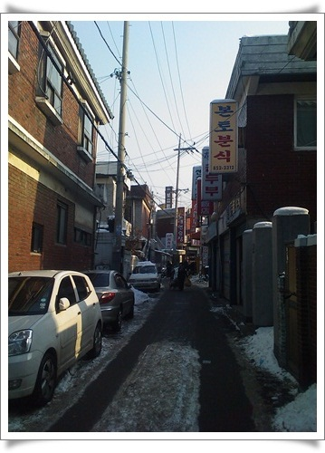
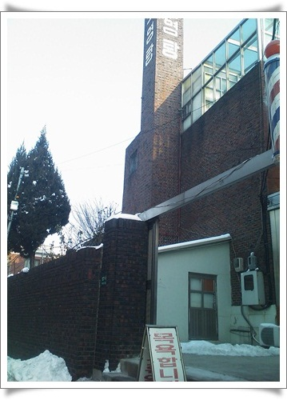

# 가산동 보영목욕탕

새벽 3시에 퇴근하여, 4시에 집에 도착하여, 한시간 자고 다시 회사 출근했다.

저녁에는 워크샵가느라 사람들 내 차에 태우고 운전해야 하는데, 내 차에 탈 사람들이 염려하는 통에, 목욕탕에 갔다 왔다.

목욕탕이 얼마만인지 모르겠다.

목욕탕->사우나->찜질방 이런 순으로 변천해 왔는데, 여기 가산동에는 아직 목욕통이 있더군.

네이버지도에서 가산디지털단지역에서 가장 가까운 목욕탕으로 검색된 곳이 바로 보영목욕탕.

이 좁은 골목길 사이에 굴뚝이 보이는군.

이게 목욕탕.

내 기억상 서울의 마지막 목욕탕은 중학교 시절로 기억한다.

그때 주말 아침이 되면, 목욕하는 사람들도 꽤나 북적였었는데,..

이용료 4,000원.

그냥 탕에 들어갔다가, 수면실에서 2시간 누워있다가 왔다.

대낮에 누워있으려니 잠도 안오고, 좀 춥더군.

